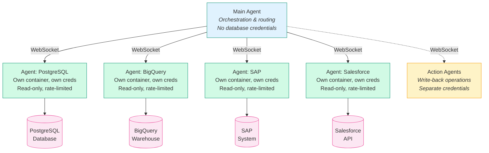
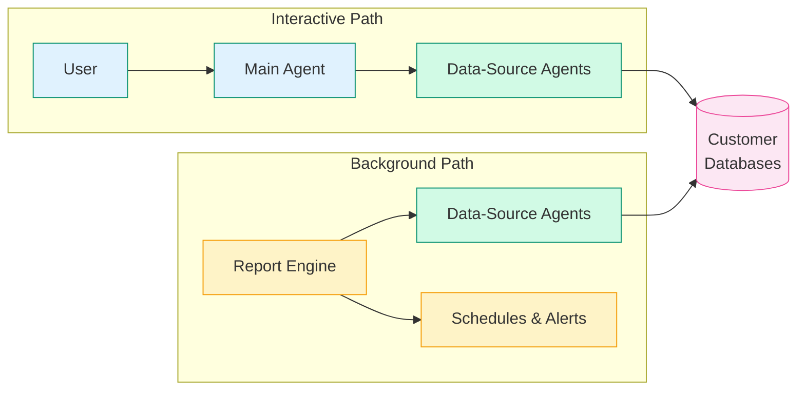
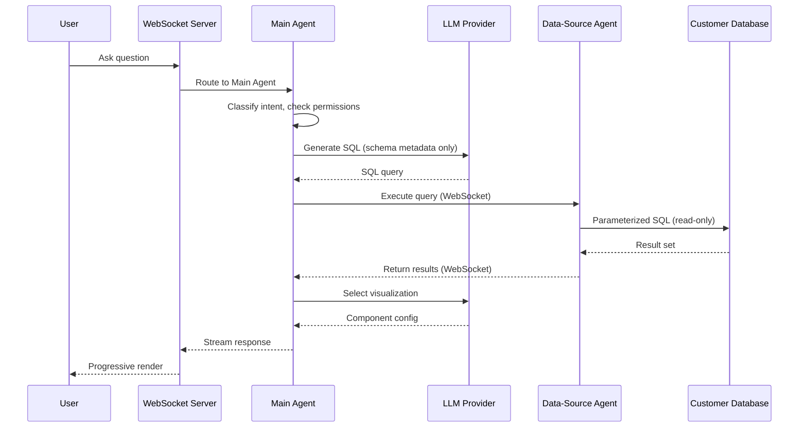

Superatom uses a multi-agent architecture where specialized agents handle distinct responsibilities. The **Main Agent** orchestrates requests, **Data-Source Agents** connect to individual databases, and **Action Agents** handle write-back operations. Each agent runs in isolation with its own container, credentials, and lifecycle.

---

## Main Agent

The Main Agent is the orchestrator at the center of the system. When a user asks a question, the Main Agent handles the full request lifecycle:

1. **Classifies the intent** — determines whether the request is a lookup, comparison, trend analysis, root cause investigation, forecast, or action
2. **Determines data sources** — identifies which connected data sources are needed to answer the question
3. **Checks permissions** — validates the user's access against the required data
4. **Routes to agents** — dispatches the request to the appropriate data-source agent(s)
5. **Synthesizes results** — combines responses from multiple agents for cross-source queries
6. **Selects visualization** — picks the optimal chart or table component
7. **Streams the response** — delivers results progressively back to the user

<Note>
  The Main Agent **never** directly accesses customer databases. It does not hold database credentials. All data access is delegated to data-source agents over internal WebSocket connections.
</Note>

---

## Data-Source Agents

Each connected data source has a dedicated agent. An agent is a containerized service responsible for a single data source.

### Agent Characteristics

| Property | Detail |
|----------|--------|
| **Runtime** | Own Docker container with isolated filesystem and memory |
| **Credentials** | Holds credentials for its specific data source only |
| **Communication** | Internal WebSocket connection to the Main Agent |
| **Query execution** | Parameterized SQL queries against the live data source |
| **Access level** | Read-only database access by default |
| **Throughput control** | Rate-limited per agent |
| **Performance** | Maintains a local query cache |

### Agent Isolation

Each agent runs in its own Docker container. There is no shared filesystem or memory between agents. Credentials are stored only within each agent's container. All inter-agent communication goes through the WebSocket server.

### Cross-Source Queries

When a user's question requires data from multiple sources, the Main Agent coordinates across agents:

1. The Main Agent identifies all required data sources
2. It dispatches parallel requests to each relevant data-source agent
3. Each agent executes against its own data source independently
4. The Main Agent synthesizes the results into a unified response

Because each agent is independent, a slow response from one data source does not block results from others.

---

## Action Agents

Action Agents are architecturally separate from Data-Source Agents. While data-source agents handle read operations, Action Agents handle write-back operations such as creating records, updating statuses, or triggering external systems.

| Property | Detail |
|----------|--------|
| **Credentials** | Write-capable credentials, completely separate from read-only data-source agents |
| **Approval gates** | Require approval before execution (auto-execute, user confirm, manager approve, or dual control) |
| **Dry-run mode** | Support simulation before committing changes |
| **Audit trail** | Every action is logged with full context |

<Note>
  The separation between read and write agents is an architectural decision, not just a security policy. Data-source agents cannot write, and action agents use entirely different credential sets and approval workflows.
</Note>

---

## Why This Architecture

The multi-agent model is not arbitrary -- it delivers concrete architectural benefits:

<CardGroup cols={2}>
  <Card title="Independent Scaling" icon="arrows-up-down">
    Each data-source agent can be scaled independently based on query load. A heavily-queried PostgreSQL source can have more agent instances without affecting the BigQuery agent.
  </Card>
  <Card title="Fault Isolation" icon="shield-halved">
    If one agent fails or becomes overloaded, all other data sources remain accessible. A problem with the SAP agent does not take down PostgreSQL queries.
  </Card>
  <Card title="Technology Flexibility" icon="puzzle-piece">
    Different agents can use different connection strategies -- SQL for relational databases, REST for APIs like Salesforce, file parsing for Excel. The Main Agent does not need to know the details.
  </Card>
  <Card title="Credential Minimization" icon="key">
    The Main Agent, which handles LLM communication and orchestration, never sees database credentials. Each agent holds only the credentials it needs for its specific data source.
  </Card>
</CardGroup>

### Resource Profile

Each component has a defined resource footprint for deployment planning:

| Component | CPU | Memory |
|-----------|-----|--------|
| Main Agent | 4-8 vCPU | 16-32 GB |
| Data-Source Agent (each) | 1-2 vCPU | 2-4 GB |
| Report Engine | 4-8 vCPU | 16-32 GB |

---

## Report Engine

The Report Engine is a dedicated component that runs independently from the interactive query path. It handles background and scheduled workloads:

- **Scheduled report generation and delivery** — recurring reports run on defined schedules
- **Anomaly detection baseline models** — continuous learning from historical data patterns
- **Continuous metric monitoring** — tracks key metrics and detects deviations
- **Triggered alert investigation** — automatically investigates when alerts fire

<Note>
  The Report Engine is architecturally separate from the interactive query pipeline. Scheduled processing does not compete with interactive queries for resources, ensuring consistent response times for live users.
</Note>

---

## Communication Flow

All communication between the Main Agent and data-source agents uses internal WebSocket connections. This provides real-time, bidirectional messaging with streaming support.

---

## Further Reading

<CardGroup cols={2}>
  <Card
    title="Security Perspective"
    icon="lock"
    href="/security/agent-model"
  >
    How the agent model enforces security boundaries and credential isolation
  </Card>
  <Card
    title="Data Flow"
    icon="diagram-project"
    href="/architecture/data-flow"
  >
    Detailed request and response flow through the system
  </Card>
  <Card
    title="AI Engine"
    icon="brain"
    href="/architecture/ai-engine"
  >
    How the intelligence layer processes queries
  </Card>
  <Card
    title="Infrastructure"
    icon="cloud"
    href="/architecture/infrastructure"
  >
    Deployment model and scaling strategies
  </Card>
</CardGroup>
