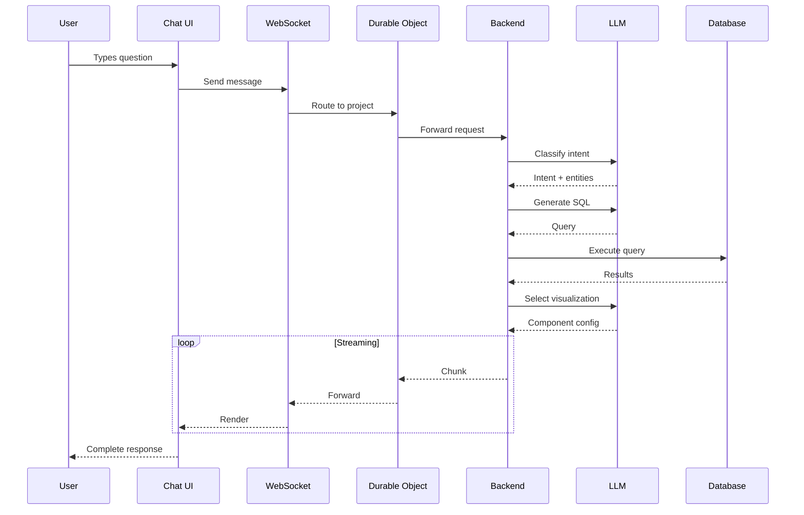

## Request Lifecycle

## Data Processing Stages

<Steps>
  <Step title="Intent Classification">
    AI determines what type of question was asked and extracts entities (metrics, dimensions, filters, time periods).
  </Step>
  <Step title="Context Enrichment">
    Tribal knowledge is applied at global, user, and query levels to add organizational context.
  </Step>
  <Step title="Query Generation">
    SQL or analysis code is generated using the semantic model and context.
  </Step>
  <Step title="Execution">
    Query runs against the connected data source with parameterized inputs.
  </Step>
  <Step title="Visualization">
    AI selects the optimal component based on data characteristics.
  </Step>
  <Step title="Streaming">
    Response is streamed to the user in real-time.
  </Step>
</Steps>

## Data Security Throughout

| Stage | Security Measure |
|-------|-----------------|
| Transit | TLS 1.3 encryption |
| Processing | Ephemeral, deleted after use |
| Storage | Never persisted outside your network |
| Access | Role-based, row-level filtering |
