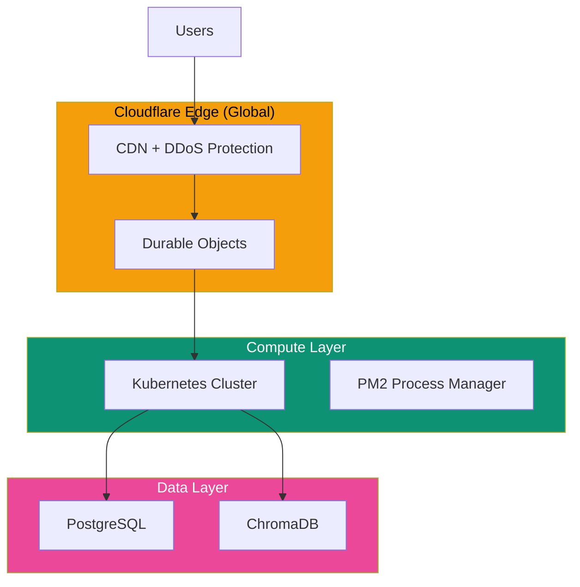

## Deployment Architecture

## Scaling Model

### Horizontal Scaling

Each project scales independently:

| Load Pattern | Scaling Response |
|--------------|------------------|
| More users | More DO instances |
| More queries | More backend pods |
| More data | Database scaling |

### Cost Optimization

| Strategy | Savings |
|----------|---------|
| Hibernatable WebSockets | 90-99% |
| Query caching | 30-50% |
| Model selection | 20-40% |
| Edge caching | 10-20% |

## Technology Stack

| Layer | Technologies |
|-------|-------------|
| Edge | Cloudflare Workers, Durable Objects |
| Compute | Node.js, Express, PM2 |
| Database | PostgreSQL, ChromaDB |
| Build | Vite, pnpm |
| CI/CD | GitHub Actions |

## Performance Targets

| Metric | Target | Actual |
|--------|--------|--------|
| Query response | < 3s | ~2s |
| Chart render | < 500ms | ~300ms |
| WebSocket connect | < 500ms | ~200ms |
| Page load | < 2s | ~1.5s |

---

## On-Premise Deployment

For enterprise deployments, all components run on the customer's infrastructure.

### Core Platform Components

| Component | Purpose | Minimum | Recommended |
|-----------|---------|---------|-------------|
| **Main Agent** | Orchestration, routing, query planning, synthesis | 4 vCPU, 16 GB RAM | 8 vCPU, 32 GB RAM |
| **WebSocket Server** | Internal agent communication | 2 vCPU, 4 GB RAM | 4 vCPU, 8 GB RAM |
| **Web UI Server** | Serves the frontend application | 2 vCPU, 4 GB RAM | 4 vCPU, 8 GB RAM |
| **Graph Database** | Metadata, tribal knowledge, query history (PostgreSQL with Apache AGE or Neo4j) | 4 vCPU, 16 GB RAM | 8 vCPU, 32 GB RAM, SSD |
| **Report Engine** | Scheduled reports, anomaly detection | 4 vCPU, 16 GB RAM | 8 vCPU, 32 GB RAM |
| **Audit Storage** | Immutable audit trail | S3-compatible or local FS | S3-compatible with lifecycle policies |

### Data-Source Agents

| Resource | Per Agent | Notes |
|----------|----------|-------|
| **Compute** | 1-2 vCPU, 2-4 GB RAM | One agent per data source. Typical deployment: 5-20 agents. |
| **Storage** | 1-5 GB | Local memory and query cache. Not shared between agents. |
| **Container runtime** | Docker (minimum), Kubernetes (recommended) | Agents distributed as Docker containers. |

### Network Requirements

| Requirement | Detail |
|-------------|--------|
| **Internal network** | All platform components communicate over internal network |
| **Database access** | Each agent needs network access to its respective database (internal) |
| **Outbound HTTPS** | To LLM provider API (can be proxied) |
| **Outbound HTTPS** | To Superatom platform for usage telemetry (can be restricted or proxied) |
| **Inbound connections** | None required |
| **Self-hosted LLM** | For air-gapped environments: deploy LLM on-premise for zero outbound traffic |

### Deployment Options

<AccordionGroup>
  <Accordion title="Docker Compose" icon="docker">
    Suitable for smaller deployments and development environments. Single-host deployment with all components managed by Docker Compose. Simpler to set up, limited horizontal scaling.
  </Accordion>
  <Accordion title="Kubernetes / Helm" icon="dharmachakra">
    Recommended for production scale. Multi-node deployment with auto-scaling, rolling updates, health checks, and resource management. Deployed via Helm charts.
  </Accordion>
</AccordionGroup>

<Card title="Implementation Guide" icon="rocket" href="/implementation/infrastructure">
  Full infrastructure requirements and deployment walkthrough
</Card>
