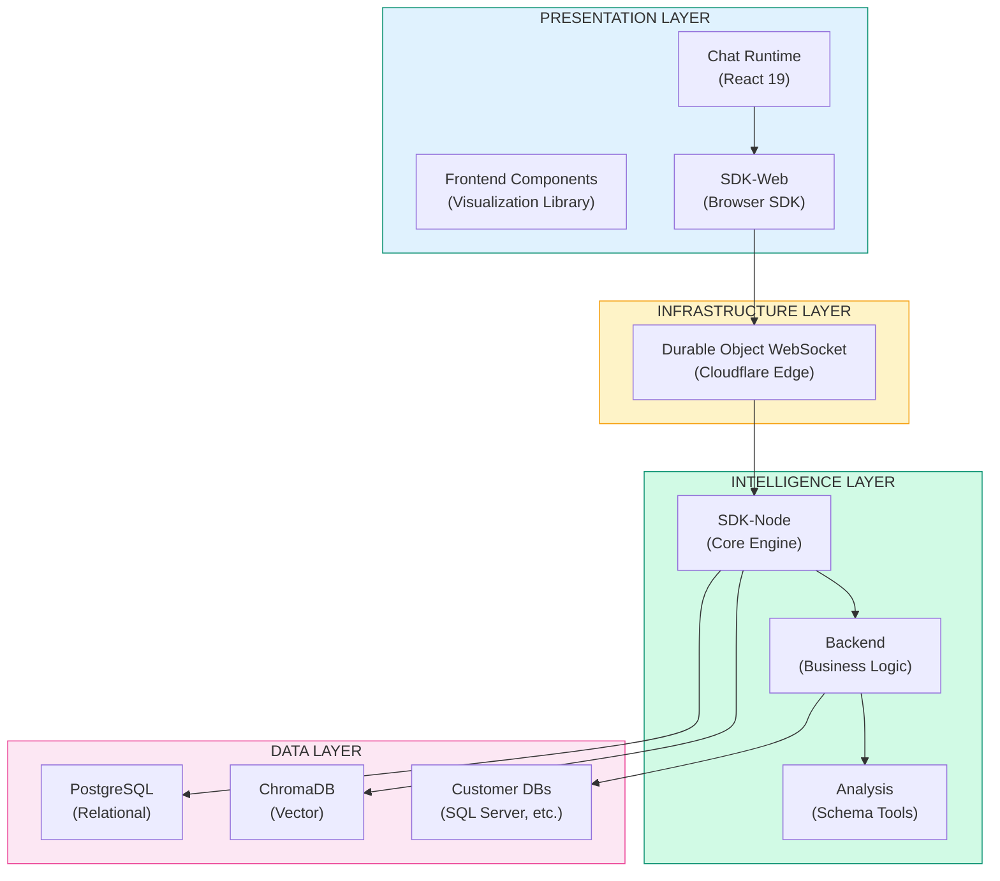
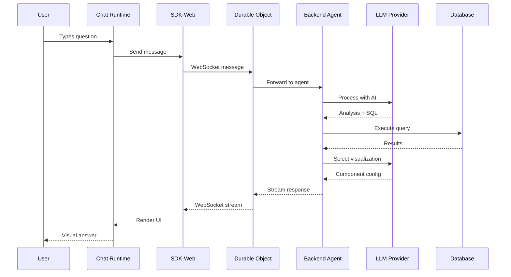
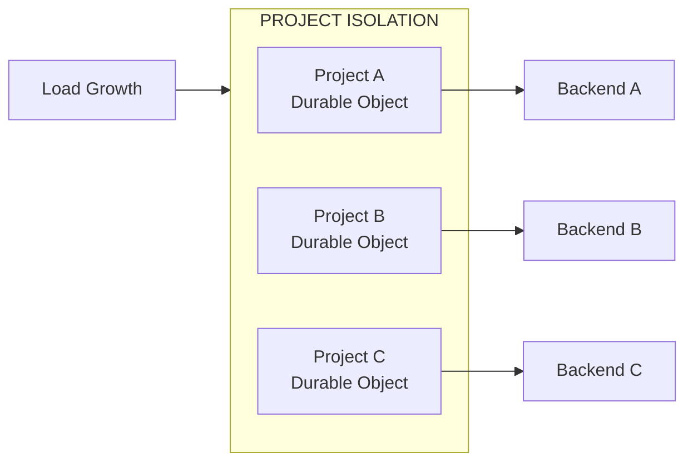

Superatom is built as a modular, multi-layer architecture designed for enterprise scale, security, and flexibility.

---

## High-Level Architecture

---

## Layer Overview

### Presentation Layer

The user-facing components:

| Module | Purpose | Technology |
|--------|---------|------------|
| **Chat Runtime** | Primary user interface | React 19, MobX, Tailwind |
| **Frontend Components** | Visualization library | ECharts, React |
| **SDK-Web** | Browser-server communication | TypeScript, Zod |

### Infrastructure Layer

Handles real-time communication and scaling:

| Module | Purpose | Technology |
|--------|---------|------------|
| **Durable Object WebSocket** | Message routing, session management | Cloudflare Workers |

### Intelligence Layer

The "brain" of the platform:

| Module | Purpose | Technology |
|--------|---------|------------|
| **SDK-Node** | Core AI engine | Node.js, TypeScript |
| **Backend** | Business logic, tools | Express, TypeScript |
| **Analysis** | Schema documentation | Python |

### Data Layer

Persistent storage:

| Module | Purpose | Technology |
|--------|---------|------------|
| **PostgreSQL** | User data, configs, history | Drizzle ORM |
| **ChromaDB** | Vector search, semantic matching | Python |
| **Customer Databases** | Enterprise data | SQL Server, etc. |

---

## Request Flow

---

## Key Design Decisions

### WebSocket-First Communication

All real-time communication uses WebSockets:

<CardGroup cols={2}>
  <Card title="Bi-directional" icon="arrows-left-right">
    Server can push updates without polling
  </Card>
  <Card title="Streaming" icon="wave-square">
    Responses appear as they're generated
  </Card>
  <Card title="Efficient" icon="gauge">
    Lower latency than REST for interactive apps
  </Card>
  <Card title="Hibernatable" icon="moon">
    90-99% cost reduction with Cloudflare DO
  </Card>
</CardGroup>

### Multi-LLM Support

No vendor lock-in:

| Provider | Strength | Use Case |
|----------|----------|----------|
| Anthropic Claude | Best reasoning | Complex analysis |
| OpenAI GPT | General purpose | Balanced tasks |
| Google Gemini | Fast processing | Quick queries |
| Groq | Ultra-fast | Real-time responses |

### Type Safety Throughout

Full TypeScript with Zod validation:

- **Compile-time** type checking
- **Runtime** message validation
- **Schema generation** for API documentation

---

## Scalability

### Horizontal Scaling

Each project has:
- **Dedicated Durable Object** for WebSocket handling
- **Independent scaling** based on load
- **Complete isolation** from other projects

### Cost Efficiency

| Component | Strategy | Savings |
|-----------|----------|---------|
| WebSockets | Hibernatable DOs | 90-99% |
| Queries | 5-minute caching | 30-50% |
| LLM | Model strategy selection | 20-40% |
| Edge | Cloudflare global network | 10-20% |

---

## Technology Stack

### Frontend

| Technology | Purpose |
|------------|---------|
| React 19 | Component framework |
| MobX | State management |
| Tailwind CSS | Styling |
| ECharts | Visualizations |
| TypeScript | Type safety |
| Zod | Schema validation |

### Backend

| Technology | Purpose |
|------------|---------|
| Node.js | Runtime |
| Express | HTTP server |
| TypeScript | Type safety |
| Drizzle | ORM |
| PM2 | Process management |

### Infrastructure

| Technology | Purpose |
|------------|---------|
| Cloudflare Workers | Edge compute |
| Durable Objects | Stateful WebSockets |
| PostgreSQL | Primary database |
| ChromaDB | Vector search |

### DevOps

| Technology | Purpose |
|------------|---------|
| pnpm | Package management |
| Vite | Build tool |
| GitHub Actions | CI/CD |
| Docker | Containerization |

---

## Next Steps

<CardGroup cols={2}>
  <Card
    title="Data Flow"
    icon="diagram-project"
    href="/architecture/data-flow"
  >
    Detailed request/response flow
  </Card>
  <Card
    title="Modules"
    icon="cubes"
    href="/architecture/modules"
  >
    Deep dive into each module
  </Card>
  <Card
    title="AI Engine"
    icon="brain"
    href="/architecture/ai-engine"
  >
    How the intelligence layer works
  </Card>
  <Card
    title="Infrastructure"
    icon="cloud"
    href="/architecture/infrastructure"
  >
    Deployment and scaling
  </Card>
</CardGroup>
