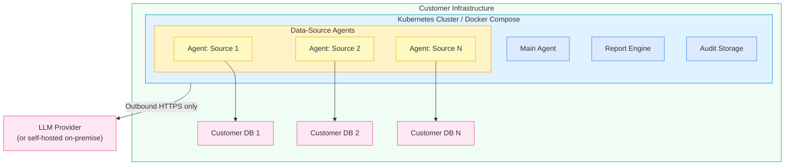

Superatom deploys entirely within your infrastructure as Docker containers. This page covers the compute, storage, and network requirements for a production deployment.

---

## Core Platform Components

| Component | Purpose | Minimum | Recommended |
|-----------|---------|---------|-------------|
| **Main Agent** | Orchestration, routing, query planning, synthesis | 4 vCPU, 16 GB RAM | 8 vCPU, 32 GB RAM |
| **Report Engine** | Scheduled reports, anomaly detection, baseline models | 4 vCPU, 16 GB RAM | 8 vCPU, 32 GB RAM |
| **Audit Storage** | Immutable audit trail | S3-compatible or local filesystem | S3-compatible with lifecycle policies |

<Note>
  The recommended specs support production-scale workloads with concurrent users. Minimum specs are suitable for pilot deployments and proof-of-concept environments.
</Note>

---

## Data-Source Agents

Each connected data source gets its own dedicated agent container. A typical deployment runs 5-20 agents.

| Resource | Per Agent | Notes |
|----------|-----------|-------|
| **Compute** | 1-2 vCPU, 2-4 GB RAM | One agent per data source |
| **Storage** | 1-5 GB | Local memory and query cache. Not shared between agents. |
| **Container runtime** | Docker (minimum), Kubernetes (recommended at scale) | Agents are distributed as Docker containers |
| **Database access** | Read-only credentials to its data source | Write credentials only for explicit Action Agents |

---

## Network Requirements

| Requirement | Detail |
|-------------|--------|
| **Internal network** | All platform components communicate over internal network |
| **Database access** | Agents need network access to their respective databases (internal) |
| **Outbound HTTPS** | To LLM provider API (can be proxied) |
| **Outbound HTTPS** | To Superatom platform for usage telemetry (can be restricted or proxied) |
| **Inbound connections** | None required |
| **Self-hosted LLM** | For air-gapped environments: deploy LLM on-premise for zero outbound traffic |

<Warning>
  Inbound connections are **not** required. All communication is outbound-only. For air-gapped environments, deploy a self-hosted LLM on-premise to eliminate all outbound traffic.
</Warning>

---

## Deployment Architecture

The platform is deployed as Docker containers, orchestrated with Docker Compose (smaller deployments) or Kubernetes with Helm charts (production scale).

---

## Docker Compose vs Kubernetes

<AccordionGroup>
  <Accordion title="Docker Compose">
    Suitable for **pilot deployments**, proof-of-concept environments, and smaller organizations with fewer than 10 data sources and limited concurrent users.

    - Single-host deployment
    - Simpler setup and management
    - Lower operational overhead
    - Manual scaling
  </Accordion>
  <Accordion title="Kubernetes with Helm Charts">
    Recommended for **production deployments** at scale, organizations with many data sources, and environments that require high availability.

    - Multi-node deployment with automatic failover
    - Horizontal scaling of agents and platform components
    - Rolling updates with zero downtime
    - Resource limits and autoscaling policies
    - Integration with existing cluster monitoring and alerting
  </Accordion>
</AccordionGroup>

<Note>
  Both deployment options use the same container images. You can start with Docker Compose for a pilot and migrate to Kubernetes for production without re-implementation.
</Note>

---

## Next Steps

<CardGroup cols={2}>
  <Card
    title="Implementation Phases"
    icon="list-check"
    href="/implementation/phases"
  >
    Detailed phase-by-phase deployment plan
  </Card>
  <Card
    title="Timeline & Responsibilities"
    icon="calendar"
    href="/implementation/timeline"
  >
    Week-by-week schedule and what your team provides
  </Card>
</CardGroup>
