Core implementation takes **6-8 weeks**. An additional 4-week optimization phase follows for performance tuning, expanded use cases, and admin training.

---

## Timeline Summary

| Week | Phase | Status at End of Phase |
|------|-------|----------------------|
| 1-2 | **Phase 1:** Deploy and Connect | Platform deployed. Chat Agent live. Priority questions validated. |
| 2-4 | **Phase 2:** Build Knowledge and Refine | Semantic model enriched. Tribal knowledge captured. Permissions configured. |
| 4-6 | **Phase 3:** Dashboards, Reports, and Workflows | Dashboards shared. Reports scheduled. Workflows configured. Mobile enabled. |
| 6-8 | **Phase 4:** Go-Live and Activation | Full production. Autonomous monitoring live. All teams onboarded. |
| 8-12 | **Phase 5:** Optimization and Expansion | Performance tuned. Additional sources connected. Advanced workflows. Admin trained. |

```mermaid
gantt
    title Implementation Timeline
    dateFormat  X
    axisFormat  Week %s

    section Core
    Phase 1 - Deploy and Connect        :active, p1, 1, 2
    Phase 2 - Build Knowledge and Refine :active, p2, 2, 4
    Phase 3 - Dashboards and Reports     :active, p3, 4, 6
    Phase 4 - Go-Live and Activation     :active, p4, 6, 8

    section Optimization
    Phase 5 - Optimization and Expansion :p5, 8, 12
```

---

## What Your Team Provides

The following table lists every item your organization is responsible for, which team typically owns it, and when it is needed.

| Item | Team | Phase |
|------|------|-------|
| Server/VM resources ([see specs](/implementation/infrastructure)) | IT / Infrastructure | Before Phase 1 |
| Docker or Kubernetes environment | IT / Infrastructure | Before Phase 1 |
| Read-only database credentials per source | DBA | Phase 1 |
| Internal network access from agents to databases | Network | Phase 1 |
| Outbound HTTPS access to LLM provider | Network | Phase 1 |
| SSO / IdP configuration (SAML/OIDC) | IT | Phase 1 |
| 2-3 power users for validation | Business team | Phase 1 |
| Business definitions and tribal knowledge | Domain experts | Phase 2 |
| Dashboard requirements | Business team | Phase 3 |
| Report schedules and distribution lists | Business team | Phase 3 |
| Write credentials for Action Agents (if applicable) | DBA | Phase 3 |
| Approval workflow definitions | Business leadership | Phase 3 |

<Note>
  Most customer responsibilities are one-time setup tasks. Once infrastructure is provisioned and credentials are provided, the Superatom team handles the platform deployment and configuration.
</Note>

---

## Ongoing Operations

After the implementation phases are complete, the platform operates with minimal ongoing administration.

<AccordionGroup>
  <Accordion title="Continuous Improvement">
    The semantic model improves as users ask questions and provide corrections. New tribal knowledge nodes can be added at any time by admin users. Golden paths accumulate for frequently asked questions, reducing response times over time.
  </Accordion>
  <Accordion title="Data Source Onboarding">
    Connecting a new source is a self-service operation: deploy an agent, provide credentials, and the system builds a semantic model automatically. No re-implementation required.
  </Accordion>
  <Accordion title="Platform Updates">
    Superatom provides updated container images on a regular cadence. Your team applies updates on your own schedule using standard container deployment workflows.
  </Accordion>
  <Accordion title="Usage Analytics">
    Built-in visibility into query patterns, feature adoption, accuracy metrics, and areas where additional tribal knowledge would improve results.
  </Accordion>
  <Accordion title="Support Model">
    Superatom provides support using only usage telemetry (query counts, response times, error rates, feature usage). Support does not access customer data, databases, or user queries.
  </Accordion>
</AccordionGroup>

---

## Next Steps

<CardGroup cols={2}>
  <Card
    title="Implementation Phases"
    icon="list-check"
    href="/implementation/phases"
  >
    Detailed breakdown of each phase with deliverables
  </Card>
  <Card
    title="Infrastructure Requirements"
    icon="server"
    href="/implementation/infrastructure"
  >
    Server specs, network, and deployment options
  </Card>
</CardGroup>
