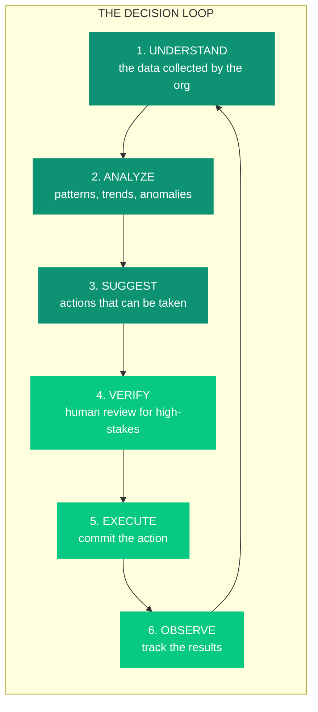
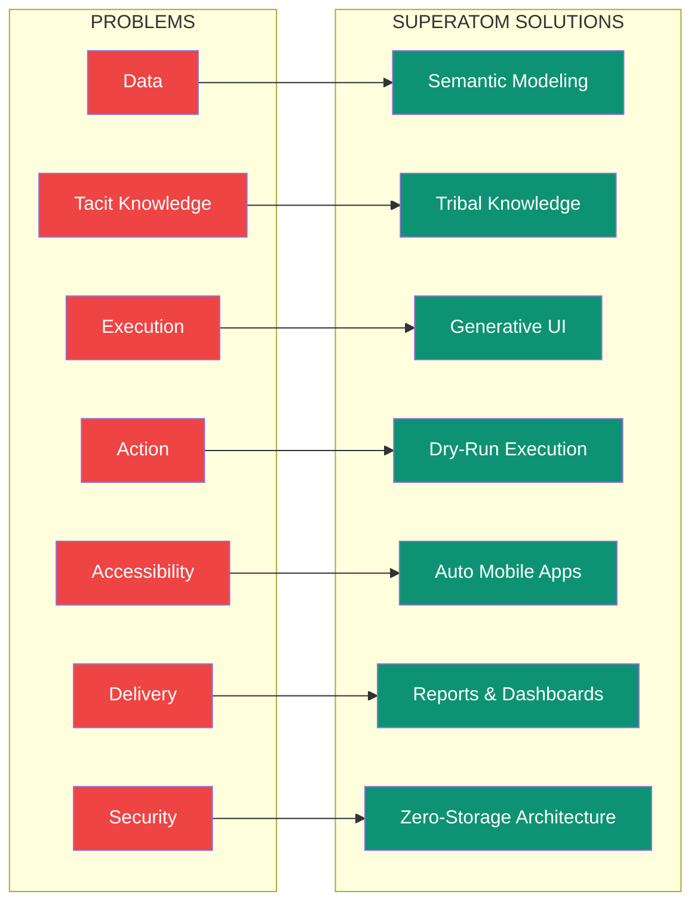

## The Goal

**Enterprises want to make decisions with data.**

Previously, this required a collection of analysts, complex processes, and significant time to analyze information and arrive at decisions. The best organizations had armies of analysts, sophisticated BI tools, and still took days or weeks to answer critical business questions.

**Current AI is remarkably powerful at making decisions—if given quality data.**

But here's the gap: getting quality data into AI, interpreting results correctly, and acting on insights remains extraordinarily difficult for enterprises.

<Note>
Superatom bridges this gap. We don't just answer questions—we create a continuous intelligence loop that understands, analyzes, suggests, verifies, executes, and learns.
</Note>

---

## The Decision Loop

The ideal enterprise decision system operates as a continuous loop:

<Steps>
  <Step title="Understand the Data">
    Connect to all organizational data sources and build a semantic understanding of what the data represents, how it's structured, and how different pieces relate.
  </Step>
  <Step title="Perform Analysis">
    Apply AI-powered analysis to find patterns, detect anomalies, identify trends, and surface insights that matter to the business.
  </Step>
  <Step title="Suggest Actions">
    Based on insights discovered, recommend specific, actionable steps that can address issues or capitalize on opportunities.
  </Step>
  <Step title="Human Verification">
    For high-stakes decisions, present recommendations to humans for review and approval. As confidence builds from historical accuracy, low-stakes decisions can be automated.
  </Step>
  <Step title="Execute Actions">
    Commit approved actions to connected systems—whether that's updating inventory, sending alerts, or triggering workflows.
  </Step>
  <Step title="Observe Results">
    Track the outcomes of actions taken to measure effectiveness and continuously improve future recommendations.
  </Step>
</Steps>

**This loop should run continuously**, with leaders able to ask questions and get insights at any time, connected to action systems, running perpetually.

---

## The Problem

This loop sounds simple. In practice, **seven serious problems** make enterprise adoption nearly impossible:

<CardGroup cols={2}>
  <Card title="1. The Data Problem" icon="database" href="/introduction/problems#the-data-problem">
    Data isn't clean, connected, or contextualized
  </Card>
  <Card title="2. The Tacit Knowledge Problem" icon="head-side-brain" href="/introduction/problems#the-tacit-knowledge-problem">
    Critical knowledge lives in people's heads, not systems
  </Card>
  <Card title="3. The Execution Problem" icon="display" href="/introduction/problems#the-execution-problem">
    Insights need to be accessible, visual, and auditable
  </Card>
  <Card title="4. The Action Problem" icon="play" href="/introduction/problems#the-action-problem">
    AI suggestions don't account for organizational reality
  </Card>
  <Card title="5. The Accessibility Problem" icon="mobile" href="/introduction/problems#the-accessibility-problem">
    Data needs to be available everywhere, not just desktops
  </Card>
  <Card title="6. The Delivery Problem" icon="paper-plane" href="/introduction/problems#the-delivery-problem">
    Insights must come to users, not wait to be queried
  </Card>
  <Card title="7. The Security Problem" icon="shield-halved" href="/introduction/problems#the-security-problem">
    Enterprise data requires enterprise-grade protection
  </Card>
</CardGroup>

---

## The Superatom Approach

Superatom solves each of these problems with specific innovations:

| Problem | Solution | How It Works |
|---------|----------|--------------|
| Data isn't connected | **Semantic Modeling** | AI analyzes schema, samples data, profiles statistics, applies domain knowledge to create a unified semantic model |
| Knowledge is tacit | **Tribal Knowledge** | Capture org-specific knowledge at user, query, and global levels to guide analysis |
| Results aren't consumable | **Generative UI** | Automatically generate the perfect visualization for any data |
| Actions aren't safe | **Dry-Run Execution** | Simulate actions before committing, human review before final execution |
| Access isn't mobile | **Auto Mobile Apps** | Generate iOS/Android apps automatically from your data model |
| Insights aren't proactive | **Reports & Dashboards** | Scheduled delivery, threshold alerts, custom dashboards |
| Security isn't assured | **Zero-Storage Architecture** | Data never leaves your network, ephemeral processing, end-to-end encryption |

---

## What Makes Us Different

<CardGroup cols={3}>
  <Card title="< 3 seconds" icon="gauge-high">
    Average query response time
  </Card>
  <Card title="90-99%" icon="piggy-bank">
    Infrastructure cost reduction
  </Card>
  <Card title="~15 minutes" icon="clock">
    New project setup time
  </Card>
  <Card title="4 LLM Providers" icon="brain-circuit">
    No vendor lock-in
  </Card>
  <Card title="16+ Components" icon="chart-mixed">
    Automatic visualization selection
  </Card>
  <Card title="Zero Data Storage" icon="shield-check">
    Enterprise-grade security
  </Card>
</CardGroup>

---

## Continue Reading

<CardGroup cols={2}>
  <Card
    title="The Seven Problems"
    icon="triangle-exclamation"
    href="/introduction/problems"
  >
    Deep dive into the challenges Superatom solves
  </Card>
  <Card
    title="Core Concepts"
    icon="lightbulb"
    href="/introduction/core-concepts"
  >
    Understand the fundamental concepts
  </Card>
  <Card
    title="Our Innovations"
    icon="flask"
    href="/ip/overview"
  >
    The intellectual property powering Superatom
  </Card>
  <Card
    title="Quickstart"
    icon="rocket"
    href="/introduction/quickstart"
  >
    Get started in 15 minutes
  </Card>
</CardGroup>
