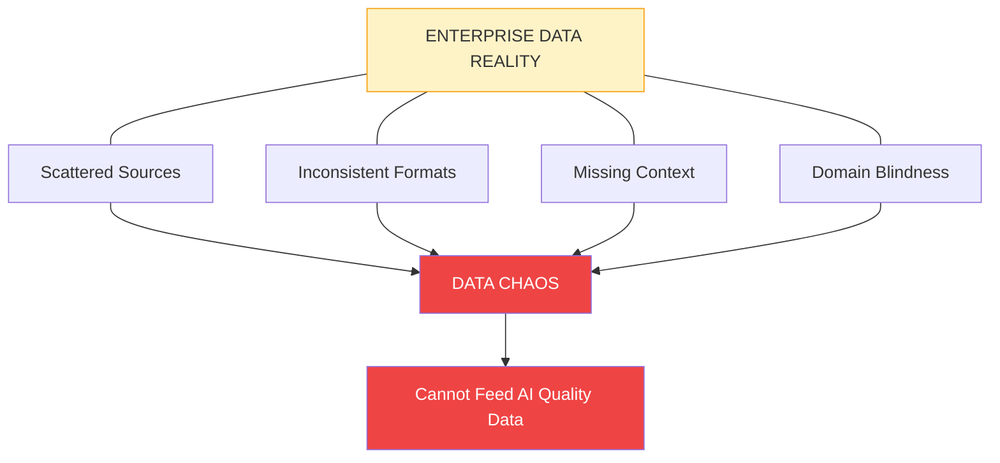
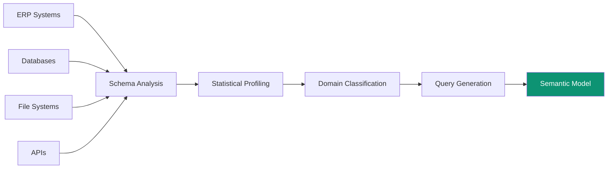
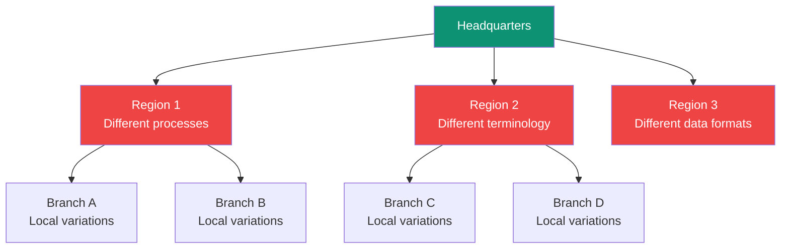
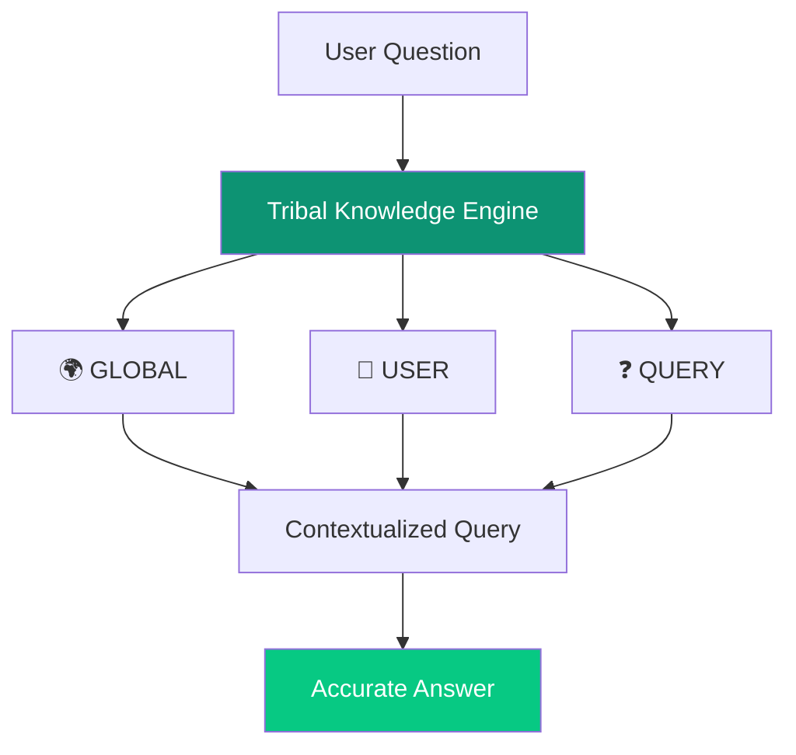
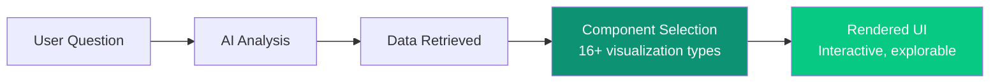
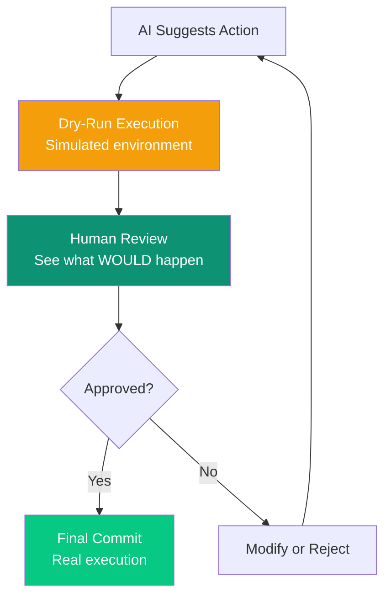
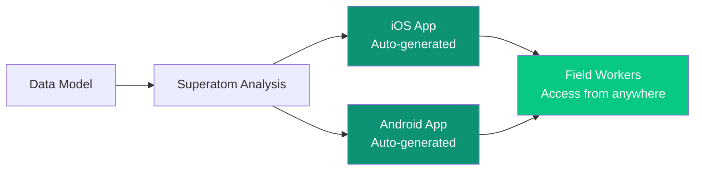
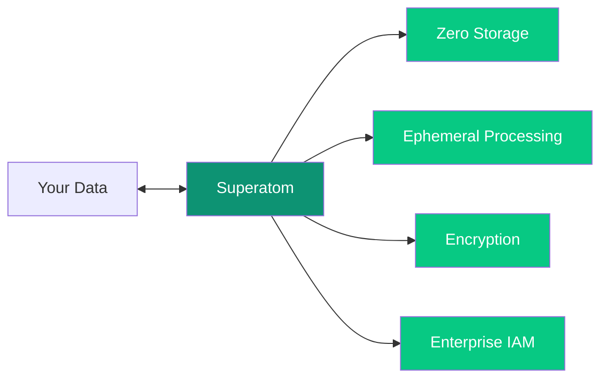
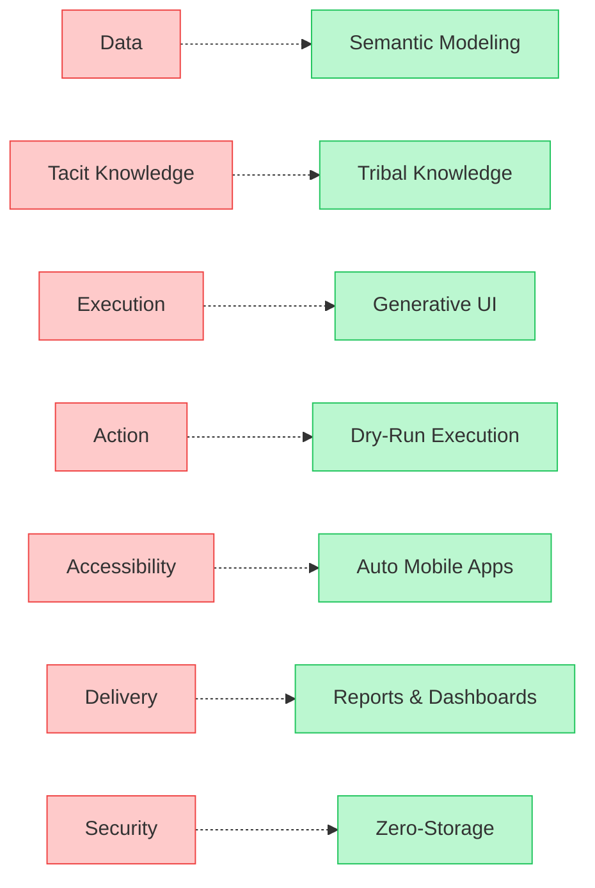

The decision loop sounds simple: understand data, analyze, suggest actions, verify, execute, observe, repeat. In practice, **seven interconnected problems** have made this nearly impossible for enterprises.

<Info>
Each problem builds on the previous. Solving them requires a systemic approach, not point solutions.
</Info>

---

## 1. The Data Problem

<Icon icon="database" size={32} />

**The Challenge:** Enterprise data is messy, disconnected, and lacks context.

### The Sub-Problems

| Issue | Description | Traditional Solution |
|-------|-------------|---------------------|
| **Lack of Collection** | Orgs may not have systematic data collection processes | Expensive consulting engagements |
| **Dirty Data** | Data exists but isn't clean or well-organized | Manual data cleaning teams |
| **Disconnected Sources** | Data from different systems doesn't connect | Custom ETL pipelines |
| **Missing Domain Context** | Numbers without business meaning | Domain experts manually document |

<Warning>
**Problem 1 (Lack of Collection)** is an organizational challenge that Superatom cannot fix. You need data to analyze.
</Warning>

### Superatom's Solution: Automated Semantic Modeling

For Problems 2, 3, and 4, Superatom AI makes sense of your data automatically:

<Tabs>
  <Tab title="Schema Analysis">
    - Analyze database names, table names, column names
    - Detect relationships between tables
    - Identify primary keys and foreign keys
    - Map data types and constraints
  </Tab>
  <Tab title="Statistical Profiling">
    - Sample data from each field
    - Calculate distinct values, max, min, mean, standard deviation
    - Find most common values
    - Detect percentage distributions (yes/no ratios)
  </Tab>
  <Tab title="Domain Classification">
    - Recognize domain context (Supply Chain, Retail, Finance, etc.)
    - Apply domain-specific interpretation rules
    - Connect industry-standard terminology
  </Tab>
  <Tab title="Query Generation">
    - Generate common questions for the data type
    - Create high-level system understanding
    - Build queryable knowledge base
  </Tab>
</Tabs>

<Note>
This analysis typically takes ~2 days for a complex enterprise database. It learns patterns and can be re-run periodically to capture data drift and evolution.
</Note>

---

## 2. The Tacit Knowledge Problem

<Icon icon="head-side-brain" size={32} />

**The Challenge:** Critical business knowledge exists only in people's heads.

### Three Types of Hidden Knowledge

<CardGroup cols={3}>
  <Card title="Institutional Knowledge" icon="building">
    How things work in *this* organization. Unwritten rules, cultural norms, political realities.
  </Card>
  <Card title="Experiential Knowledge" icon="graduation-cap">
    Learned through doing, never documented. "We tried that in 2019, it doesn't work here."
  </Card>
  <Card title="Operational Knowledge" icon="gears">
    How things *actually* work day-to-day, not how the manual says they should work.
  </Card>
</CardGroup>

### The Geographic Complexity

Different departments, branches, and geographies interpret data differently. A "sale" in Region 1 might include returns; in Region 2, it might not. Without this context, analysis is meaningless.

### Superatom's Solution: Tribal Knowledge System

Superatom captures organization-specific knowledge at **three levels**:

| Level | Example | Effect |
|-------|---------|--------|
| **Global** | "Sales always exclude returns" | Applies to all queries for all users |
| **User** | "Show me only West Coast data" | This user always sees filtered view |
| **Query** | "When I ask about 'deadstock', include items with no sales in 12 months" | Specific definition for specific questions |

---

## 3. The Execution Problem

<Icon icon="display" size={32} />

**The Challenge:** Even when you have insights, presenting them to business users is hard.

### What Business Users Need

<AccordionGroup>
  <Accordion title="No SQL Required" icon="code">
    Business users should never write database queries. They should ask questions in plain English.
  </Accordion>
  <Accordion title="Visual, Not Textual" icon="chart-pie">
    Raw text and tables create cognitive overload. Data must be visualized in ways that make sense instantly.
  </Accordion>
  <Accordion title="Transparency" icon="eye">
    Users need to see *how* analysis was done. What query ran? What data was included?
  </Accordion>
  <Accordion title="Follow-up Capability" icon="comments">
    One question leads to another. Users need to drill down, ask follow-ups, explore tangents.
  </Accordion>
  <Accordion title="Save and Share" icon="share-nodes">
    Useful insights should be bookmarkable and shareable with colleagues.
  </Accordion>
  <Accordion title="Deterministic Results" icon="equals">
    The same question should give the same answer. Consistency builds trust.
  </Accordion>
  <Accordion title="Audit Trail" icon="clipboard-list">
    Who asked what, when, and what data was retrieved? Complete accountability.
  </Accordion>
  <Accordion title="Access Control" icon="lock">
    Different users should see different data based on their permissions.
  </Accordion>
</AccordionGroup>

### Superatom's Solution: Generative UI

Superatom pioneered **Generative UI**—automatically creating the perfect visualization for any data:

<Frame>
  
</Frame>

| Component Type | Use Case | Auto-Selected When |
|----------------|----------|-------------------|
| Bar Chart | Comparisons, rankings | Categorical data with values |
| Line Chart | Trends over time | Time-series data |
| Pie Chart | Part-to-whole | Percentage distributions |
| KPI Card | Single metrics | Aggregate values |
| Data Table | Detailed records | Row-level data needed |
| Gauge | Progress metrics | Single value with target |
| Map | Geographic data | Location-based fields detected |

---

## 4. The Action Problem

<Icon icon="play" size={32} />

**The Challenge:** Knowing *why* something is happening is good. Knowing *how to fix it* is essential.

### Why AI Suggestions Often Fail

<CardGroup cols={3}>
  <Card title="Domain Expertise Gap" icon="brain">
    AI isn't as intelligent as humans in specific domains. Generic suggestions miss nuance.
  </Card>
  <Card title="Organizational Blindness" icon="building">
    AI doesn't know what's *possible* in your organization. Suggestions may be impractical, costly, or politically impossible.
  </Card>
  <Card title="Accountability Gap" icon="scale-balanced">
    AI is non-deterministic—it can make mistakes. Who's responsible when it does?
  </Card>
</CardGroup>

### Superatom's Solution: Dry-Run Execution

Superatom implements a **simulation-first approach**:

**How it works:**

1. **AI suggests an action** (e.g., "Transfer 500 units from Warehouse A to B")
2. **Action is committed to a simulated system**—you see exactly what would happen
3. **Human reviews the simulation**—costs, impacts, side effects
4. **Human approves or rejects**—maintaining accountability
5. **Only then is the action executed** in the real system

<Note>
As confidence builds from historical accuracy, low-stakes decisions can be automated—but humans always have the option to intervene.
</Note>

---

## 5. The Accessibility Problem

<Icon icon="mobile" size={32} />

**The Challenge:** Not all data is accessible everywhere. Field workers need insights too.

A warehouse manager needs to see KPIs and take actions from the warehouse floor—but they don't have an office setup with them. Traditional solution: build mobile apps. Traditional problem: **mobile apps are expensive and time-consuming**.

### Superatom's Solution: Auto-Generated Mobile Apps

Superatom automatically generates **iOS and Android applications** from your data analysis:

<Frame>
  
</Frame>

- **Thin clients** with restricted, specific functionality
- **Role-based** views and actions
- **Offline capable** for disconnected environments
- **Zero development cost**—generated automatically

---

## 6. The Delivery Problem

<Icon icon="paper-plane" size={32} />

**The Challenge:** Users can't constantly monitor dashboards. Insights need to come to them.

<Tabs>
  <Tab title="The Problem">
    - Users can't keep looking at KPIs all day
    - Can't keep asking questions to a conversational AI
    - Need proactive notification when things change
    - Different users want different views and schedules
  </Tab>
  <Tab title="What Users Need">
    - Weekly metrics delivered to email automatically
    - Alerts when thresholds are exceeded
    - Custom dashboards with personalized views
    - Scheduled reports in their preferred format
  </Tab>
</Tabs>

### Superatom's Solution: Reports & Dashboards

<Frame>
  
</Frame>

| Feature | Description |
|---------|-------------|
| **Dashboards** | Build custom dashboards with permission-based access |
| **Scheduled Reports** | Automatic delivery at pre-defined intervals |
| **Threshold Alerts** | Notifications when metrics cross boundaries |
| **Custom Formats** | PDF, CSV, interactive links |
| **Distribution Lists** | Send to individuals, teams, or roles |

---

## 7. The Security Problem

<Icon icon="shield-halved" size={32} />

**The Challenge:** This is the #1 reason enterprises hesitate to adopt AI systems.

### Enterprise Security Concerns

<Warning>
When you employ a person, you control what they see and how they report. Programs have the potential to be leaked. AI has additional risks.
</Warning>

| Concern | Description |
|---------|-------------|
| **Data Leakage** | Programs can be exploited to leak sensitive data |
| **AI Hallucinations** | AI can generate false information, affecting data integrity |
| **Prompt Injection** | Malicious prompts can change AI behavior, damage systems, or extract unauthorized data |
| **Access Control** | Difficulty ensuring users only see what they're authorized to see |

### Superatom's Solution: Zero-Storage Architecture

| Security Feature | Implementation |
|------------------|----------------|
| **Zero Storage** | Superatom NEVER stores your data anywhere. Deployed entirely within your enterprise network. |
| **Ephemeral Processing** | Data is deleted immediately after analysis. No persistence, no leak possibility. |
| **Encrypted Connections** | All connections end-to-end encrypted. Can be severed instantly. |
| **Enterprise IAM** | Role-based permissions. Only explicitly authorized users can access. Okta/Office 365 integration coming. |

---

## The Connected Solution

These seven problems are interconnected, and so are Superatom's solutions:

<Card title="Continue to Our Innovations" icon="flask" href="/ip/overview">
  Learn about the intellectual property that powers these solutions
</Card>
