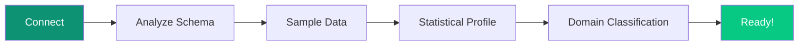

## Prerequisites

<CardGroup cols={2}>
  <Card title="Workspace Access" icon="key">
    Your Superatom workspace URL and credentials
  </Card>
  <Card title="Data Source" icon="database">
    Connection details for at least one database
  </Card>
</CardGroup>

---

## Step 1: Log In

Navigate to your Superatom workspace URL and log in with your credentials or enterprise SSO.

<Frame caption="Login to the Superatom AI platform">
  
</Frame>

After logging in, you'll see the home page where you can create and manage projects:

<Frame caption="Home page — create and manage projects">
  
</Frame>

<Frame caption="Create a new project">
  
</Frame>

You'll see the main interface with the sidebar navigation:

| Section | Purpose |
|---------|---------|
| **BUILD** | Create interfaces, dashboards, reports |
| **SYSTEM** | Configure knowledge, actions, users |
| **MONITOR** | Analytics and logs |
| **DEVELOPERS** | API docs, keys, integrations |

---

## Step 2: Connect a Data Source

<Steps>
  <Step title="Navigate to Knowledge Base">
    Click **Knowledge Base** → **Data Sources** in the sidebar
  </Step>
  <Step title="Click Add Connection">
    Select your database type
  </Step>
  <Step title="Enter Connection Details">
    ```
    Host: your-database-host.com
    Port: 5432
    Database: your_database
    Username: your_username
    Password: ********
    ```
  </Step>
  <Step title="Test Connection">
    Verify connectivity before saving
  </Step>
  <Step title="Save">
    Connection is established
  </Step>
</Steps>

<Frame caption="Supported database types">
  
</Frame>

---

## Step 3: Wait for Analysis

Superatom automatically analyzes your connected data:



This typically takes 2-5 minutes for a medium-sized database. You'll be notified when complete.

---

## Step 4: Ask Your First Question

Navigate to **UIs / Chat Agent** and ask a question:

<Tabs>
  <Tab title="Simple">
    ```
    What tables are in my database?
    ```
  </Tab>
  <Tab title="Business">
    ```
    Show me total sales by category
    ```
  </Tab>
  <Tab title="Analysis">
    ```
    Which products have declining sales?
    ```
  </Tab>
</Tabs>

### What Happens

1. **AI understands** your intent
2. **SQL is generated** automatically
3. **Query executes** against your database
4. **Visualization selected** based on results
5. **Response streams** in real-time

<Frame caption="AI-generated analysis with visualization">
  
</Frame>

---

## Step 5: Explore Further

### Follow-Up Questions

After each response, you'll see suggested follow-ups:
- *"Break down by region"*
- *"Compare to last quarter"*
- *"What's driving this trend?"*

Click any suggestion or type your own follow-up.

### Save Useful Insights

Found something valuable?

1. Click the **bookmark icon** to save
2. Add to a **dashboard** for ongoing monitoring
3. Create a **scheduled report** for delivery

---

## Step 6: Add Knowledge (Optional)

Make the AI smarter about YOUR organization:

<Steps>
  <Step title="Go to Knowledge Graphs">
    Navigate to **Knowledge Base** → **Knowledge Graphs**
  </Step>
  <Step title="Create a Node">
    Click **+ Create Node**
  </Step>
  <Step title="Add Business Rules">
    ```yaml
    Title: Sales Definition
    Type: Global

    Description: |
      Sales figures should always exclude:
      - Internal transfers
      - Returns and refunds
      - Demo units
    ```
  </Step>
  <Step title="Save">
    Now all queries respect this rule
  </Step>
</Steps>

<Frame caption="Knowledge node management">
  
</Frame>

---

## What's Next?

<CardGroup cols={2}>
  <Card
    title="Build a Dashboard"
    icon="grid-2"
    href="/platform/dashboards"
  >
    Combine multiple visualizations
  </Card>
  <Card
    title="Create a Report"
    icon="file-lines"
    href="/platform/reports"
  >
    Schedule automated delivery
  </Card>
  <Card
    title="Set Up Alerts"
    icon="bell"
    href="/platform/actions"
  >
    Get notified when metrics change
  </Card>
  <Card
    title="Add More Data"
    icon="database"
    href="/platform/knowledge-base"
  >
    Connect additional sources
  </Card>
</CardGroup>

---

## Need Help?

- **Documentation** — You're in the right place
- **Support** — support@superatom.ai
- **Community** — Join our Slack workspace
