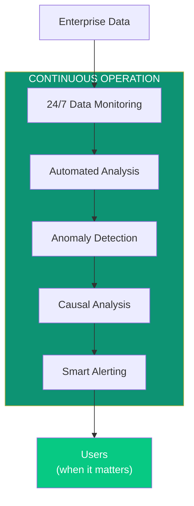
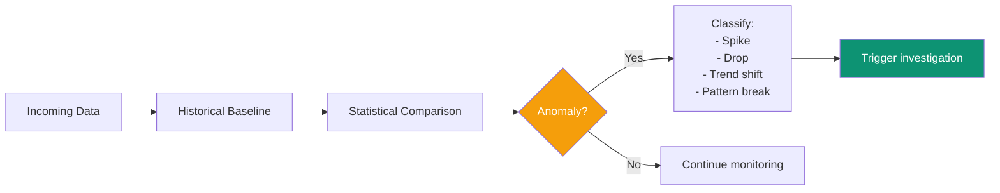
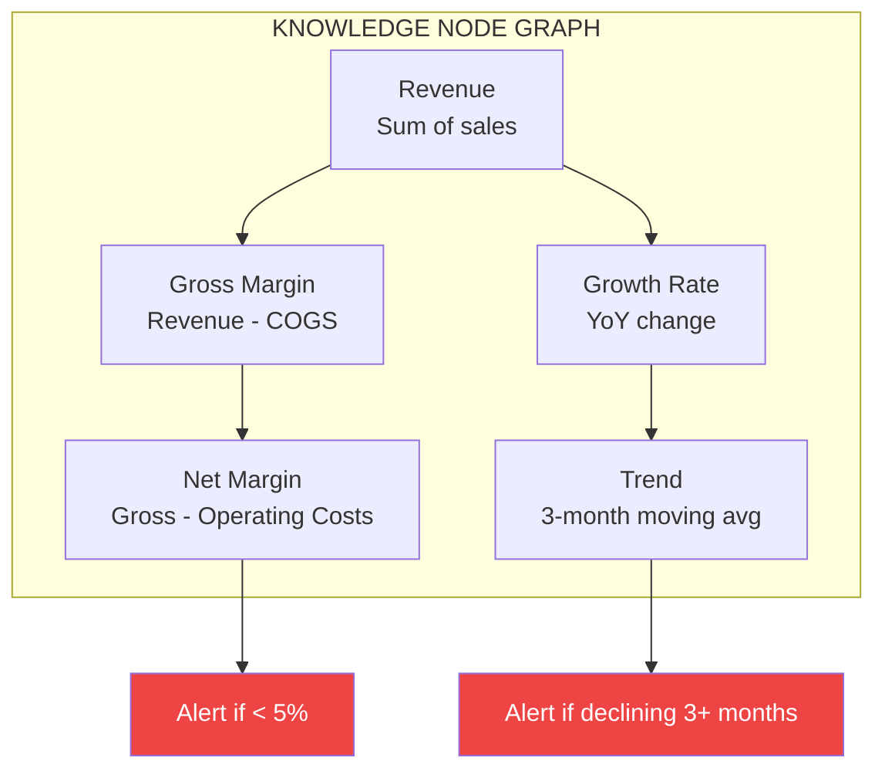
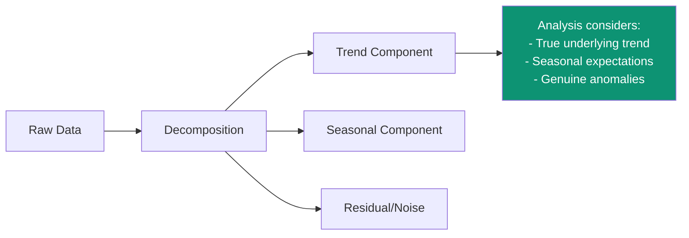
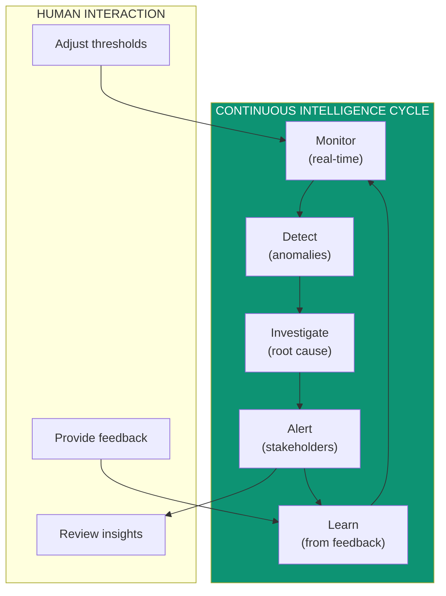
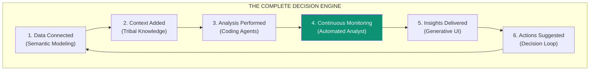

## The Problem with On-Demand Analysis

Traditional analytics—including conversational AI—only works when someone asks a question.

**What happens when no one's asking?**

- Anomalies go undetected
- Opportunities slip by
- Problems compound until they're crises
- Patterns emerge and disappear unseen

**Superatom's Automated Analyst runs continuously**, monitoring your data, surfacing insights, and alerting you to what matters—even at 3 AM on a Sunday.

---

## The Automated Analyst System



---

## Core Capabilities

### 1. Continuous Monitoring

The system watches key metrics automatically:

| What's Monitored | How Often | Alert Conditions |
|-----------------|-----------|------------------|
| Revenue trends | Hourly | > 10% deviation from forecast |
| Inventory levels | Real-time | Below safety stock |
| Margin metrics | Daily | Negative or declining |
| Customer behavior | Daily | Churn risk indicators |
| Operational KPIs | Configurable | Threshold breaches |

### 2. Anomaly Detection



**Detection Methods:**
- Statistical outlier detection (z-score, IQR)
- Time-series decomposition (trend, seasonality, residual)
- Machine learning pattern recognition
- Domain-specific rules (tribal knowledge)

### 3. Causal Analysis

When something changes, the system automatically investigates **why**:

<Tabs>
  <Tab title="Variable Tracking">
    Track which variables changed when outcomes changed:

    ```
    Revenue dropped 15% last week

    CAUSAL ANALYSIS:
    - Order volume: -8% (contributing -12% to revenue)
    - Average order value: -5% (contributing -3% to revenue)
    - Return rate: +2% (negligible impact)

    ROOT CAUSE: Order volume decline
    DRILL DOWN: New customer acquisition -40%
    ```
  </Tab>
  <Tab title="Dependency Mapping">
    Understand what depends on what:

    ```mermaid
    flowchart TD
        REVENUE["Revenue"] --> ORDERS["Order Volume"]
        REVENUE --> AOV["Avg Order Value"]

        ORDERS --> NEW["New Customers"]
        ORDERS --> RETURNING["Returning Customers"]

        NEW --> MARKETING["Marketing Spend"]
        NEW --> CONVERSION["Website Conversion"]

        style MARKETING fill:#ef4444,color:#fff
    ```

    Automatically identifies: Marketing spend dropped → Fewer new customers → Lower order volume → Revenue decline
  </Tab>
  <Tab title="Counterfactuals">
    What would have happened if...?

    ```
    COUNTERFACTUAL ANALYSIS:

    Actual revenue: $1.2M

    IF marketing had stayed constant:
    → Estimated revenue: $1.38M
    → Impact: $180K loss from marketing reduction

    IF conversion rate improved 1%:
    → Estimated revenue: $1.25M
    → Potential gain: $50K
    ```
  </Tab>
</Tabs>

### 4. Knowledge Nodes

The Automated Analyst uses **Knowledge Nodes**—fundamental building blocks that define how computations work:



Each node knows:
- How to calculate its value
- What it depends on
- When to alert
- How to explain changes

---

## Automated Actions

<Frame>
  
</Frame>

### Action Types

| Action | Description | Example |
|--------|-------------|---------|
| **Daily KPI Summary** | Executive summary of business health | Every morning at 7 AM |
| **Anomaly Alert** | Immediate notification of issues | Revenue drop > 10% |
| **Trend Warning** | Emerging patterns that need attention | 3 consecutive weeks of margin decline |
| **Opportunity Signal** | Positive patterns to capitalize on | Product X sales surging in Region Y |

### Action Configuration

```yaml
automated_action:
  name: "Revenue Anomaly Detection"
  type: "financial_intelligence"

  trigger:
    metric: "daily_revenue"
    condition: "variance > 15% OR variance < -10%"

  schedule:
    frequency: "hourly"
    active_hours: "24/7"

  actions:
    - generate_dashboard
    - send_email_alert
    - create_investigation_task

  recipients:
    - role: "Finance Team"
    - user: "cfo@company.com"

  intelligence:
    - include_causal_analysis: true
    - include_recommendations: true
    - historical_context: "30 days"
```

---

## Time-Based Intelligence

### Temporal Query Understanding

The Automated Analyst understands time in business context:

| Query Type | Example | System Behavior |
|-----------|---------|-----------------|
| **Point-in-time** | "What was inventory on Jan 1?" | Snapshot query |
| **Period comparison** | "Compare Q4 to Q3" | Fiscal-aware comparison |
| **Trend analysis** | "How has margin trended?" | Time-series with seasonality |
| **Forecast** | "What will revenue be next month?" | Predictive modeling |
| **Counterfactual** | "What if we hadn't raised prices?" | Causal inference |

### Seasonality Awareness



The system knows that a December sales spike isn't an anomaly—but a December spike that's 30% below last December IS.

---

## Always-On Intelligence



**The system gets smarter over time:**
- False positive alerts? Thresholds adjusted.
- Missed important events? Detection rules refined.
- User feedback incorporated into future analysis.

---

## Business Impact

### From Reactive to Proactive

| Traditional | With Automated Analyst |
|-------------|----------------------|
| Discover problems in monthly review | Know about problems in minutes |
| Investigate manually when asked | Root cause analysis automatic |
| Miss patterns between reports | Continuous pattern detection |
| Rely on analyst availability | 24/7 monitoring |

### ROI Examples

<CardGroup cols={2}>
  <Card title="Early Anomaly Detection" icon="bell">
    Detected inventory discrepancy 3 days earlier than manual review would have.

    **Saved:** $45K in potential stockout costs
  </Card>
  <Card title="Margin Erosion Alert" icon="chart-line-down">
    Identified supplier cost increase affecting margins before quarterly close.

    **Action:** Renegotiated contract, recovered 2% margin
  </Card>
  <Card title="Opportunity Surfacing" icon="lightbulb">
    Detected regional demand surge for understock product.

    **Result:** Expedited shipment, captured $120K additional revenue
  </Card>
  <Card title="Time Savings" icon="clock">
    Automated daily KPI summary replaces 2 hours of analyst work.

    **Annual savings:** 500+ analyst hours
  </Card>
</CardGroup>

---

## The Complete Vision

The Automated Analyst is the final piece that closes the decision loop:



**Top leaders in the organization can just ask questions and get insights. We connect it to action systems. And it runs in a loop.**

---

## Next Steps

<CardGroup cols={2}>
  <Card
    title="Platform: Actions"
    icon="play"
    href="/platform/actions"
  >
    See automated actions in the platform
  </Card>
  <Card
    title="Security Overview"
    icon="shield"
    href="/security/overview"
  >
    How we protect your data while monitoring
  </Card>
</CardGroup>
