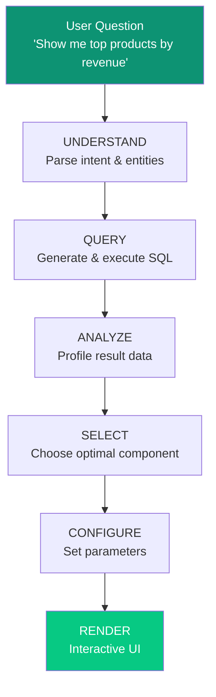
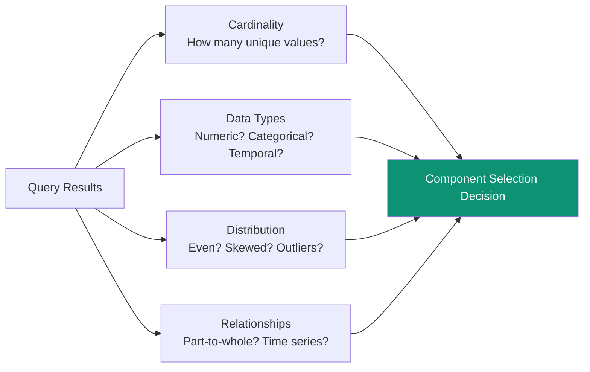
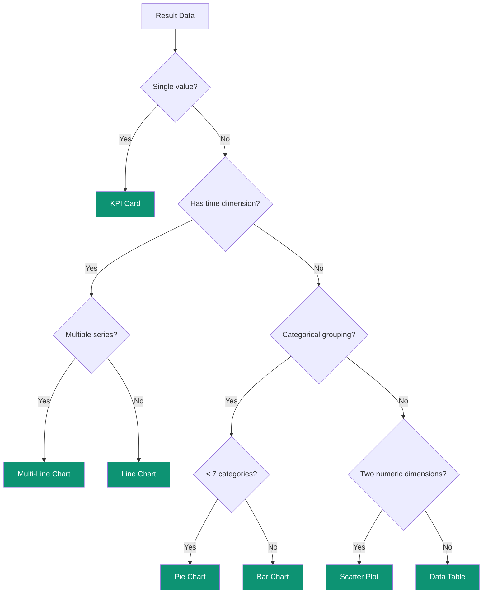
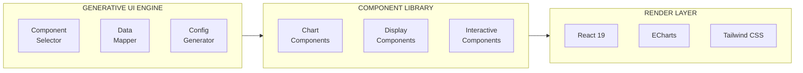

<Note>
**Superatom pioneered Generative UI.** We were first to market with the ability to automatically generate interactive UI components from raw data sources.
</Note>

## The Problem

Business users need to see data in visual formats, but:

- Building custom dashboards is **expensive** ($10K+ per dashboard)
- Each new question requires **development work**
- Pre-built dashboards become **stale** as business needs change
- Users are **limited** to what's already been built

Traditional approach: Teams of BI developers building static dashboards.

**Superatom approach: AI generates the perfect visualization instantly for any query.**

---

## How Generative UI Works



### Stage 1: Understanding Intent

The AI parses the natural language question to extract:

| Element | Example | Purpose |
|---------|---------|---------|
| **Metric** | "revenue" | What to measure |
| **Dimension** | "products" | How to group |
| **Filter** | "this quarter" | What to include |
| **Sort** | "top" | How to order |
| **Limit** | "10" | How many |

### Stage 2: Query Generation

SQL is generated and executed against your semantic model:

```sql
SELECT
    product_name,
    SUM(revenue) as total_revenue
FROM sales
WHERE sale_date >= DATE_TRUNC('quarter', CURRENT_DATE)
GROUP BY product_name
ORDER BY total_revenue DESC
LIMIT 10
```

### Stage 3: Data Analysis

Before visualization, we analyze the result set:



### Stage 4: Component Selection

Based on data characteristics, the optimal visualization is chosen:

<Tabs>
  <Tab title="Selection Logic">
    | Data Pattern | Selected Component | Reasoning |
    |--------------|-------------------|-----------|
    | Single value | KPI Card | Clear metric display |
    | Categorical + values | Bar Chart | Easy comparison |
    | Time series | Line Chart | Shows trends |
    | Part-to-whole | Pie/Donut Chart | Proportion visualization |
    | Multi-dimensional | Radar Chart | Complex comparison |
    | Geographic | Map Chart | Spatial context |
    | Hierarchical | Treemap | Nested relationships |
    | Detailed records | Data Table | Full information |
  </Tab>
  <Tab title="Component Library">
    **16 Component Types:**

    **Charts (8)**
    - Bar Chart (horizontal/vertical)
    - Line Chart (single/multi-series)
    - Pie/Donut Chart
    - Scatter Plot
    - Gauge Chart
    - Radar Chart
    - Treemap
    - Heatmap

    **Data Display (3)**
    - KPI Card
    - Data Table
    - Map Chart

    **Interactive (5)**
    - Form
    - Filter Dropdown
    - Action Button
    - Action Container
    - Multi-Component Layout
  </Tab>
</Tabs>

### Stage 5: Configuration

Each component is configured with:

- **Color schemes** based on data semantics (red for negative, green for positive)
- **Axis labels** derived from column names
- **Tooltips** with relevant details
- **Legends** for multi-series data
- **Interactivity** (click, hover, drill-down)

### Stage 6: Rendering

The final component is rendered as an interactive React component with:

- Real-time responsiveness
- Export capabilities (PNG, CSV)
- Bookmark/save functionality
- Drill-down options
- Follow-up question suggestions

---

## Visual Examples

### From Question to Visualization

<Frame caption="Customer Segmentation Analysis - automatically generated from query">
  
</Frame>

This dashboard was generated from the question: *"Analyze customer behavior and lifetime value across segments"*

The system automatically:
1. Selected a **donut chart** for customer distribution (categorical proportions)
2. Selected a **bar chart** for lifetime value comparison (categorical + values)
3. Created **KPI cards** for key segment metrics (single values)
4. Arranged components in a logical layout

---

## The Intelligence Behind Selection

### Decision Tree Example



### Contextual Adaptation

The same data can be visualized differently based on context:

| Question | Data | Visualization | Why |
|----------|------|---------------|-----|
| "What were sales last month?" | $1.2M | KPI Card | Single metric emphasis |
| "How do regions compare?" | 5 regions with values | Bar Chart | Comparison focus |
| "What's the sales breakdown?" | 5 regions with % | Pie Chart | Part-to-whole focus |
| "Show the trend" | 12 months of data | Line Chart | Temporal pattern |

---

## Technical Implementation

### Component Architecture



### Technology Stack

| Layer | Technology | Purpose |
|-------|------------|---------|
| Framework | React 19 | Modern reactive rendering |
| Charts | ECharts | High-performance visualization |
| Styling | Tailwind CSS | Consistent, responsive design |
| State | MobX | Reactive state management |
| Streaming | WebSocket | Real-time updates |

---

## Why This Matters

### Business Impact

<CardGroup cols={2}>
  <Card title="Zero Development Cost" icon="dollar-sign">
    No dashboard development needed. Every question gets a custom visualization instantly.
  </Card>
  <Card title="Unlimited Flexibility" icon="infinity">
    Users aren't limited to pre-built views. Any question, any visualization.
  </Card>
  <Card title="Always Current" icon="clock">
    No stale dashboards. Every visualization is generated fresh from live data.
  </Card>
  <Card title="Democratized Access" icon="users">
    Business users don't need to know SQL or BI tools. Just ask questions.
  </Card>
</CardGroup>

### Competitive Advantage

| Metric | Traditional BI | Superatom Generative UI |
|--------|---------------|-------------------------|
| Time to new visualization | Days-weeks | Seconds |
| Cost per visualization | $1,000-10,000 | $0 marginal |
| Required expertise | BI developer | None |
| Visualization variety | Limited to pre-built | Unlimited |

---

## Next Steps

<CardGroup cols={2}>
  <Card
    title="Tribal Knowledge"
    icon="brain"
    href="/ip/tribal-knowledge"
  >
    Adding organizational context to visualizations
  </Card>
  <Card
    title="Platform: Chat Agent"
    icon="message"
    href="/platform/chat-agent"
  >
    See Generative UI in action
  </Card>
</CardGroup>
