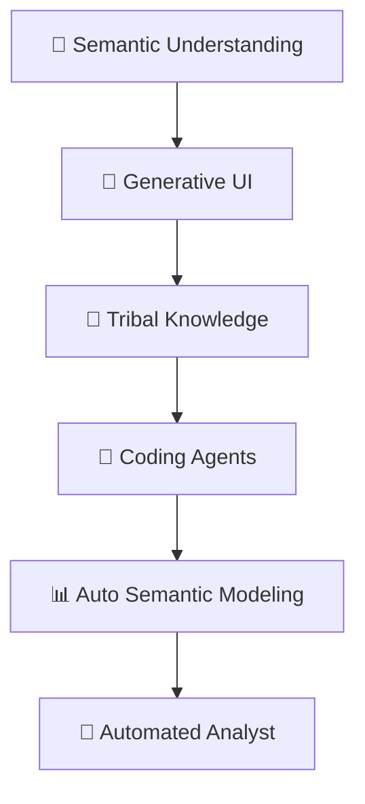
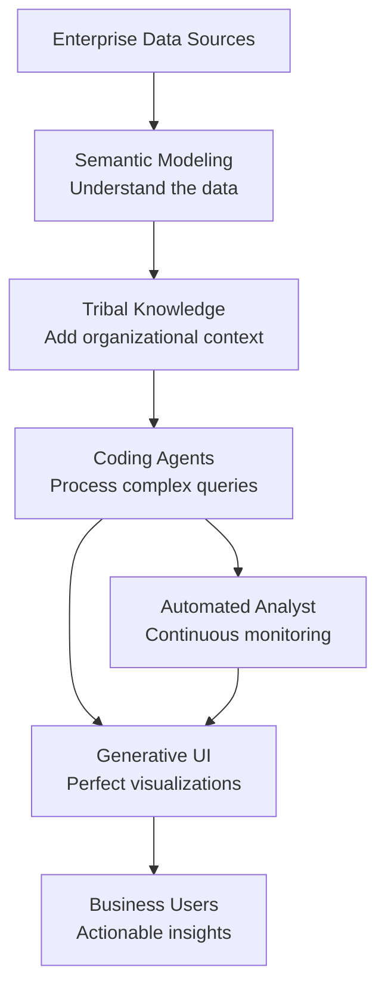

Superatom has developed **six core innovations** that together create an enterprise AI platform unlike anything else in the market. Each innovation addresses specific challenges and represents years of research and development.

---

## The Six Innovations

<CardGroup cols={2}>
  <Card title="1. Multi-Source Semantic Understanding" icon="link" href="/ip/semantic-modeling">
    **The Problem:** Enterprise data is scattered across ERPs, databases, files, and APIs with no unified meaning.

    **Our Innovation:** A system that automatically connects multiple data sources, analyzes their structure, and creates a unified semantic model that understands how every piece relates to every other piece.

    *Analysis typically takes ~2 days and continuously improves.*
  </Card>

  <Card title="2. Generative UI" icon="wand-magic-sparkles" href="/ip/generative-ui">
    **The Problem:** Raw data is unusable by business users. Building custom visualizations is slow and expensive.

    **Our Innovation:** We pioneered Generative UI, automatically generating interactive UI components from raw data. The system selects the perfect visualization type and renders it instantly.

    *We were first to market with this technology.*
  </Card>

  <Card title="3. Tribal Knowledge System" icon="brain" href="/ip/tribal-knowledge">
    **The Problem:** Critical organizational knowledge exists only in people's heads. AI can't access it.

    **Our Innovation:** Knowledge Nodes that can be attached at three levels (global, user, query) to guide how analysis is performed. This allows the decision engine to be curated for any domain.

    *Makes AI understand how YOUR organization works.*
  </Card>

  <Card title="4. Coding Agents for Enterprise" icon="robot" href="/ip/coding-agents">
    **The Problem:** Coding agents are powerful but don't understand enterprise data contexts.

    **Our Innovation:** We've figured out how to use coding agents for full-form analysis and decision-making in complex enterprise data contexts. This IP enables us to work with any domain and dataset.

    *The key to universal applicability.*
  </Card>

  <Card title="5. Automated Semantic Modeling" icon="diagram-project" href="/ip/semantic-modeling#automated-modeling">
    **The Problem:** Semantic modeling requires high-level experts and domain knowledge specialists. It's expensive and slow.

    **Our Innovation:** A system that automatically creates semantic knowledge from data and generates the queries you can run against it. As we add more domain knowledge, setup cost approaches zero.

    *Zero-setup for new organizations.*
  </Card>

  <Card title="6. Automated Analyst" icon="chart-line" href="/ip/automated-analyst">
    **The Problem:** Analysis only happens when someone asks. Insights are missed when no one's looking.

    **Our Innovation:** An automated analyst that runs continuously, performing causal analysis, tracking variable changes, identifying dependencies, running counterfactuals, and surfacing insights 24/7.

    *Intelligence that never sleeps.*
  </Card>
</CardGroup>

---

## How They Work Together

These innovations aren't isolated. They form an integrated system:

| Innovation | Feeds Into | Receives From |
|------------|-----------|---------------|
| Semantic Modeling | Tribal Knowledge, Coding Agents | Raw Data Sources |
| Tribal Knowledge | Coding Agents, Automated Analyst | Semantic Model, User Input |
| Coding Agents | Generative UI, Automated Analyst | Semantic Model, Tribal Knowledge |
| Automated Analyst | Generative UI | Coding Agents, Tribal Knowledge |
| Generative UI | Business Users | Coding Agents, Automated Analyst |

---

## Competitive Moat

These innovations create significant barriers to entry:

<Steps>
  <Step title="Years of Development">
    Each innovation represents extensive R&D. Competitors would need years to replicate.
  </Step>
  <Step title="Integrated System">
    The innovations work together synergistically. Individual components wouldn't achieve the same results.
  </Step>
  <Step title="Domain Knowledge Accumulation">
    As we add more verticals and domain knowledge, our semantic modeling becomes more powerful, creating a flywheel effect.
  </Step>
  <Step title="First-Mover Advantage">
    We pioneered Generative UI and enterprise coding agents. Market position compounds over time.
  </Step>
</Steps>

---

## Deep Dives

<CardGroup cols={2}>
  <Card
    title="Semantic Modeling"
    icon="link"
    href="/ip/semantic-modeling"
  >
    How we make sense of disconnected enterprise data
  </Card>
  <Card
    title="Generative UI"
    icon="wand-magic-sparkles"
    href="/ip/generative-ui"
  >
    Automatically creating perfect visualizations
  </Card>
  <Card
    title="Tribal Knowledge"
    icon="brain"
    href="/ip/tribal-knowledge"
  >
    Capturing organizational wisdom in AI
  </Card>
  <Card
    title="Coding Agents"
    icon="robot"
    href="/ip/coding-agents"
  >
    AI agents that understand enterprise context
  </Card>
  <Card
    title="Automated Analyst"
    icon="chart-line"
    href="/ip/automated-analyst"
  >
    Continuous intelligence that never sleeps
  </Card>
</CardGroup>
