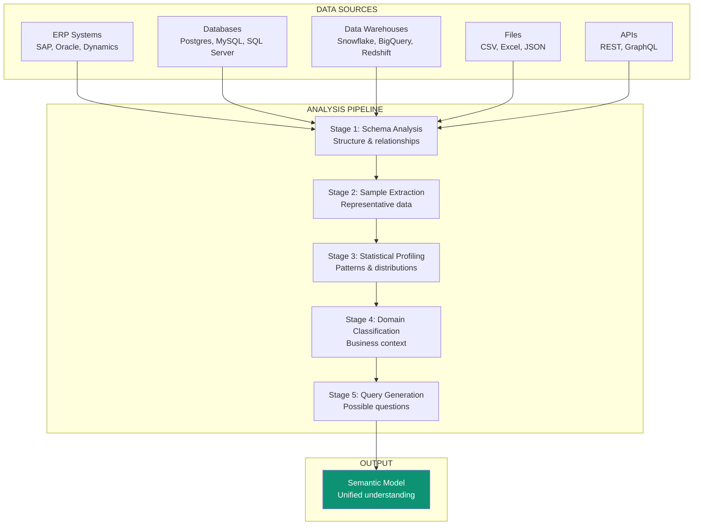
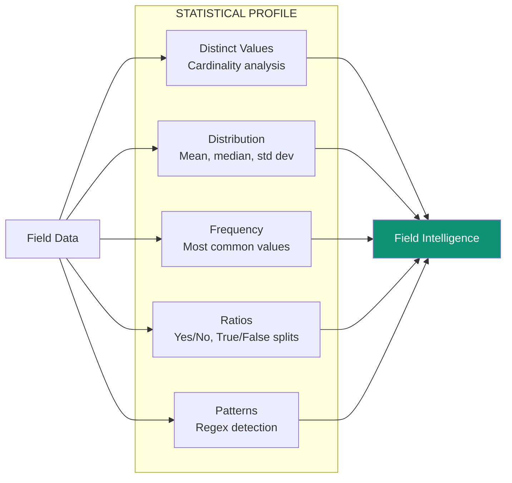
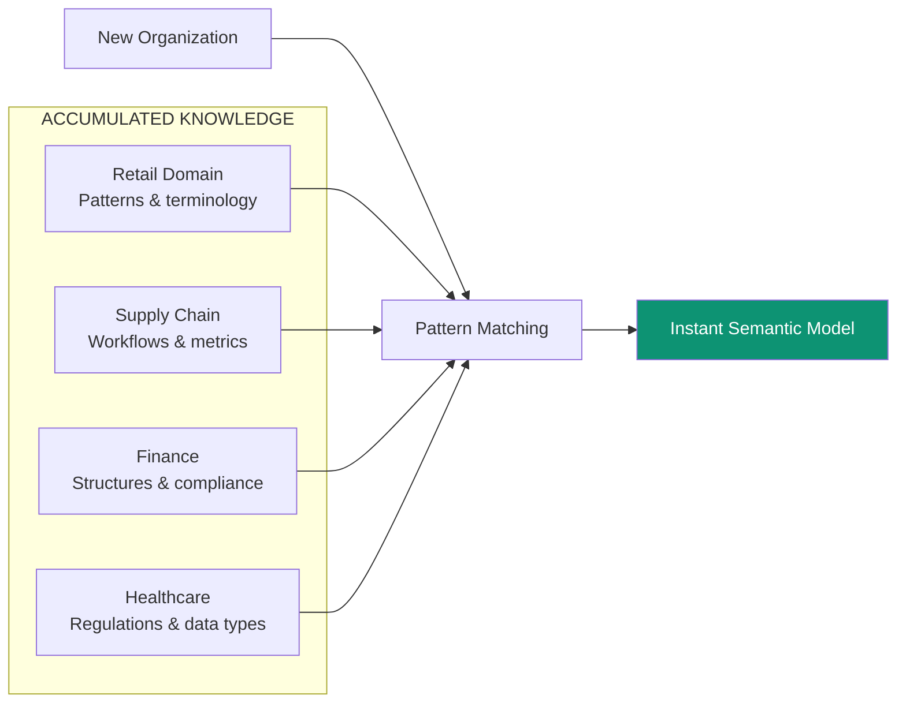
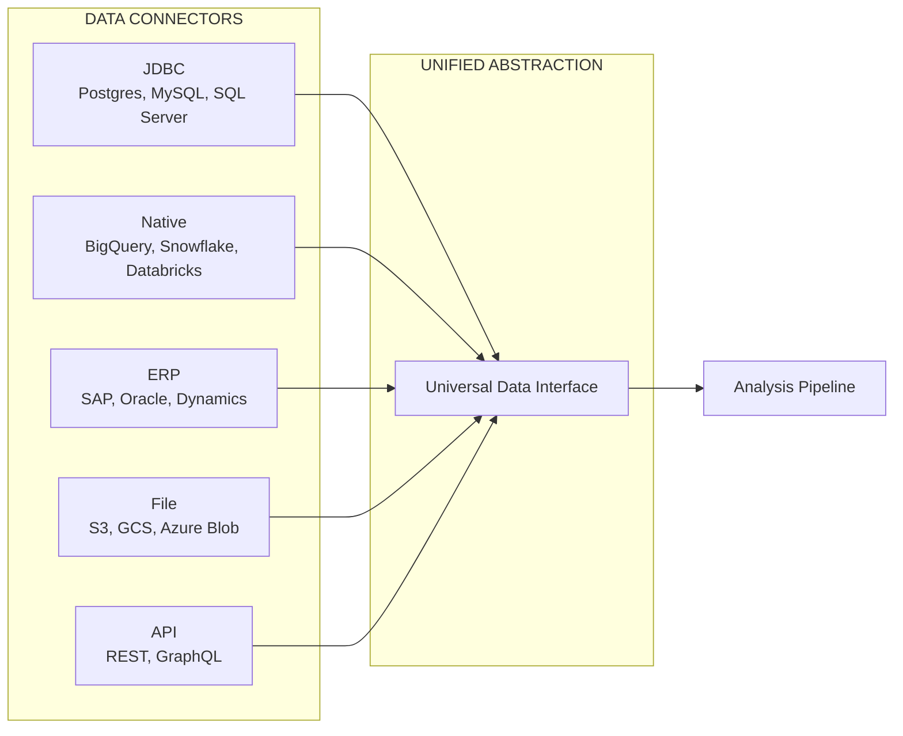

## The Challenge

Enterprise data is scattered across dozens of systems—ERPs, databases, file systems, APIs—each with its own schema, terminology, and logic. Making sense of how all these pieces connect has traditionally required:

- Expensive data engineering teams
- Months of integration work
- Continuous maintenance as systems change
- Deep domain expertise

**Superatom automates this entirely.**

---

## How It Works

Our semantic modeling system performs a multi-stage analysis that transforms disconnected data sources into a unified, queryable knowledge structure.



---

## The Five Analysis Stages

### Stage 1: Schema Analysis

<Tabs>
  <Tab title="What We Analyze">
    - Database names and their purposes
    - Table names and relationships
    - Column names and data types
    - Primary keys and foreign keys
    - Indexes and constraints
    - File structures and hierarchies
  </Tab>
  <Tab title="What We Discover">
    - How tables relate to each other
    - Which fields are identifiers
    - Data lineage and dependencies
    - Naming conventions and patterns
  </Tab>
  <Tab title="Output">
    ```json
    {
      "tables": {
        "orders": {
          "columns": ["id", "customer_id", "product_id", "quantity", "date"],
          "primary_key": "id",
          "foreign_keys": {
            "customer_id": "customers.id",
            "product_id": "products.id"
          },
          "relationships": ["customers", "products", "order_items"]
        }
      }
    }
    ```
  </Tab>
</Tabs>

### Stage 2: Sample Data Extraction

We retrieve representative samples from each field to understand actual data characteristics:

| Analysis Type | What We Capture | Why It Matters |
|---------------|-----------------|----------------|
| **Value Samples** | Random selection of actual values | Understand real data patterns |
| **Edge Cases** | Minimum/maximum values | Identify boundaries and outliers |
| **Null Analysis** | Percentage of empty fields | Data quality assessment |
| **Format Detection** | Date formats, number formats, encodings | Proper parsing and display |

### Stage 3: Statistical Profiling

Deep statistical analysis of each field:



**Example Output:**

```yaml
field: order_status
type: categorical
distinct_values: 5
distribution:
  - value: "completed", percentage: 68%
  - value: "pending", percentage: 15%
  - value: "processing", percentage: 10%
  - value: "cancelled", percentage: 5%
  - value: "refunded", percentage: 2%
likely_meaning: "Order lifecycle status"
suggested_visualizations: ["pie_chart", "bar_chart"]
```

### Stage 4: Domain Classification

The system recognizes industry and domain context:

<CardGroup cols={3}>
  <Card title="Supply Chain" icon="truck">
    - Inventory levels
    - Warehouse locations
    - Transfer orders
    - Lead times
  </Card>
  <Card title="Retail" icon="store">
    - Products & SKUs
    - Customer segments
    - Sales channels
    - Promotions
  </Card>
  <Card title="Finance" icon="coins">
    - Transactions
    - Accounts
    - Reconciliation
    - Reporting periods
  </Card>
</CardGroup>

Domain classification enables:
- **Automatic terminology mapping** (e.g., "SKU" = "product identifier")
- **Industry-specific analysis rules**
- **Contextual query interpretation**
- **Relevant visualization defaults**

### Stage 5: Query Generation

Based on all previous analysis, we generate:

<AccordionGroup>
  <Accordion title="Common Questions" icon="circle-question">
    Questions any user would likely ask about this data:
    - "What are total sales by region?"
    - "Which products are low on inventory?"
    - "How has revenue trended this quarter?"
  </Accordion>
  <Accordion title="Diagnostic Questions" icon="stethoscope">
    Questions that help identify problems:
    - "Which items have negative margins?"
    - "Where are delivery delays occurring?"
    - "What's causing order cancellations?"
  </Accordion>
  <Accordion title="Exploratory Questions" icon="magnifying-glass">
    Questions that reveal insights:
    - "What patterns exist in customer behavior?"
    - "How do different regions compare?"
    - "What correlations exist between metrics?"
  </Accordion>
</AccordionGroup>

---

## Automated Semantic Modeling

<Note>
**This is a key innovation.** Semantic modeling used to require high-level experts and domain specialists. Superatom automates this entirely.
</Note>

### Traditional vs. Superatom Approach

| Aspect | Traditional | Superatom |
|--------|-------------|-----------|
| **Time to Model** | 3-6 months | ~2 days |
| **Required Expertise** | Data architects + domain experts | None |
| **Cost** | $100K+ consulting | Included |
| **Maintenance** | Manual updates | Automatic drift detection |
| **Scalability** | Linear effort increase | Near-zero marginal cost |

### The Zero-Setup Vision

As we add more domain knowledge and verticals, setup cost for new organizations approaches zero:



Each new deployment adds to our knowledge base. Each addition makes the next deployment faster.

---

## Handling Data Evolution

Enterprise data isn't static. Superatom handles evolution:

<Steps>
  <Step title="Drift Detection">
    Periodic re-analysis identifies schema changes, new tables, modified fields.
  </Step>
  <Step title="Impact Assessment">
    System determines which queries and dashboards are affected.
  </Step>
  <Step title="Model Update">
    Semantic model is updated without losing existing customizations.
  </Step>
  <Step title="Notification">
    Relevant users are notified of changes that might affect their work.
  </Step>
</Steps>

<Info>
**Currently:** Manual re-analysis on request
**Roadmap:** Automatic continuous drift detection
</Info>

---

## Technical Implementation

### Connection Layer



### Supported Sources

| Category | Sources |
|----------|---------|
| **Databases** | PostgreSQL, MySQL, SQL Server, Oracle |
| **Data Warehouses** | BigQuery, Snowflake, Databricks, Redshift, ClickHouse |
| **ERP Systems** | SAP, Oracle ERP Cloud, Microsoft Dynamics 365 |
| **Files** | CSV, Excel, JSON, Parquet |
| **APIs** | REST endpoints, GraphQL |

---

## Next Steps

<CardGroup cols={2}>
  <Card
    title="Generative UI"
    icon="wand-magic-sparkles"
    href="/ip/generative-ui"
  >
    How we turn semantic models into visual interfaces
  </Card>
  <Card
    title="Tribal Knowledge"
    icon="brain"
    href="/ip/tribal-knowledge"
  >
    Adding organizational context to the model
  </Card>
</CardGroup>
