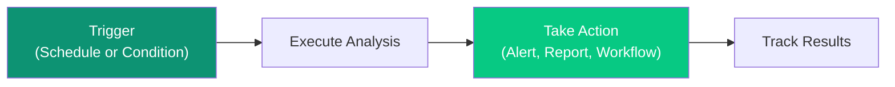

Automated Actions let you create workflows that respond to data conditions—from daily summaries to real-time alerts when critical thresholds are breached.

<Frame>
  
</Frame>

---

## How Actions Work



Actions have three components:

1. **Trigger** — When to run
2. **Analysis** — What to check or calculate
3. **Action** — What to do with the results

---

## Trigger Types

| Type | Description | Examples |
|------|-------------|----------|
| **Schedule-based** | Run at defined intervals | Daily at 7 AM, weekly on Monday, monthly on the 1st, custom cron |
| **Condition-based** | Fire when a metric crosses a threshold | Revenue deviates >15% from forecast, inventory below safety stock |
| **Event-based** | Respond to data changes or external signals | New record appears, status changes, external webhook fires |

---

## Approval Gates

Write-back actions pass through configurable approval levels based on risk:

| Gate | Risk Level | Example |
|------|------------|---------|
| **Auto-execute** | Low risk, reversible | Tag an item, add a note, send a notification |
| **User confirm** | Medium risk, user reviews parameters | Update a price, change a status |
| **Manager approve** | High risk, affects budget or contracts | Approve a purchase order, change credit terms |
| **Dual control** | Critical, regulatory requirement | Write off inventory, adjust financial records |

### Dry-Run Mode

Any action can be simulated before activation. The system shows exactly what would happen — which records would be affected, what notifications would be sent, what values would change — without executing. Use dry-run mode during the first 1-2 weeks of a new workflow to validate its behavior.

---

## Action Types

### Scheduled Actions

Run on a regular schedule:

<CardGroup cols={2}>
  <Card title="Daily KPI Summary" icon="calendar-day">
    Every morning at 7 AM, send executive summary of business health
  </Card>
  <Card title="Weekly Cash Flow Forecast" icon="calendar-week">
    Every Monday, generate cash flow projections for the week
  </Card>
</CardGroup>

### Triggered Actions

Run when conditions are met:

<CardGroup cols={2}>
  <Card title="Revenue Anomaly Detection" icon="chart-line-down">
    Alert when revenue variance exceeds 15% from forecast
  </Card>
  <Card title="Margin Compression Alert" icon="compress">
    Notify when profit margins fall below acceptable thresholds
  </Card>
</CardGroup>

---

## Creating an Action

<Steps>
  <Step title="Navigate to Actions">
    Click **Actions** in the sidebar under SYSTEM
  </Step>
  <Step title="Click Create Action">
    Start the action creation wizard
  </Step>
  <Step title="Choose Trigger Type">
    - **Schedule** — Run at specific times (daily, weekly, monthly, cron)
    - **Condition** — Run when data meets criteria (threshold, variance)
    - **Event** — Run when data changes (new record, status update, webhook)
  </Step>
  <Step title="Define the Analysis">
    Describe what to analyze: *"Check if daily revenue is more than 10% below forecast"*
  </Step>
  <Step title="Configure Actions">
    What happens when triggered:
    - Generate dashboard
    - Send email alert
    - Post to Slack
    - Create task
    - Trigger webhook
  </Step>
  <Step title="Set Recipients">
    Who receives the output
  </Step>
  <Step title="Activate">
    Turn on the action
  </Step>
</Steps>

---

## Example Actions

### Daily KPI Summary

```yaml
name: "Daily KPI Summary"
category: "Executive Dashboard"

trigger:
  type: schedule
  frequency: daily
  time: "07:00"
  timezone: "America/New_York"

analysis: |
  Generate executive summary of:
  - Revenue vs. target
  - Orders and average order value
  - Inventory health
  - Customer metrics

actions:
  - generate_dashboard
  - send_email

recipients:
  - role: "Executive Team"

status: active
last_run: "2026-01-25 07:00 AM"
success_rate: 100%
```

### Revenue Anomaly Detection

```yaml
name: "Revenue Anomaly Detection"
category: "Financial Intelligence"

trigger:
  type: condition
  metric: "daily_revenue"
  condition: "variance > 15% OR variance < -10%"
  check_frequency: "hourly"

analysis: |
  When revenue variance detected:
  - Identify contributing factors
  - Compare to historical patterns
  - Generate root cause analysis

actions:
  - critical_alert
  - generate_investigation_report

recipients:
  - user: "cfo@company.com"
  - role: "Finance Team"

status: active
executions: 12
success_rate: 100%
```

---

## Action Categories

| Category | Purpose | Examples |
|----------|---------|----------|
| **Executive Dashboard** | Leadership summaries | Daily KPI summary, weekly review |
| **Financial Intelligence** | Revenue and margin monitoring | Anomaly detection, forecast alerts |
| **Inventory Management** | Stock level monitoring | Low stock alerts, overstock warnings |
| **Customer Intelligence** | Customer behavior tracking | Churn risk alerts, segment changes |
| **Operational** | Process monitoring | SLA breaches, capacity alerts |

---

## Action Outputs

### Dashboards

Auto-generated visual summaries with:
- KPI cards for key metrics
- Trend charts
- Comparison tables
- AI-written analysis

### Alerts

Notifications sent via:
- Email
- Slack
- Microsoft Teams
- SMS (configurable)
- Push notification (mobile app)

### Reports

Full PDF or interactive reports with:
- Executive summary
- Detailed analysis
- Visualizations
- Recommendations

### Webhooks

Trigger external systems:
- Create tickets in Jira
- Update records in Salesforce
- Trigger workflows in Zapier
- Custom integrations

---

## Monitoring Actions

Track action performance:

| Metric | Description |
|--------|-------------|
| **Status** | Active, Paused, Error |
| **Last Run** | When it last executed |
| **Executions** | Total number of runs |
| **Success Rate** | Percentage of successful runs |
| **Average Duration** | How long it takes to run |

### Action History

View complete execution history:
- When it ran
- What triggered it
- What actions were taken
- Who received outputs
- Any errors encountered

---

## Multi-Step Workflows

Actions can chain multiple analysis and action steps:

1. **Detect** — Identify an anomaly or condition (e.g., inventory below safety stock)
2. **Investigate** — Run root cause analysis (e.g., check demand spike, supplier delay, forecast error)
3. **Assess** — Quantify impact (e.g., estimated stockout in 3 days, $45K revenue at risk)
4. **Act** — Take action based on findings (e.g., generate PO, alert procurement manager, update dashboard)

Each step can branch based on the previous step's results, enabling intelligent automated responses.

---

## Best Practices

<AccordionGroup>
  <Accordion title="Start with High-Value Alerts" icon="star">
    Focus on metrics that directly impact business decisions.
  </Accordion>
  <Accordion title="Set Reasonable Thresholds" icon="sliders">
    Too sensitive = alert fatigue. Too loose = missed issues.
  </Accordion>
  <Accordion title="Include Context" icon="info">
    Alerts should explain WHY something happened, not just WHAT.
  </Accordion>
  <Accordion title="Review and Refine" icon="rotate">
    Regularly review action effectiveness and adjust thresholds.
  </Accordion>
</AccordionGroup>

---

## Next Steps

<CardGroup cols={2}>
  <Card
    title="Automated Analyst"
    icon="robot"
    href="/ip/automated-analyst"
  >
    How continuous monitoring works
  </Card>
  <Card
    title="Security"
    icon="shield"
    href="/security/overview"
  >
    How actions respect access controls
  </Card>
</CardGroup>
