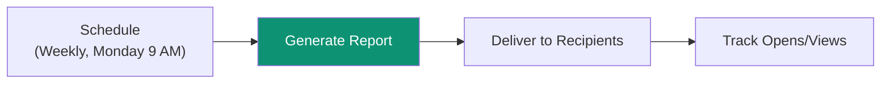
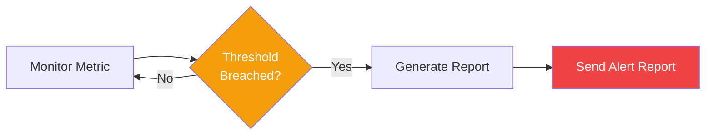

Superatom's Reports module combines AI-powered analysis with automated delivery—ensuring insights reach the right people at the right time.

<Frame>
  
</Frame>

---

## Creating Reports

### AI-Generated Reports

Let the AI Analyst create comprehensive reports automatically:

1. Navigate to **Reports / AI Analyst**
2. Click **+ Create Report**
3. Describe what you want: *"Monthly sales performance analysis with regional breakdown"*
4. AI generates a complete report with:
   - Executive summary
   - Key metrics and KPIs
   - Visualizations
   - Trend analysis
   - Recommendations

<Frame caption="AI-generated Monthly Sales Report">
  
</Frame>

### Report Components

Reports can include:

| Component | Description |
|-----------|-------------|
| **Executive Summary** | AI-written overview of key findings |
| **KPI Cards** | Key metrics with trend indicators |
| **Charts** | Bar, line, pie, and other visualizations |
| **Tables** | Detailed data breakdowns |
| **Analysis** | AI-generated insights and explanations |
| **Recommendations** | Suggested actions based on data |

---

## Scheduling Reports

Automate report generation and delivery:

<Frame>
  
</Frame>

### Schedule Options

| Setting | Options |
|---------|---------|
| **Frequency** | Daily, Weekly, Monthly, Quarterly |
| **Day** | Specific day of week/month |
| **Time** | Any time, any timezone |
| **Format** | PDF Document, CSV Data, Interactive Link |

### Delivery Options

<CardGroup cols={2}>
  <Card title="Email" icon="envelope">
    Direct to inbox with attachments or links
  </Card>
  <Card title="Slack" icon="slack">
    Post to channels or DM to users
  </Card>
  <Card title="Teams" icon="microsoft">
    Integrate with Microsoft Teams
  </Card>
  <Card title="Webhook" icon="webhook">
    Send to any endpoint
  </Card>
</CardGroup>

---

## Sharing Reports

Share reports with team members:

<Frame>
  
</Frame>

### Sharing Options

- **Select recipients** by name, email, or role
- **Add a message** to provide context
- **Set permissions** — view only or edit
- **Track views** — see who accessed the report

---

## Report Types

### Scheduled Reports

Automated delivery on a recurring basis:

Use cases:
- Weekly sales summaries
- Monthly financial reports
- Quarterly business reviews

### Triggered Reports

Sent when specific conditions are met:

Use cases:
- Inventory below safety stock
- Revenue drops more than 10%
- Customer churn rate spikes

### Ad-Hoc Reports

Generated on-demand for specific needs:

- Board meeting preparation
- Investor updates
- Customer presentations
- One-time analysis

---

## Export Formats

| Format | Best For |
|--------|----------|
| **PDF** | Printing, formal distribution, archiving |
| **CSV** | Data analysis in Excel/Sheets |
| **Interactive** | Web-based exploration, drilling down |
| **PowerPoint** | Presentations (coming soon) |

---

## Report Templates

Save time with reusable templates:

1. Create a report
2. Click **Save as Template**
3. Reuse for similar reports
4. Customize as needed

Templates preserve:
- Report structure
- Visualization types
- Filters and parameters
- Formatting preferences

---

## Best Practices

<AccordionGroup>
  <Accordion title="Start with the Question" icon="circle-question">
    What decision should this report inform? Design backwards from the action.
  </Accordion>
  <Accordion title="Less is More" icon="minimize">
    Focus on 3-5 key metrics. Avoid data overload.
  </Accordion>
  <Accordion title="Automate What Repeats" icon="clock">
    If you create the same report monthly, schedule it.
  </Accordion>
  <Accordion title="Include Context" icon="book">
    Add executive summaries and explanations for non-technical audiences.
  </Accordion>
</AccordionGroup>

---

## Next Steps

<CardGroup cols={2}>
  <Card
    title="Automated Actions"
    icon="bolt"
    href="/platform/actions"
  >
    Trigger workflows based on report findings
  </Card>
  <Card
    title="Mobile Apps"
    icon="mobile"
    href="/platform/mobile-apps"
  >
    Access reports on the go
  </Card>
</CardGroup>
