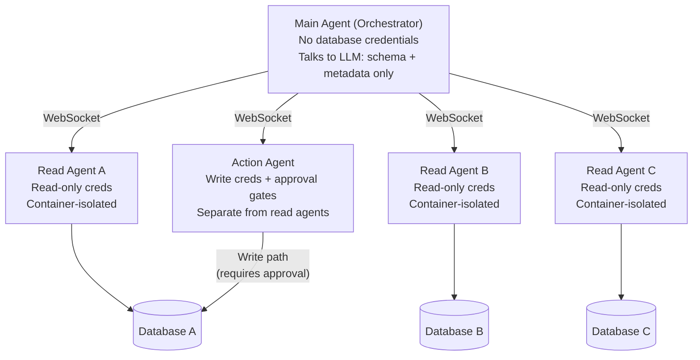

Superatom uses a multi-agent architecture where each data source is served by an independent, containerized agent. The Main Agent orchestrates requests and communicates with the LLM but **never holds database credentials** and **never directly accesses customer databases**.

This separation enforces credential isolation, limits blast radius on compromise, and ensures the component with external connectivity (Main Agent to LLM) has no path to customer data.

## Data-Source Agents

A data-source agent is a containerized service dedicated to a single data source. When an organization connects PostgreSQL, BigQuery, and SAP, three separate agents are deployed, one per source.

Each agent:

- Runs in its own Docker container with isolated filesystem and memory
- Holds the database credentials for its data source only
- Communicates with the Main Agent exclusively through the internal WebSocket server
- Executes queries using parameterized statements (preventing SQL injection)
- Operates with **read-only** database access by default
- Has configurable rate limits to prevent database overload

<Note>
  Data-source agents communicate only over the internal WebSocket bus. They have no outbound internet access and no visibility into other agents' containers, credentials, or data.
</Note>

## Credential Isolation

The Main Agent and data-source agents have strictly separated responsibilities:

| Component | Holds credentials | Accesses databases | Communicates externally |
|---|---|---|---|
| **Main Agent** | No | No | Yes (LLM API) |
| **Data-Source Agent** | Yes (read-only, single source) | Yes (its own source only) | No |
| **Action Agent** | Yes (write-capable, single source) | Yes (write path with approval) | No |

This design means:

- The component that talks to the LLM (Main Agent) cannot access customer data directly
- The components that access customer data (data-source agents) do not communicate externally
- Compromising one agent does not grant access to other data sources
- Each agent can be independently scaled, monitored, and updated

## Action Agents

Write-back operations (creating purchase orders, updating records, triggering external systems) are handled by separate **Action Agents**. These are distinct from read-only data-source agents.

Action Agents carry:

- **Write-capable credentials** completely separate from read-only data-source agent credentials
- **Approval gates** that must be passed before execution (see [Action Safety](/security/action-safety))
- **Dry-run capability** to simulate before executing
- **Separate audit logging** for all write operations

<Warning>
  Action Agent credentials are never shared with data-source agents. Read and write paths use entirely separate credential sets, stored in separate containers.
</Warning>

## Architecture Diagram

## Compromise Containment

The agent architecture limits the impact of any single point of compromise:

<AccordionGroup>
  <Accordion title="If a data-source agent is compromised">
    The attacker gains read-only access to a single data source. They cannot reach other databases, the Main Agent, or any external endpoint. Rate limits constrain the volume of data that can be extracted.
  </Accordion>
  <Accordion title="If the Main Agent is compromised">
    The attacker has no database credentials and no direct path to any data source. They can observe schema metadata and generated SQL but cannot execute queries against customer databases independently.
  </Accordion>
  <Accordion title="If an Action Agent is compromised">
    Write operations still require approval gates. The attacker holds write credentials for a single source but must pass the configured approval model to execute changes. All attempts are logged in the immutable audit trail.
  </Accordion>
</AccordionGroup>

## Container Security Properties

Each agent container enforces:

| Property | Detail |
|---|---|
| **Filesystem isolation** | Own filesystem, no shared volumes between agents |
| **Memory isolation** | Separate memory space per container |
| **Credential scope** | Credentials for one data source only |
| **Network scope** | Internal WebSocket bus only; no outbound internet |
| **Access mode** | Read-only by default (data-source agents) |
| **Rate limiting** | Configurable per-agent to prevent database overload |
| **Independent lifecycle** | Each agent can be scaled, restarted, or updated without affecting others |
