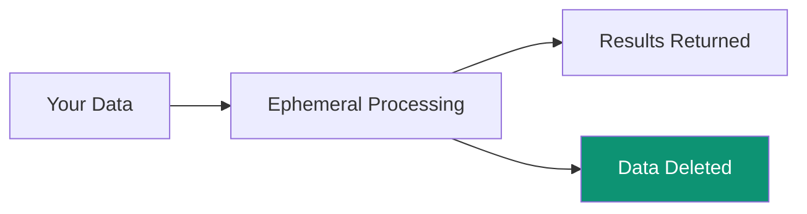

## Zero-Storage Principle

<Note>
Superatom NEVER stores your business data. All processing is ephemeral.
</Note>

## What IS Stored

| Data Type | Storage Location | Purpose |
|-----------|-----------------|---------|
| User accounts | PostgreSQL | Authentication |
| Conversation history | PostgreSQL | Context, audit |
| Dashboard configs | PostgreSQL | User preferences |
| Knowledge nodes | PostgreSQL | Tribal knowledge |
| Embeddings | ChromaDB | Semantic search |

## What is NOT Stored

- Raw business data
- Query results
- Exported files
- Customer PII from sources

## Encryption

| State | Method |
|-------|--------|
| In transit | TLS 1.3 |
| At rest | AES-256 |
| API keys | Hashed (SHA-256) |
| Passwords | Hashed (bcrypt) |

## Data Lifecycle

<Steps>
  <Step title="Query Received">
    User asks a question
  </Step>
  <Step title="Data Retrieved">
    Query executes against source
  </Step>
  <Step title="Processing">
    AI analyzes results in memory
  </Step>
  <Step title="Response Sent">
    Visualization streamed to user
  </Step>
  <Step title="Cleanup">
    All temporary data deleted
  </Step>
</Steps>

## Network Security

- VPC deployment
- No public database exposure
- TLS for all connections
- Connection severable instantly
