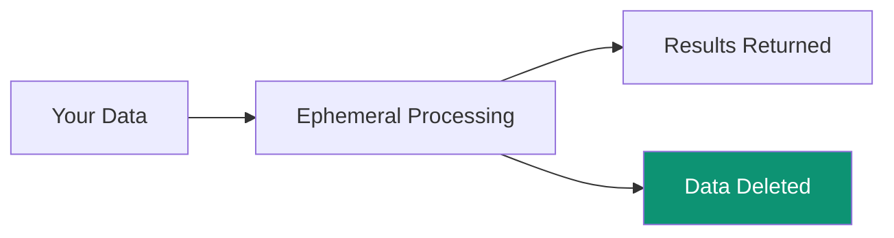

## Zero-Storage Principle

<Note>
Superatom NEVER stores your business data. All processing is ephemeral.
</Note>

## What IS Stored

| Data Type | Storage Location | Purpose |
|-----------|-----------------|---------|
| User accounts | PostgreSQL | Authentication |
| Conversation history | PostgreSQL | Context, audit |
| Dashboard configs | PostgreSQL | User preferences |
| Knowledge nodes | PostgreSQL | Tribal knowledge |
| Embeddings | ChromaDB | Semantic search |

## What is NOT Stored

- Raw business data
- Query results
- Exported files
- Customer PII from sources

## Encryption

| State | Method |
|-------|--------|
| In transit | TLS 1.3 |
| At rest | AES-256 |
| API keys | Hashed (SHA-256) |
| Passwords | Hashed (bcrypt) |

## Data Lifecycle

<Steps>
  <Step title="Query Received">
    User asks a question
  </Step>
  <Step title="Data Retrieved">
    Query executes against source
  </Step>
  <Step title="Processing">
    AI analyzes results in memory
  </Step>
  <Step title="Response Sent">
    Visualization streamed to user
  </Step>
  <Step title="Cleanup">
    All temporary data deleted
  </Step>
</Steps>

## What the LLM Receives

The LLM is called as a stateless inference service. Each request is constructed from scratch — no state persists between calls.

### Sent to the LLM

| Data | Purpose |
|------|---------|
| Schema metadata (table/column names, types) | Enable correct SQL generation |
| Generated SQL queries | Validation and refinement |
| Natural language questions | Intent classification |
| Tribal knowledge definitions | Business context (e.g., "Sales excludes returns") |
| Aggregated statistics (cardinality, distribution) | Query optimization |

### Never Sent to the LLM

| Data | Category |
|------|----------|
| Raw data rows or individual records | Business data |
| PII (names, emails, addresses, SSNs) | Personal information |
| Database credentials or connection strings | Secrets |
| Query results or actual business numbers | Business data |
| File contents or document data | Business data |
| User identities or conversation content | User data |

<Note>
Customer data, queries, and knowledge nodes are never used to train or fine-tune AI models. The LLM provider receives stateless inference requests only.
</Note>

---

## Air-Gapped Deployment

For environments that cannot make any external calls, Superatom supports self-hosted LLM deployment using open-source or licensed models running within the customer's network.

In this configuration:
- Zero data leaves the network perimeter
- All AI inference runs on-premise
- Usage telemetry can be disabled
- The platform operates completely independently

---

## Network Security

- Deploy within the customer's network
- No public database exposure
- TLS 1.3 for all connections
- No inbound ports required
- Connection severable instantly
- All outbound traffic can be proxied

<Card title="Network & Data Flow" icon="network-wired" href="/security/network">
  Full details on outbound traffic, what stays in-network, and air-gapped deployment
</Card>
