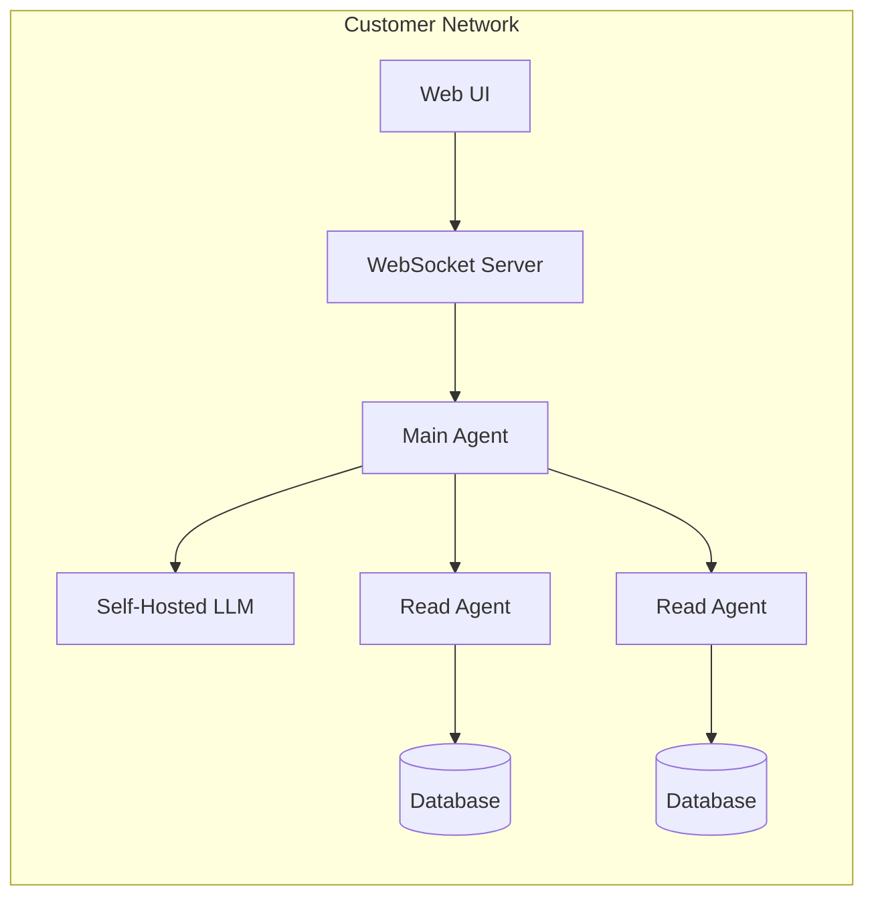

Superatom is deployed entirely within customer infrastructure. All external communication is outbound HTTPS only. No inbound ports need to be opened.

## Outbound Traffic

The platform makes two categories of outbound HTTPS calls:

| Destination | Content | Can Be Proxied |
|---|---|---|
| **LLM provider API** | Schema metadata, generated SQL, questions, tribal knowledge | Yes |
| **Superatom platform** | Usage telemetry (query counts, response times, feature usage) | Yes |

Both destinations can be routed through the organization's existing forward proxy or firewall.

<Note>
  In air-gapped deployments with a self-hosted LLM, both outbound connections are eliminated. Zero data leaves the network perimeter.
</Note>

## What Never Leaves the Network

The following data categories are processed entirely within the customer's infrastructure and never transmitted externally:

- Raw data rows or individual records
- PII or sensitive business data
- Database credentials
- Query results
- File contents
- User identities or conversation content

## No Inbound Connections Required

Superatom requires no inbound ports to be opened. All external communication is initiated outbound by the platform. There are no webhooks, callbacks, or remote access channels.

## Air-Gapped Deployment

For environments that cannot make any external calls, Superatom supports deployment with a self-hosted LLM running within the customer's network.

In this configuration:

- Open-source or licensed models run on the customer's GPU infrastructure
- The Main Agent calls the LLM over the internal network
- No external API calls are made
- All telemetry is disabled or routed internally

## What the LLM Receives

The LLM is a stateless inference service. Each request is constructed from scratch, and no state persists between calls.

### Sent to the LLM

| Data | Purpose |
|---|---|
| Schema metadata (table/column names, types) | Correct SQL generation |
| Generated SQL queries | Validation and refinement |
| Natural language questions | Intent classification |
| Tribal knowledge definitions | Business context (e.g., "Sales excludes returns") |
| Aggregated statistics (cardinality, distribution) | Query optimization |

### Never Sent to the LLM

| Data | Category |
|---|---|
| Raw data rows or individual records | Business data |
| PII (names, emails, addresses, SSNs) | Personal data |
| Database credentials or connection strings | Secrets |
| Query results or actual business numbers | Business data |
| File contents or document data | Business data |
| User identities or conversation content | User data |

<Warning>
  The LLM receives only structural metadata: table names, column names, data types, and business definitions. It never receives the actual data stored in those tables.
</Warning>

## No Training on Customer Data

Customer data, queries, and knowledge nodes are never used to train or fine-tune models. The LLM provider receives stateless inference requests only. This applies to both cloud-hosted and self-hosted LLM configurations.
