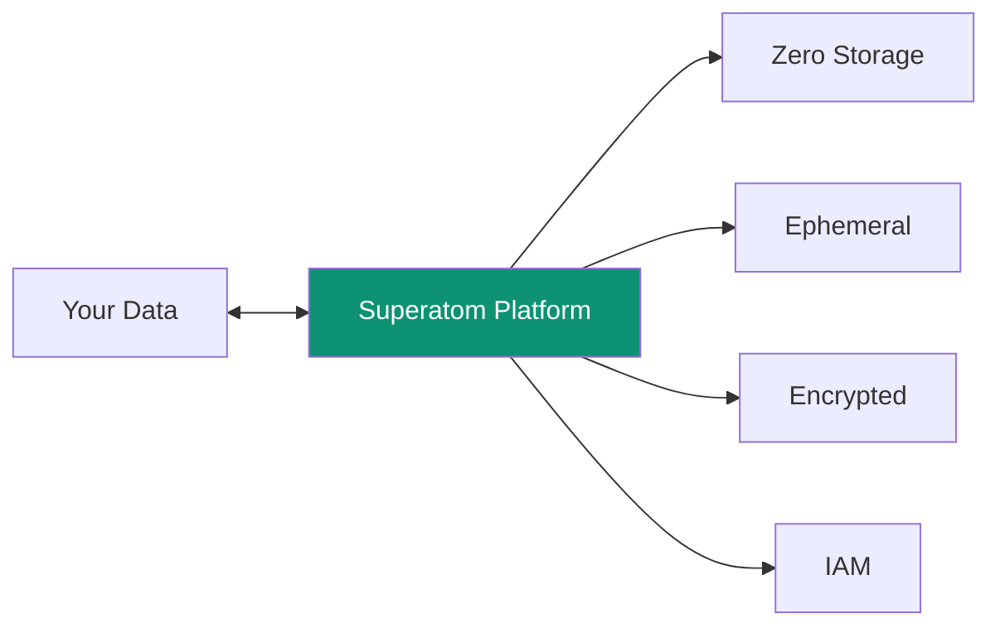
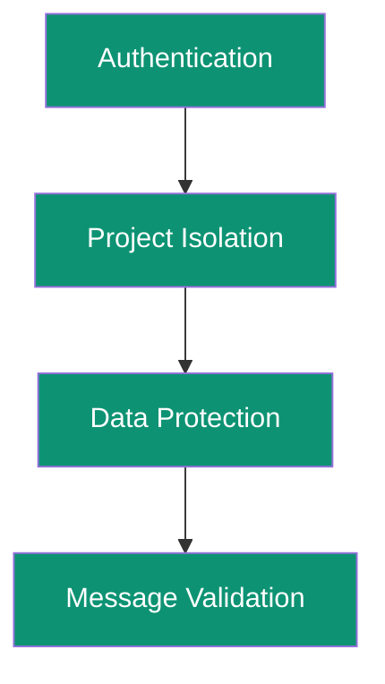

Security is the #1 concern for enterprise AI adoption. Superatom addresses this with a **zero-storage architecture** and comprehensive security controls.

---

## The Security Challenge

Why enterprises hesitate to adopt AI systems:

<CardGroup cols={2}>
  <Card title="Data Leakage Risk" icon="water">
    Programs can be exploited to leak sensitive data
  </Card>
  <Card title="AI Hallucinations" icon="brain">
    AI can generate false information affecting decisions
  </Card>
  <Card title="Prompt Injection" icon="syringe">
    Malicious prompts can change AI behavior
  </Card>
  <Card title="Access Control" icon="lock">
    Ensuring users only see authorized data
  </Card>
</CardGroup>

---

## Zero-Storage Architecture

<Note>
**Superatom NEVER stores your data.** The platform is deployed within your enterprise network and data never leaves your control.
</Note>



### How It Works

| Principle | Implementation |
|-----------|----------------|
| **Zero Storage** | Data is never persisted outside your network |
| **Ephemeral Processing** | Data deleted immediately after analysis |
| **In-Network Deployment** | Superatom runs inside your enterprise |
| **Connection Severable** | Can disconnect Superatom instantly |

---

## Security Layers



---

## Authentication

### Password Security

- **Hashing** — Passwords never stored in plain text
- **Session Tokens** — JWT with configurable expiration
- **Secure Transmission** — All auth over HTTPS

### SSO Integration

Coming soon:
- Okta
- Microsoft Azure AD / Office 365
- SAML 2.0
- OpenID Connect

---

## Authorization

### Role-Based Access Control

| Role | Data Access | Actions |
|------|-------------|---------|
| **Viewer** | Read permitted data | View dashboards, ask questions |
| **Analyst** | Read permitted data | All viewer + export, bookmark |
| **Admin** | Full access | All analyst + user management |
| **Super Admin** | Full access | All admin + system configuration |

### Data-Level Permissions

Control access at multiple levels:

- **Project** — Which projects a user can access
- **Data Source** — Which databases/tables
- **Row-Level** — Filter data by user attributes
- **Column-Level** — Hide sensitive columns

---

## Network Security

### Encryption

| Connection | Encryption |
|------------|------------|
| Browser ↔ Cloudflare | TLS 1.3 |
| Cloudflare ↔ Backend | TLS 1.3 |
| Backend ↔ Database | TLS/SSL |

### Network Isolation

- Deploy in private VPC
- No public internet exposure
- VPN access only (optional)

---

## SQL Injection Prevention

All database queries use parameterized statements:

```sql
-- NEVER this (vulnerable):
SELECT * FROM users WHERE id = 'user_input_here'

-- ALWAYS this (safe):
SELECT * FROM users WHERE id = $1
-- Parameters passed separately
```

Superatom's query generation:
1. AI generates query structure
2. Parameters extracted separately
3. Query executed with parameterization
4. Results returned safely

---

## API Security

### API Key Management

- Keys hashed before storage
- Configurable expiration
- Scope limitations
- Usage tracking

### Rate Limiting

- Per-user limits
- Per-API-key limits
- Automatic throttling

---

## Audit Logging

Complete audit trail of all activity:

| Event | Logged Data |
|-------|-------------|
| **Queries** | Who, what, when, results count |
| **Exports** | Data exported, format, destination |
| **Access** | Login attempts, session activity |
| **Changes** | Configuration modifications |

### Log Retention

- Configurable retention period
- Export to SIEM systems
- Compliance reporting

---

## Prompt Injection Defense

Protection against malicious prompt manipulation:

<Steps>
  <Step title="Input Sanitization">
    User inputs cleaned before processing
  </Step>
  <Step title="Prompt Structure">
    System prompts separated from user input
  </Step>
  <Step title="Output Validation">
    AI outputs validated before execution
  </Step>
  <Step title="Action Confirmation">
    Dangerous actions require human approval
  </Step>
</Steps>

---

## Compliance

### Certifications (Roadmap)

- SOC 2 Type II
- ISO 27001
- GDPR compliance
- HIPAA (healthcare deployments)

### Data Residency

- Deploy in your preferred region
- Data never leaves your jurisdiction
- Regional compliance requirements met

---

## Security Best Practices

<AccordionGroup>
  <Accordion title="Use Strong Authentication" icon="lock">
    Enable SSO, enforce strong passwords, use MFA where available.
  </Accordion>
  <Accordion title="Principle of Least Privilege" icon="user-shield">
    Grant minimum necessary permissions to each user.
  </Accordion>
  <Accordion title="Monitor Audit Logs" icon="eye">
    Regularly review access patterns and anomalies.
  </Accordion>
  <Accordion title="Keep Systems Updated" icon="rotate">
    Apply security patches promptly.
  </Accordion>
</AccordionGroup>

---

## Next Steps

<CardGroup cols={2}>
  <Card
    title="Data Protection"
    icon="database"
    href="/security/data-protection"
  >
    How data is protected at rest and in transit
  </Card>
  <Card
    title="Access Control"
    icon="users"
    href="/security/access-control"
  >
    Detailed permission system documentation
  </Card>
</CardGroup>
