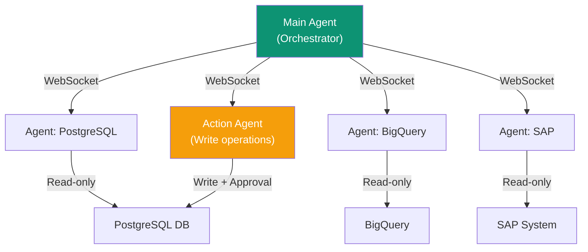

Superatom is deployed entirely within the customer's infrastructure. All platform components run as Docker containers on the customer's servers. Business data is processed ephemerally and never stored in the platform.

---

## Deployment Model

The entire platform — orchestrator, data-source agents, WebSocket server, UI, reporting engine, and audit storage — runs on the customer's infrastructure. There is no cloud-hosted instance.

| Principle | Implementation |
|-----------|----------------|
| **Zero Storage** | Business data is never persisted in the platform — query, process, return, discard |
| **In-Network Deployment** | All components run inside the customer's network as Docker containers |
| **Ephemeral Processing** | Query results exist only in memory during processing, then are discarded |
| **Severable Connection** | The platform can be disconnected instantly with no data loss |

---

## Agent Security Model

Each connected data source has a dedicated agent — a containerized service that holds credentials only for its assigned source. The Main Agent (orchestrator) never holds database credentials and never directly accesses customer databases.



Each agent runs in its own Docker container with isolated filesystem and memory. A compromised agent cannot access another agent's data or credentials.

<Card title="Agent Security Model" icon="shield-halved" href="/security/agent-model">
  Full details on agent isolation, credential separation, and security boundaries
</Card>

---

## What the LLM Receives

The LLM is a stateless inference service. Each request is constructed from scratch with no memory between calls.

| Sent to LLM | Never Sent to LLM |
|---|---|
| Schema metadata (table/column names, types) | Raw data rows or individual records |
| Generated SQL queries (for validation) | PII (names, emails, addresses, SSNs) |
| Natural language questions | Database credentials or connection strings |
| Tribal knowledge definitions | Query results or business numbers |
| Aggregated statistics (cardinality, distribution) | File contents or document data |

Customer data, queries, and knowledge nodes are never used to train or fine-tune models. The LLM provider receives stateless inference requests only.

---

## Authentication

### SSO Integration

Superatom delegates authentication to the customer's existing identity infrastructure:

| Method | Description |
|--------|-------------|
| **SAML 2.0** | Superatom acts as a Service Provider; the customer's IdP (Okta, Azure AD, OneLogin, etc.) handles authentication |
| **OpenID Connect** | Standard OAuth 2.0 / OIDC flow with the customer's identity provider |
| **Role Mapping** | Groups and roles from the IdP map directly to Superatom permission levels — no manual role configuration needed |
| **MFA** | Enforced by the identity provider; Superatom inherits the configured MFA policy |

### Session Management

- JWT tokens with configurable expiration
- Automatic logout on inactivity
- All authentication over HTTPS
- Disabling a user in the IdP immediately revokes Superatom access

---

## Authorization

### Role-Based Access Control

| Role | Data Access | Actions |
|------|-------------|---------|
| **Viewer** | Read permitted data | View dashboards, ask questions |
| **Analyst** | Read permitted data | All viewer + export, bookmark, create |
| **Admin** | Full project access | All analyst + user management |
| **Super Admin** | Full system access | All admin + system configuration |

### Data-Level Permissions

| Level | Controls | Example |
|-------|----------|---------|
| **Source-level** | Which data sources a user can query | Finance team accesses financial databases; Operations accesses logistics |
| **Table-level** | Which tables within a source are visible | Salary table restricted to HR and executives |
| **Column-level** | Which columns are visible | Individual salary amounts hidden from non-managers |
| **Row-level** | Which rows are returned based on user context | Regional managers see only their region's data |

Permissions are enforced at the query planning stage — before any SQL is generated or data is accessed. Rephrasing a question does not bypass permissions.

---

## Encryption

| Layer | Method |
|-------|--------|
| Browser ↔ Web UI | TLS 1.3 |
| Agent ↔ WebSocket Server | TLS (WSS) |
| Agent ↔ Database | SSL/TLS (database-native) |
| Platform ↔ LLM Provider | TLS 1.3 (only external traffic) |
| Metadata at rest | AES-256 |
| Agent container volumes | AES-256 |
| Audit trail | AES-256 |
| API keys | SHA-256 hashing |
| Passwords | bcrypt hashing |

---

## Audit Logging

Every interaction is recorded in an immutable audit trail stored on the customer's infrastructure:

| Event | Logged Data |
|-------|-------------|
| **Queries** | Who asked, what was asked, SQL executed, data accessed, what was returned |
| **Actions** | Write operations, approval decisions, escalations |
| **Exports** | Data exported, format, destination |
| **Access** | Login attempts, session activity, permission checks |
| **Changes** | Configuration modifications, knowledge node updates |

The audit trail is immutable, queryable within Superatom, and exportable to SIEM systems.

---

## Tenant Isolation

For multi-department or multi-business-unit deployments:

| Layer | Isolation Method |
|-------|-----------------|
| **WebSocket sessions** | Each department has its own session scope |
| **Knowledge** | Per-tenant tribal knowledge, query history, and golden paths |
| **LLM context** | Prompts constructed per-request, scoped to the requesting tenant |
| **Audit trail** | Per-tenant records; one department cannot view another's history |
| **Data access** | Per-tenant data source permissions; row-level filtering by tenant |

---

## SQL Injection Prevention

All queries use parameterized statements:

```sql
-- Parameters passed separately from query structure
SELECT * FROM users WHERE id = $1
```

The AI generates the query structure; parameters are extracted and passed separately. User input is never concatenated into SQL strings.

---

## Prompt Injection Defense

<Steps>
  <Step title="Input Sanitization">
    User inputs cleaned before processing
  </Step>
  <Step title="Prompt Structure">
    System prompts separated from user input
  </Step>
  <Step title="Output Validation">
    AI outputs validated before execution
  </Step>
  <Step title="Action Confirmation">
    Write operations require human approval through configurable approval gates
  </Step>
</Steps>

---

## Company Access

Superatom as a company does not have access to customer deployments. There is no remote access, admin portal, or backdoor. Support is provided using only usage telemetry: query counts, response times, error rates, and feature usage.

---

## Further Reading

<CardGroup cols={3}>
  <Card
    title="Agent Security Model"
    icon="shield-halved"
    href="/security/agent-model"
  >
    Agent isolation and credential separation
  </Card>
  <Card
    title="Data Protection"
    icon="database"
    href="/security/data-protection"
  >
    Zero-storage architecture and encryption
  </Card>
  <Card
    title="Access Control"
    icon="users"
    href="/security/access-control"
  >
    Permission system and enforcement
  </Card>
  <Card
    title="Action Safety"
    icon="lock"
    href="/security/action-safety"
  >
    Approval gates and write-back controls
  </Card>
  <Card
    title="Network & Data Flow"
    icon="network-wired"
    href="/security/network"
  >
    What leaves your network and air-gapped options
  </Card>
  <Card
    title="Compliance"
    icon="certificate"
    href="/security/compliance"
  >
    SOC 2, GDPR, HIPAA, ISO 27001
  </Card>
</CardGroup>
