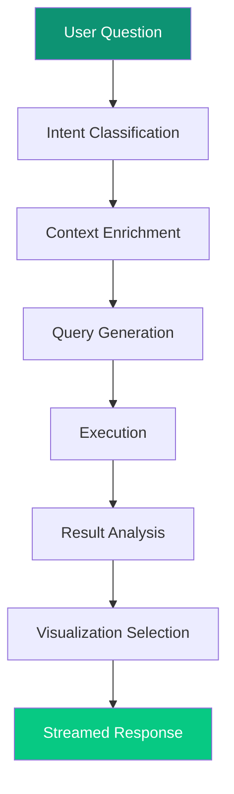

import { Card, CardGrid } from '@astrojs/starlight/components';

## AI Pipeline

## Multi-LLM Architecture

| Provider | Strength | Selection Criteria |
|----------|----------|-------------------|
| Anthropic Claude | Complex reasoning | Multi-step analysis |
| OpenAI GPT | General purpose | Balanced tasks |
| Google Gemini | Fast processing | Quick queries |
| Groq | Ultra-fast | Real-time needs |

## Model Strategies

<CardGrid>
  <Card title="Best" icon="star">
		Highest quality output, complex analysis
	</Card>
  <Card title="Fast" icon="bolt">
		Lowest latency, simple queries
	</Card>
  <Card title="Balanced" icon="scale-balanced">
		Cost-effective, everyday use
	</Card>
</CardGrid>

## Prompt Architecture

| Prompt | Purpose |
|--------|---------|
| text-response | Main response generation |
| actions | Follow-up suggestions |
| category-classification | Intent detection |
| dash-comp-picker | Visualization selection |
| dash-filter-picker | Filter recommendations |
| database-rules | SQL syntax guidance |
| adapt-ui-block-params | UI customization |
| match-text-components | Component matching |

## Caching Strategy

- **Query cache:** 5-minute TTL for repeated queries
- **Embedding cache:** Vector representations persist
- **Component cache:** Frequently-used configs cached
