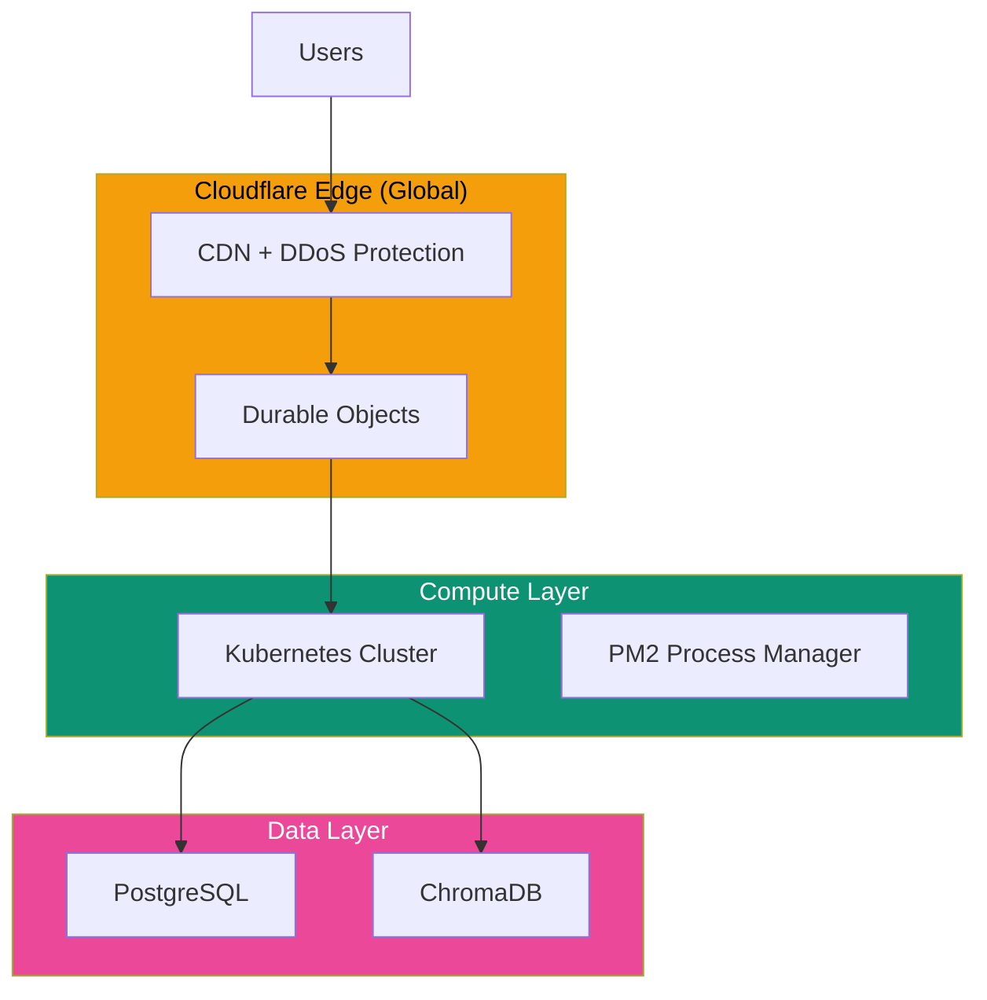

## Deployment Architecture

## Scaling Model

### Horizontal Scaling

Each project scales independently:

| Load Pattern | Scaling Response |
|--------------|------------------|
| More users | More DO instances |
| More queries | More backend pods |
| More data | Database scaling |

### Cost Optimization

| Strategy | Savings |
|----------|---------|
| Hibernatable WebSockets | 90-99% |
| Query caching | 30-50% |
| Model selection | 20-40% |
| Edge caching | 10-20% |

## Technology Stack

| Layer | Technologies |
|-------|-------------|
| Edge | Cloudflare Workers, Durable Objects |
| Compute | Node.js, Express, PM2 |
| Database | PostgreSQL, ChromaDB |
| Build | Vite, pnpm |
| CI/CD | GitHub Actions |

## Performance Targets

| Metric | Target | Actual |
|--------|--------|--------|
| Query response | < 3s | ~2s |
| Chart render | < 500ms | ~300ms |
| WebSocket connect | < 500ms | ~200ms |
| Page load | < 2s | ~1.5s |
