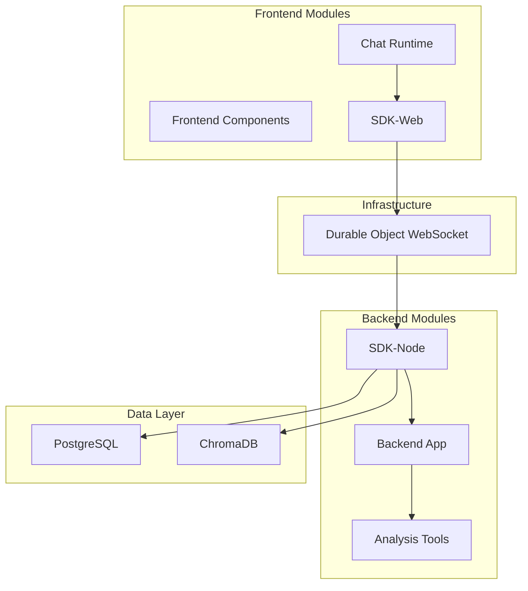

## Module Overview

## Chat Runtime

**Purpose:** Primary user interface

| Feature | Technology |
|---------|------------|
| Framework | React 19 |
| State | MobX |
| Styling | Tailwind CSS |
| Real-time | WebSocket |

## SDK-Web

**Purpose:** Browser-server communication

- 40+ service functions
- Type-safe with Zod validation
- Auto-reconnect with exponential backoff
- Real-time streaming support

## Durable Object WebSocket

**Purpose:** Serverless WebSocket infrastructure

| Capability | Benefit |
|------------|---------|
| Project isolation | Security boundary |
| Hibernatable | 90-99% cost savings |
| Smart routing | Target by client/type |
| Admin monitoring | Full visibility |

## SDK-Node

**Purpose:** Core intelligence engine

- Multi-LLM support (Anthropic, OpenAI, Gemini, Groq)
- Model strategy selection (Best, Fast, Balanced)
- Query caching (5-minute TTL)
- Collection registry for data handlers

## Backend Application

**Purpose:** Business logic and tools

- 21 specialized tools
- 8 AI prompt categories
- Custom integrations
- Database connections

## Analysis Tools

**Purpose:** Schema documentation

| Output | Format | Purpose |
|--------|--------|---------|
| schema.json | JSON | Machine-readable |
| schema.md | Markdown | Human-readable |
| create_indexes.sql | SQL | Performance |
