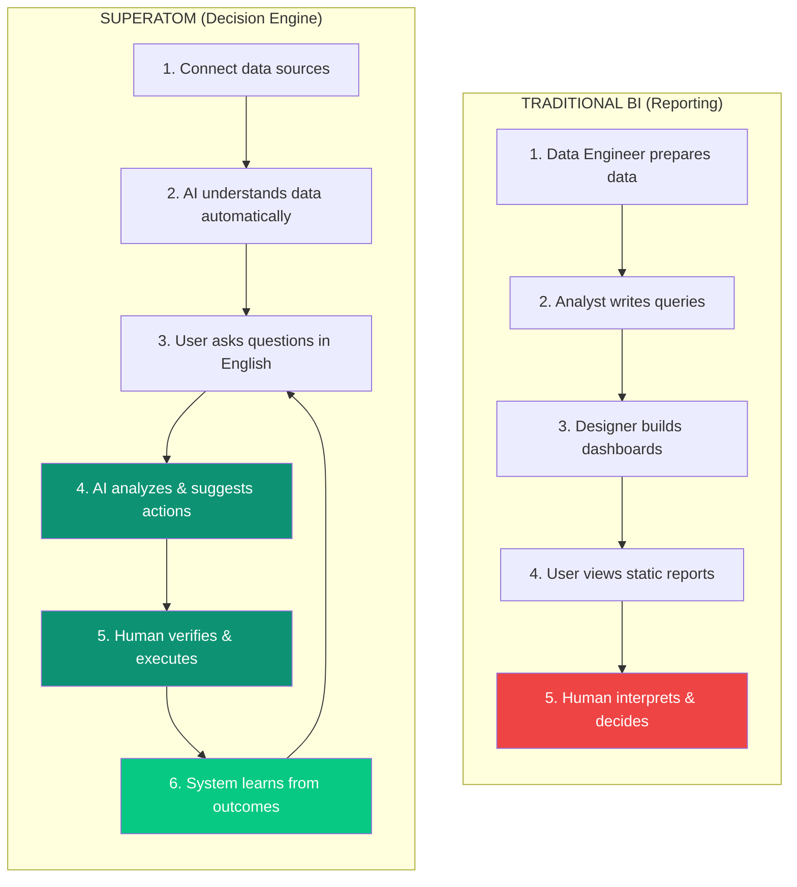
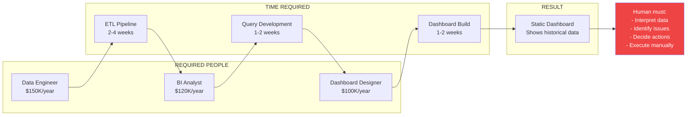
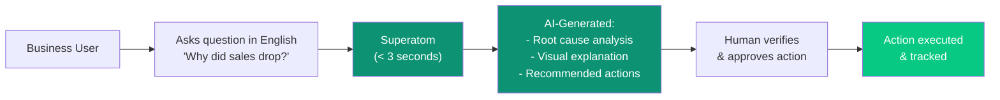
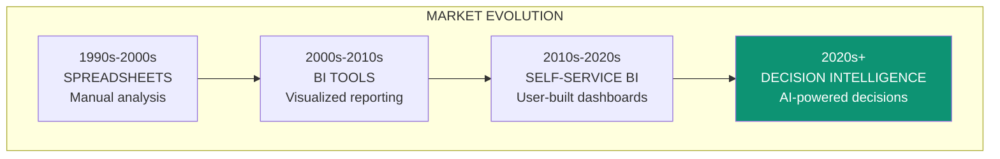
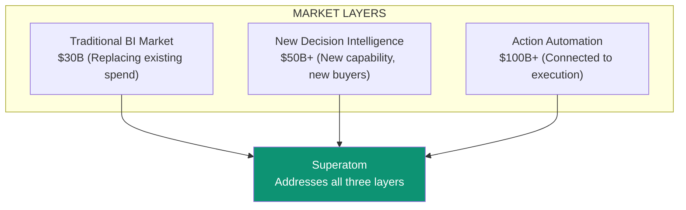

import { Card, CardGrid, LinkCard } from '@astrojs/starlight/components';

:::note
**For Investors & Decision Makers:** This page explains how Superatom creates a new market category beyond traditional Business Intelligence.
:::

## The Market Today

The Business Intelligence market is dominated by tools built for **reporting**:

- Microsoft Power BI
- Tableau
- Looker
- Qlik
- Metabase

These tools excel at one thing: **visualizing data that humans have already organized, queried, and understood.**

**But reporting is not decision-making.**

---

## Reporting vs. Decision-Making

| Aspect | Traditional BI | Superatom |
|--------|---------------|-----------|
| **Primary Function** | Show what happened | Understand why and suggest what to do |
| **User Interaction** | Navigate pre-built dashboards | Ask questions in natural language |
| **Analysis** | Human-performed | AI-automated |
| **Output** | Static charts and tables | Dynamic insights with recommended actions |
| **Learning** | None | Improves from feedback and outcomes |
| **Accessibility** | Desktop-first | Conversational, mobile, embedded |

---

## The Gap Traditional BI Can't Fill

<CardGrid>
  <Card title="They Show" icon="eye">
		Traditional BI tools show you **what** the data says.

    *"Sales were $1.2M last quarter"*
	</Card>
  <Card title="We Explain & Act" icon="lightbulb">
		Superatom explains **why** and suggests **what to do**.

    *"Sales dropped 15% because of stockouts in Region 3. Here's a transfer plan to fix it."*
	</Card>
</CardGrid>

### The Traditional BI Workflow

**Total cost to answer a new business question:** $10,000+ and 4-8 weeks

### The Superatom Workflow

**Total cost to answer a new business question:** $0 marginal cost and < 3 seconds

---

## Head-to-Head Comparison

### Microsoft Power BI vs. Superatom

| Capability | Power BI | Superatom |
|-----------|----------|-----------|
| **Data Visualization** | Excellent | Excellent (auto-generated) |
| **Natural Language Queries** | Limited (Q&A feature) | Full conversational AI |
| **Automatic Analysis** | None | AI-powered root cause analysis |
| **Action Recommendations** | None | Built-in with dry-run execution |
| **Mobile App Generation** | Manual development | Automatic from data model |
| **Setup Time** | Weeks-months | ~15 minutes |
| **Required Expertise** | BI specialists | None |
| **Learning from Outcomes** | None | Continuous improvement |
| **Tribal Knowledge** | None | Built-in at 3 levels |
| **Price per User** | $10-20/month | Competitive |

### Tableau vs. Superatom

| Capability | Tableau | Superatom |
|-----------|---------|-----------|
| **Visualization Quality** | Industry-leading | AI-optimized selection |
| **Self-Service** | For technical users | For everyone (natural language) |
| **Data Prep** | Requires Prep product | Automatic semantic modeling |
| **Predictive Analytics** | Limited | Built-in AI forecasting |
| **Decision Automation** | None | Human-in-the-loop execution |
| **Real-Time Streaming** | Add-on cost | Native |
| **Embedded Analytics** | Complex SDK | Simple integration |

---

## The New Category: Decision Intelligence

Superatom isn't competing with BI tools. We're creating a new category.

### What Decision Intelligence Means

1. **Automated Understanding**

   AI automatically understands your data—no data engineering required.

  1. **Natural Interaction**

   Anyone can ask questions in plain English. No training, no SQL, no dashboard navigation.

  1. **Insight Generation**

   AI doesn't just display data—it finds patterns, anomalies, and root causes automatically.

  1. **Action Recommendation**

   System suggests specific actions to address issues or capitalize on opportunities.

  1. **Human-in-the-Loop Execution**

   Humans verify and approve. Actions execute with accountability and auditability.

  1. **Continuous Learning**

   System learns from outcomes to improve future recommendations.

---

## Market Opportunity

### Why Every Organization Needs This

<CardGrid>
  <Card title="SMBs Can't Afford BI Teams" icon="building">
		Traditional BI requires expensive specialists. Superatom gives SMBs enterprise-grade decision intelligence without the headcount.
	</Card>
  <Card title="Enterprises Are Drowning in Data" icon="database">
		Large organizations have data everywhere but can't connect insights to actions. Superatom closes the loop.
	</Card>
  <Card title="Field Workers Need Access" icon="mobile">
		Warehouse managers, sales reps, and field service don't use Power BI. They need mobile-first, conversational access.
	</Card>
  <Card title="Speed is Competitive Advantage" icon="gauge-high">
		Organizations that can make decisions in minutes vs. weeks win. Period.
	</Card>
</CardGrid>

### Total Addressable Market

---

## Competitive Moat

### Why Incumbents Can't Easily Respond

  

1. Architectural Limitations

Traditional BI tools are built for visualization, not AI-powered analysis. Retrofitting is harder than building new.

  

2. Business Model Conflict

Incumbent revenue depends on seats and services. Superatom's efficiency threatens their model.

  

3. Accumulated IP

Our six core innovations—Semantic Modeling, Generative UI, Tribal Knowledge, Coding Agents, Automated Semantic Modeling, Automated Analyst—represent years of development.

  

4. Data Flywheel

Every deployment adds domain knowledge to our system. Each new customer makes us better for the next.

### Our Defensible Advantages

| Advantage | Description | Defensibility |
|-----------|-------------|---------------|
| **Generative UI** | First to market with auto-generated visualizations | Patent-pending, years of refinement |
| **Tribal Knowledge** | Only system capturing org-specific context at 3 levels | Novel architecture, network effects |
| **Enterprise Coding Agents** | AI agents that understand business context | Proprietary training and integration |
| **Zero-Setup Modeling** | Automatic semantic understanding | Accumulating domain knowledge |

---

## The Investment Thesis

:::note
**Superatom is not a better BI tool. It's the replacement for the entire reporting-to-decision workflow.**
:::

### Why Now?

1. **LLMs Have Matured** — Foundation models can now understand business context
2. **Data Infrastructure is Ubiquitous** — Cloud data warehouses are standard
3. **Enterprises Are Ready** — AI adoption has crossed the chasm
4. **Talent is Scarce** — Organizations can't hire enough analysts

### Why Superatom?

1. **Purpose-Built** — Not retrofitting existing tools
2. **Full Stack** — From data connection to action execution
3. **Enterprise-First** — Security, compliance, and scalability from day one
4. **Domain Accumulation** — Every customer makes the platform smarter

### The Outcome

Organizations using Superatom will:
- **Reduce** decision latency from weeks to seconds
- **Eliminate** dependency on scarce technical talent
- **Enable** every employee to access data insights
- **Connect** insights to actions in a verifiable loop
- **Compound** organizational knowledge over time

---

## See It In Action

<CardGrid>
  <LinkCard title="Platform Overview" href="/platform/chat-agent" description="Explore the Superatom platform capabilities" />
  <LinkCard title="Technical Architecture" href="/architecture/overview" description="Understand how it's built" />
  <LinkCard title="Our Innovations" href="/ip/overview" description="Deep dive into our intellectual property" />
  <LinkCard title="Request Demo" href="https://superatom.ai/demo" description="See Superatom with your data" />
</CardGrid>
