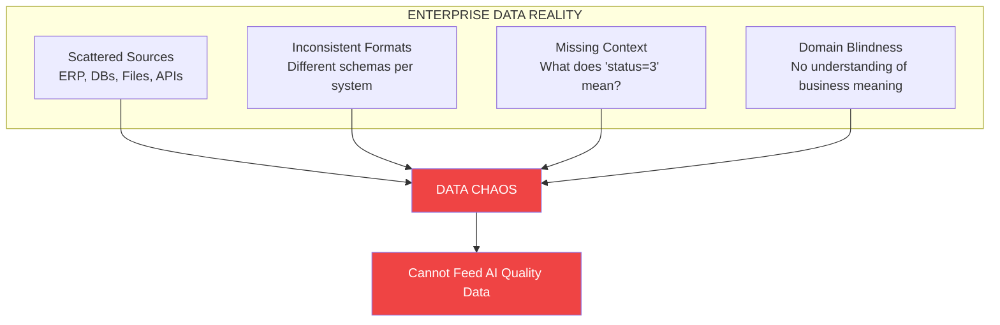
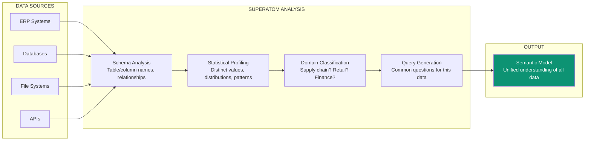
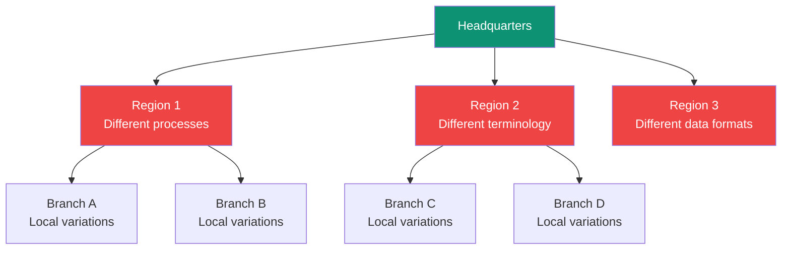
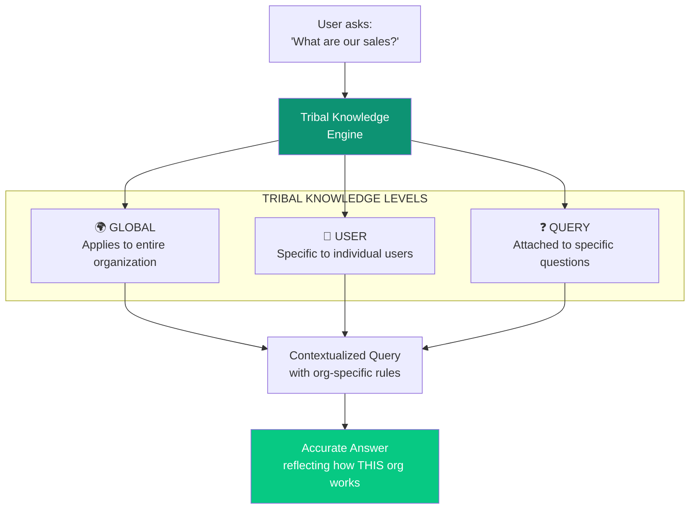
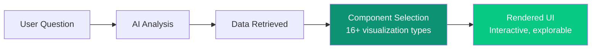
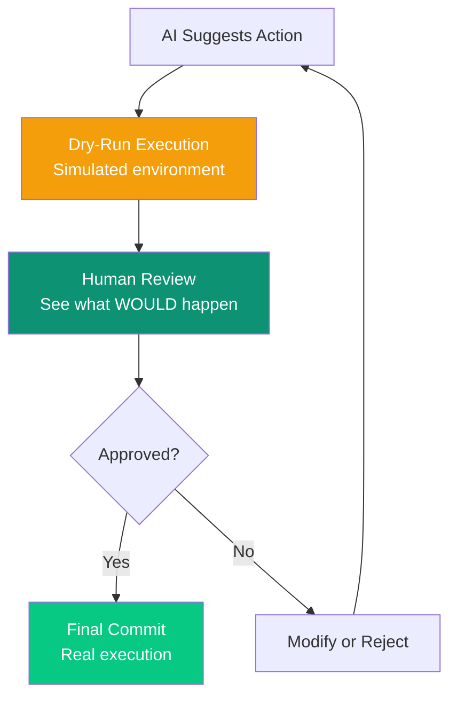
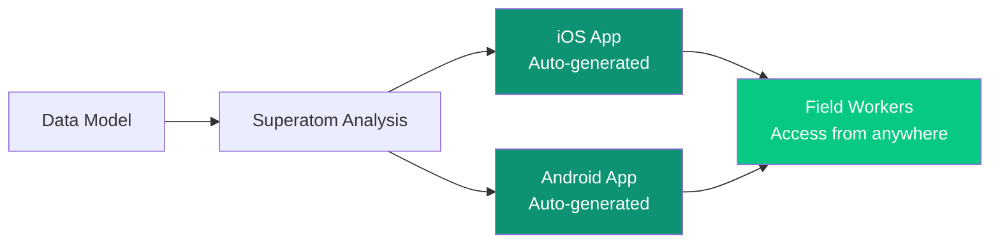
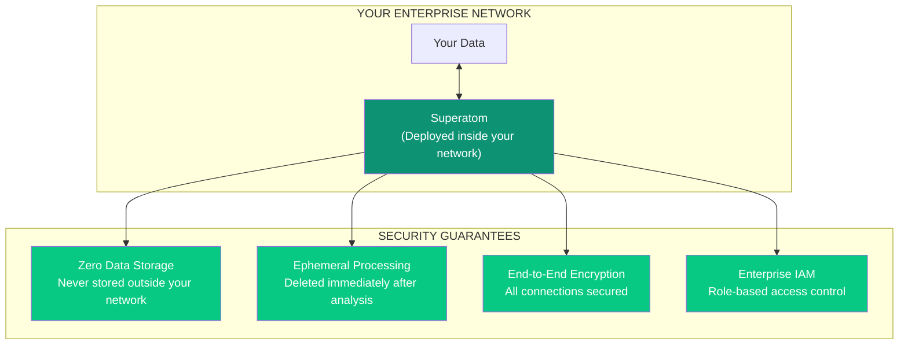
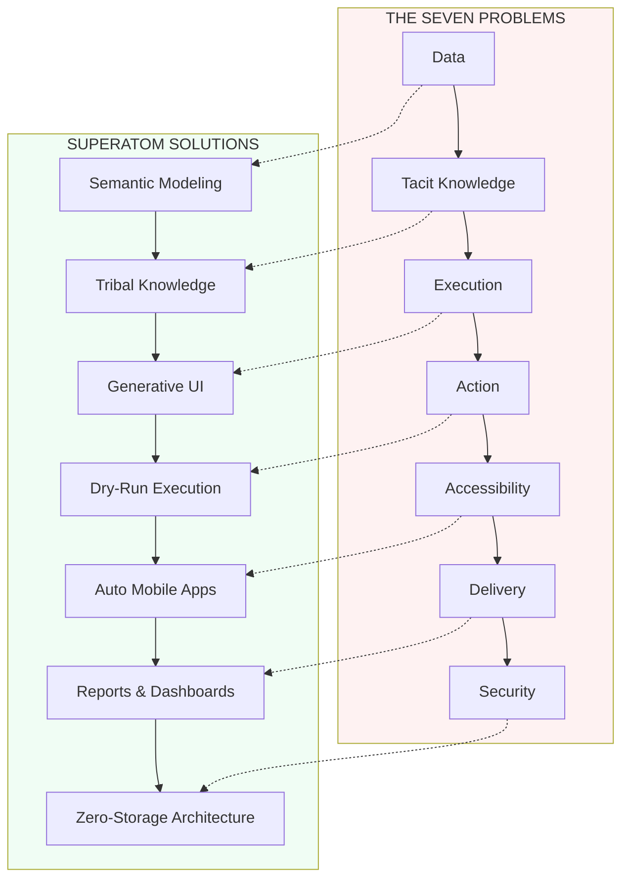

import { Card, CardGrid, LinkCard, Tabs, TabItem } from '@astrojs/starlight/components';

The decision loop sounds simple: understand data, analyze, suggest actions, verify, execute, observe, repeat. In practice, **seven interconnected problems** have made this nearly impossible for enterprises.

:::tip
Each problem builds on the previous. Solving them requires a systemic approach, not point solutions.
:::

---

## 1. The Data Problem

**The Challenge:** Enterprise data is messy, disconnected, and lacks context.

### The Sub-Problems

| Issue | Description | Traditional Solution |
|-------|-------------|---------------------|
| **Lack of Collection** | Orgs may not have systematic data collection processes | Expensive consulting engagements |
| **Dirty Data** | Data exists but isn't clean or well-organized | Manual data cleaning teams |
| **Disconnected Sources** | Data from different systems doesn't connect | Custom ETL pipelines |
| **Missing Domain Context** | Numbers without business meaning | Domain experts manually document |

:::caution
**Problem 1 (Lack of Collection)** is an organizational challenge that Superatom cannot fix. You need data to analyze.
:::

### Superatom's Solution: Automated Semantic Modeling

For Problems 2, 3, and 4, Superatom AI makes sense of your data automatically:

<Tabs>
  <TabItem label="Schema Analysis">
    - Analyze database names, table names, column names
    - Detect relationships between tables
    - Identify primary keys and foreign keys
    - Map data types and constraints
  </TabItem>
  <TabItem label="Statistical Profiling">
    - Sample data from each field
    - Calculate distinct values, max, min, mean, standard deviation
    - Find most common values
    - Detect percentage distributions (yes/no ratios)
  </TabItem>
  <TabItem label="Domain Classification">
    - Recognize domain context (Supply Chain, Retail, Finance, etc.)
    - Apply domain-specific interpretation rules
    - Connect industry-standard terminology
  </TabItem>
  <TabItem label="Query Generation">
    - Generate common questions for the data type
    - Create high-level system understanding
    - Build queryable knowledge base
  </TabItem>
</Tabs>

:::note
This analysis typically takes ~2 days for a complex enterprise database. It learns patterns and can be re-run periodically to capture data drift and evolution.
:::

---

## 2. The Tacit Knowledge Problem

**The Challenge:** Critical business knowledge exists only in people's heads.

### Three Types of Hidden Knowledge

<CardGrid>
  <Card title="Institutional Knowledge" icon="building">
		How things work in *this* organization. Unwritten rules, cultural norms, political realities.
	</Card>
  <Card title="Experiential Knowledge" icon="graduation-cap">
		Learned through doing, never documented. "We tried that in 2019, it doesn't work here."
	</Card>
  <Card title="Operational Knowledge" icon="gears">
		How things *actually* work day-to-day, not how the manual says they should work.
	</Card>
</CardGrid>

### The Geographic Complexity

Different departments, branches, and geographies interpret data differently. A "sale" in Region 1 might include returns; in Region 2, it might not. Without this context, analysis is meaningless.

### Superatom's Solution: Tribal Knowledge System

Superatom captures organization-specific knowledge at **three levels**:

| Level | Example | Effect |
|-------|---------|--------|
| **Global** | "Sales always exclude returns" | Applies to all queries for all users |
| **User** | "Show me only West Coast data" | This user always sees filtered view |
| **Query** | "When I ask about 'deadstock', include items with no sales in 12 months" | Specific definition for specific questions |

---

## 3. The Execution Problem

**The Challenge:** Even when you have insights, presenting them to business users is hard.

### What Business Users Need

  

No SQL Required

Business users should never write database queries. They should ask questions in plain English.

  

Visual, Not Textual

Raw text and tables create cognitive overload. Data must be visualized in ways that make sense instantly.

  

Transparency

Users need to see *how* analysis was done. What query ran? What data was included?

  

Follow-up Capability

One question leads to another. Users need to drill down, ask follow-ups, explore tangents.

  

Save and Share

Useful insights should be bookmarkable and shareable with colleagues.

  

Deterministic Results

The same question should give the same answer. Consistency builds trust.

  

Audit Trail

Who asked what, when, and what data was retrieved? Complete accountability.

  

Access Control

Different users should see different data based on their permissions.

### Superatom's Solution: Generative UI

Superatom pioneered **Generative UI**—automatically creating the perfect visualization for any data:

  

| Component Type | Use Case | Auto-Selected When |
|----------------|----------|-------------------|
| Bar Chart | Comparisons, rankings | Categorical data with values |
| Line Chart | Trends over time | Time-series data |
| Pie Chart | Part-to-whole | Percentage distributions |
| KPI Card | Single metrics | Aggregate values |
| Data Table | Detailed records | Row-level data needed |
| Gauge | Progress metrics | Single value with target |
| Map | Geographic data | Location-based fields detected |

---

## 4. The Action Problem

**The Challenge:** Knowing *why* something is happening is good. Knowing *how to fix it* is essential.

### Why AI Suggestions Often Fail

<CardGrid>
  <Card title="Domain Expertise Gap" icon="brain">
		AI isn't as intelligent as humans in specific domains. Generic suggestions miss nuance.
	</Card>
  <Card title="Organizational Blindness" icon="building">
		AI doesn't know what's *possible* in your organization. Suggestions may be impractical, costly, or politically impossible.
	</Card>
  <Card title="Accountability Gap" icon="scale-balanced">
		AI is non-deterministic—it can make mistakes. Who's responsible when it does?
	</Card>
</CardGrid>

### Superatom's Solution: Dry-Run Execution

Superatom implements a **simulation-first approach**:

**How it works:**

1. **AI suggests an action** (e.g., "Transfer 500 units from Warehouse A to B")
2. **Action is committed to a simulated system**—you see exactly what would happen
3. **Human reviews the simulation**—costs, impacts, side effects
4. **Human approves or rejects**—maintaining accountability
5. **Only then is the action executed** in the real system

:::note
As confidence builds from historical accuracy, low-stakes decisions can be automated—but humans always have the option to intervene.
:::

---

## 5. The Accessibility Problem

**The Challenge:** Not all data is accessible everywhere. Field workers need insights too.

A warehouse manager needs to see KPIs and take actions from the warehouse floor—but they don't have an office setup with them. Traditional solution: build mobile apps. Traditional problem: **mobile apps are expensive and time-consuming**.

### Superatom's Solution: Auto-Generated Mobile Apps

Superatom automatically generates **iOS and Android applications** from your data analysis:

  

- **Thin clients** with restricted, specific functionality
- **Role-based** views and actions
- **Offline capable** for disconnected environments
- **Zero development cost**—generated automatically

---

## 6. The Delivery Problem

**The Challenge:** Users can't constantly monitor dashboards. Insights need to come to them.

<Tabs>
  <TabItem label="The Problem">
    - Users can't keep looking at KPIs all day
    - Can't keep asking questions to a conversational AI
    - Need proactive notification when things change
    - Different users want different views and schedules
  </TabItem>
  <TabItem label="What Users Need">
    - Weekly metrics delivered to email automatically
    - Alerts when thresholds are exceeded
    - Custom dashboards with personalized views
    - Scheduled reports in their preferred format
  </TabItem>
</Tabs>

### Superatom's Solution: Reports & Dashboards

  

| Feature | Description |
|---------|-------------|
| **Dashboards** | Build custom dashboards with permission-based access |
| **Scheduled Reports** | Automatic delivery at pre-defined intervals |
| **Threshold Alerts** | Notifications when metrics cross boundaries |
| **Custom Formats** | PDF, CSV, interactive links |
| **Distribution Lists** | Send to individuals, teams, or roles |

---

## 7. The Security Problem

**The Challenge:** This is the #1 reason enterprises hesitate to adopt AI systems.

### Enterprise Security Concerns

:::caution
When you employ a person, you control what they see and how they report. Programs have the potential to be leaked. AI has additional risks.
:::

| Concern | Description |
|---------|-------------|
| **Data Leakage** | Programs can be exploited to leak sensitive data |
| **AI Hallucinations** | AI can generate false information, affecting data integrity |
| **Prompt Injection** | Malicious prompts can change AI behavior, damage systems, or extract unauthorized data |
| **Access Control** | Difficulty ensuring users only see what they're authorized to see |

### Superatom's Solution: Zero-Storage Architecture

| Security Feature | Implementation |
|------------------|----------------|
| **Zero Storage** | Superatom NEVER stores your data anywhere. Deployed entirely within your enterprise network. |
| **Ephemeral Processing** | Data is deleted immediately after analysis. No persistence, no leak possibility. |
| **Encrypted Connections** | All connections end-to-end encrypted. Can be severed instantly. |
| **Enterprise IAM** | Role-based permissions. Only explicitly authorized users can access. Okta/Office 365 integration coming. |

---

## The Connected Solution

These seven problems are interconnected, and so are Superatom's solutions:

<LinkCard title="Continue to Our Innovations" href="/ip/overview" description="Learn about the intellectual property that powers these solutions" />
