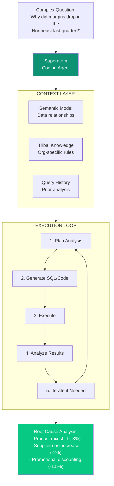
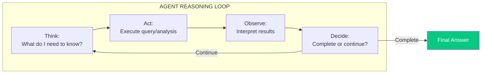
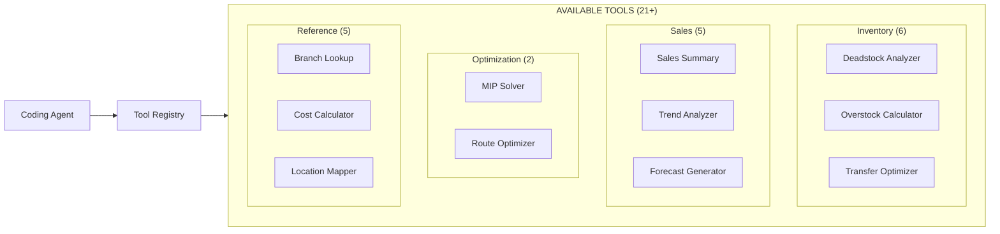
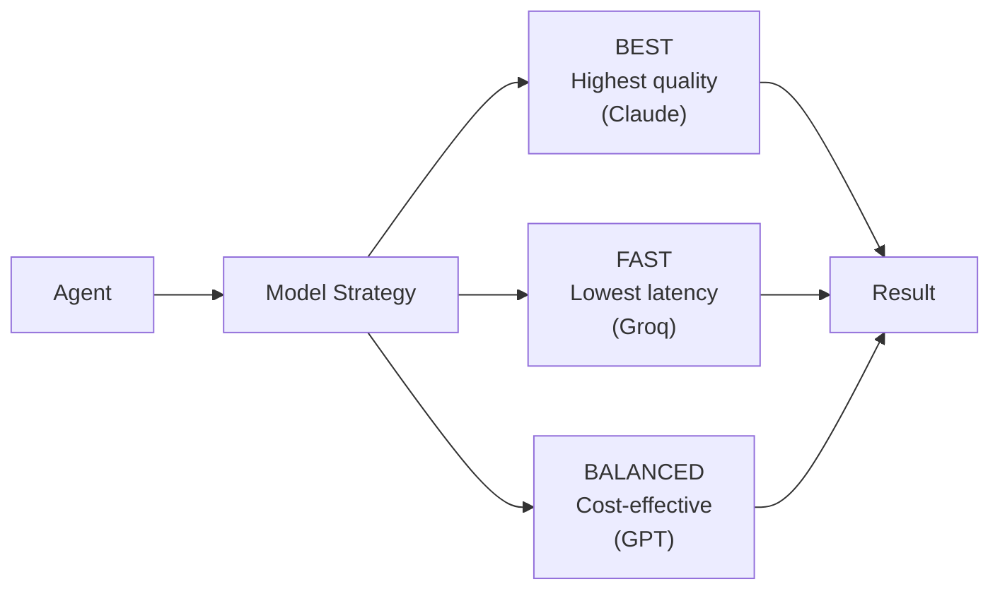

import { Card, CardGrid, LinkCard, Tabs, TabItem } from '@astrojs/starlight/components';

## The Breakthrough

**Coding agents are the most powerful outcome of modern AI.** They can write code, execute it, analyze results, and iterate—performing complex multi-step tasks autonomously.

**The problem:** Generic coding agents don't understand enterprise data contexts. They can write SQL, but they don't know that "sales" should exclude returns, or that "Q3" means fiscal Q3, or that the Miami branch data always arrives late.

**Superatom's innovation:** We've figured out how to use coding agents for **full-form analysis and decision-making** in complex enterprise data contexts.

---

## How Enterprise Coding Agents Work



---

## The Agent Execution Model

### Step 1: Task Understanding

The agent receives a question and breaks it into sub-tasks:

```yaml
question: "Why did margins drop in the Northeast last quarter?"

decomposition:
  1. Calculate current quarter margin for Northeast
  2. Calculate previous quarter margin for comparison
  3. Identify margin components (revenue, COGS, discounts)
  4. Compare each component period-over-period
  5. Identify largest contributors to change
  6. Generate root cause explanation
```

### Step 2: Context Injection

Before generating any code, the agent loads relevant context:

<Tabs>
  <TabItem label="Semantic Context">
    - What tables contain margin data?
    - How is Northeast defined (which states/branches)?
    - What date range is "last quarter" (fiscal)?
    - How are margin components calculated?
  </TabItem>
  <TabItem label="Tribal Knowledge">
    - Margin = (Revenue - COGS - Discounts - Shipping) / Revenue
    - Northeast = NY, NJ, CT, MA, PA branches
    - Q4 fiscal = January 1 - March 31
    - Exclude internal transfers from revenue
  </TabItem>
  <TabItem label="Historical Context">
    - Similar questions asked before
    - Common follow-ups
    - Known issues with this data
  </TabItem>
</Tabs>

### Step 3: Iterative Execution

The agent executes a reasoning loop:



**Example Iteration:**

| Step | Thought | Action | Observation |
|------|---------|--------|-------------|
| 1 | Need current margins | Query Q4 margins by region | Northeast: 23.2% |
| 2 | Need comparison | Query Q3 margins | Northeast was 28.7% |
| 3 | 5.5% drop - need breakdown | Query margin components | Revenue -2%, COGS +4%, Discounts +1.5% |
| 4 | COGS increased most | Query COGS by category | Product mix shifted, supplier costs up |
| 5 | Have root cause | Generate explanation | Multi-factor analysis complete |

### Step 4: Code Generation

The agent generates SQL and analysis code:

```sql
-- Step 1: Calculate margin components by quarter
WITH quarterly_metrics AS (
    SELECT
        fiscal_quarter,
        region,
        SUM(revenue) as total_revenue,
        SUM(cogs) as total_cogs,
        SUM(discounts) as total_discounts,
        SUM(shipping) as total_shipping
    FROM sales_fact sf
    JOIN dim_branch b ON sf.branch_id = b.id
    WHERE b.region = 'Northeast'
      AND sf.transaction_type NOT IN ('internal_transfer')  -- Tribal knowledge
    GROUP BY fiscal_quarter, region
)
SELECT
    fiscal_quarter,
    total_revenue,
    total_cogs,
    total_discounts,
    (total_revenue - total_cogs - total_discounts - total_shipping)
        / NULLIF(total_revenue, 0) as margin_pct
FROM quarterly_metrics
ORDER BY fiscal_quarter DESC;
```

Notice: The agent automatically applied tribal knowledge (excluding internal transfers) without being explicitly told.

---

## What Makes Enterprise Agents Different

### Generic Agent vs. Superatom Agent

| Capability | Generic Coding Agent | Superatom Enterprise Agent |
|-----------|---------------------|---------------------------|
| Write SQL | Yes | Yes, with semantic context |
| Execute queries | Yes | Yes, with security controls |
| Interpret results | Basic | Business-context aware |
| Handle ambiguity | Asks user | Uses tribal knowledge |
| Multi-step analysis | Limited | Full causal analysis |
| Domain adaptation | Manual prompting | Automatic from knowledge base |

### Example: "What's our inventory situation?"

**Generic Agent Response:**
```
SELECT * FROM inventory;
-- Returns raw data, user must interpret
```

**Superatom Agent Response:**
```
Analysis of inventory health across all locations:

OVERSTOCK (>90 days supply):
- 847 SKUs, $2.3M tied up
- Highest: Widget A ($450K, 180 days)

DEADSTOCK (No movement 12 months):
- 234 SKUs, $890K at risk
- Mostly discontinued items from 2024

LOW STOCK (<7 days supply):
- 56 SKUs, potential stockout risk
- 12 are fast-movers, recommend reorder

RECOMMENDED ACTIONS:
1. Transfer overstock Widget A to high-demand branches
2. Markdown deadstock items 40%+
3. Expedite PO #4521 for low-stock items
```

---

## The Tool System

Agents have access to a suite of specialized tools:



Each tool encapsulates domain expertise:

| Tool | Purpose | Built-in Intelligence |
|------|---------|----------------------|
| Deadstock Analyzer | Identify non-moving inventory | Category-specific thresholds |
| Transfer Optimizer | Suggest inventory moves | MIP optimization with constraints |
| Forecast Generator | Predict future demand | Seasonality, trends, events |
| Cost Calculator | Compute true costs | Includes hidden costs (holding, obsolescence) |

---

## Multi-Domain Capability

This IP is key to **universal applicability**. The same agent architecture works across industries:

<CardGrid>
  <Card title="Supply Chain" icon="truck">
		- Demand forecasting
    - Inventory optimization
    - Supplier analysis
    - Logistics planning
	</Card>
  <Card title="Retail" icon="store">
		- Assortment planning
    - Markdown optimization
    - Customer segmentation
    - Promotional analysis
	</Card>
  <Card title="Finance" icon="coins">
		- Variance analysis
    - Cash flow forecasting
    - Risk assessment
    - Compliance checking
	</Card>
  <Card title="Operations" icon="industry">
		- Capacity planning
    - Quality analysis
    - Maintenance prediction
    - Resource optimization
	</Card>
</CardGrid>

**Adding a new domain requires:**
1. Connect data sources (automatic semantic modeling)
2. Add domain tribal knowledge (knowledge nodes)
3. Agent adapts automatically

---

## LLM Provider Flexibility

Superatom agents work with multiple LLM providers:

| Provider | Strength | Use Case |
|----------|----------|----------|
| **Anthropic Claude** | Best reasoning | Complex multi-step analysis |
| **OpenAI GPT** | General purpose | Balanced everyday tasks |
| **Google Gemini** | Fast processing | Quick queries, real-time |
| **Groq** | Ultra-fast | High-volume, simple queries |



**No vendor lock-in.** Switch providers based on cost, performance, or availability.

---

## Why This Matters

### Competitive Moat

1. **Years of Development**

   Enterprise-context coding agents required solving multiple hard problems simultaneously.

  1. **Proprietary Integration**

   Our semantic model + tribal knowledge + agent framework work as an integrated system.

  1. **Domain Accumulation**

   Every deployment adds domain intelligence that makes agents smarter.

### Market Position

This innovation puts Superatom in **every domain and every kind of dataset**:

- We can quickly generate insights and actions from any data
- No domain-specific development required
- Tribal knowledge customizes for organizational context
- Agents learn and improve from usage

---

## Next Steps

<CardGrid>
  <LinkCard title="Automated Analyst" href="/ip/automated-analyst" description="Agents that run continuously, even when you sleep" />
  <LinkCard title="Architecture Overview" href="/architecture/overview" description="How agents fit into the platform" />
</CardGrid>
