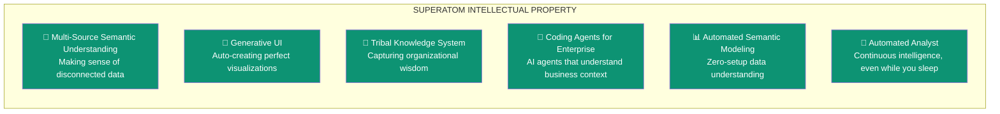
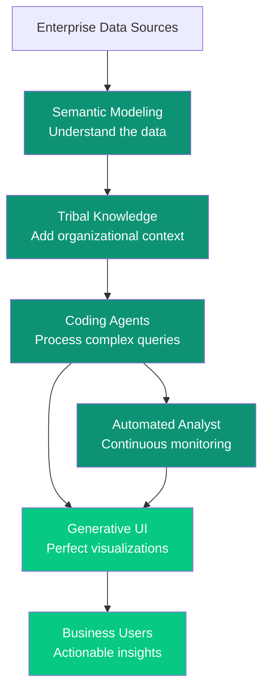

import { Card, CardGrid, LinkCard } from '@astrojs/starlight/components';

Superatom has developed **six core innovations** that together create an enterprise AI platform unlike anything else in the market. Each innovation addresses specific challenges and represents years of research and development.

---

## The Six Innovations

<CardGrid>
  <LinkCard title="1. Multi-Source Semantic Understanding" href="/ip/semantic-modeling" description="**The Problem:** Enterprise data is scattered across ERPs, databases, files, and APIs with no unifie" />

  <LinkCard title="2. Generative UI" href="/ip/generative-ui" description="**The Problem:** Raw data is unusable by business users. Building custom visualizations is slow and " />

  <LinkCard title="3. Tribal Knowledge System" href="/ip/tribal-knowledge" description="**The Problem:** Critical organizational knowledge exists only in people's heads. AI can't access it" />

  <LinkCard title="4. Coding Agents for Enterprise" href="/ip/coding-agents" description="**The Problem:** Coding agents are powerful but don't understand enterprise data contexts.

    **Ou" />

  <LinkCard title="5. Automated Semantic Modeling" href="/ip/semantic-modeling#automated-modeling" description="**The Problem:** Semantic modeling requires high-level experts and domain knowledge specialists. It'" />

  <LinkCard title="6. Automated Analyst" href="/ip/automated-analyst" description="**The Problem:** Analysis only happens when someone asks. Insights are missed when no one's looking." />
</CardGrid>

---

## How They Work Together

These innovations aren't isolated—they form an integrated system:

| Innovation | Feeds Into | Receives From |
|------------|-----------|---------------|
| Semantic Modeling | Tribal Knowledge, Coding Agents | Raw Data Sources |
| Tribal Knowledge | Coding Agents, Automated Analyst | Semantic Model, User Input |
| Coding Agents | Generative UI, Automated Analyst | Semantic Model, Tribal Knowledge |
| Automated Analyst | Generative UI | Coding Agents, Tribal Knowledge |
| Generative UI | Business Users | Coding Agents, Automated Analyst |

---

## Competitive Moat

These innovations create significant barriers to entry:

1. **Years of Development**

   Each innovation represents extensive R&D. Competitors would need years to replicate.

  1. **Integrated System**

   The innovations work together synergistically. Individual components wouldn't achieve the same results.

  1. **Domain Knowledge Accumulation**

   As we add more verticals and domain knowledge, our semantic modeling becomes more powerful—creating a flywheel effect.

  1. **First-Mover Advantage**

   We pioneered Generative UI and enterprise coding agents. Market position compounds over time.

---

## Deep Dives

<CardGrid>
  <LinkCard title="Semantic Modeling" href="/ip/semantic-modeling" description="How we make sense of disconnected enterprise data" />
  <LinkCard title="Generative UI" href="/ip/generative-ui" description="Automatically creating perfect visualizations" />
  <LinkCard title="Tribal Knowledge" href="/ip/tribal-knowledge" description="Capturing organizational wisdom in AI" />
  <LinkCard title="Coding Agents" href="/ip/coding-agents" description="AI agents that understand enterprise context" />
  <LinkCard title="Automated Analyst" href="/ip/automated-analyst" description="Continuous intelligence that never sleeps" />
</CardGrid>
