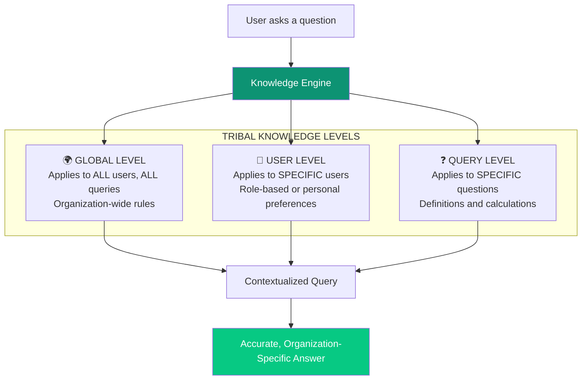
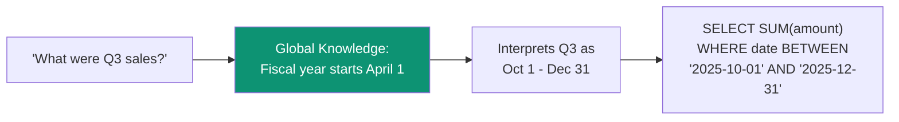
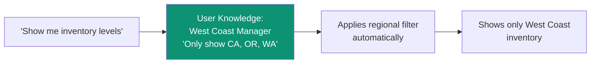
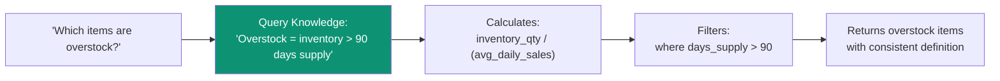
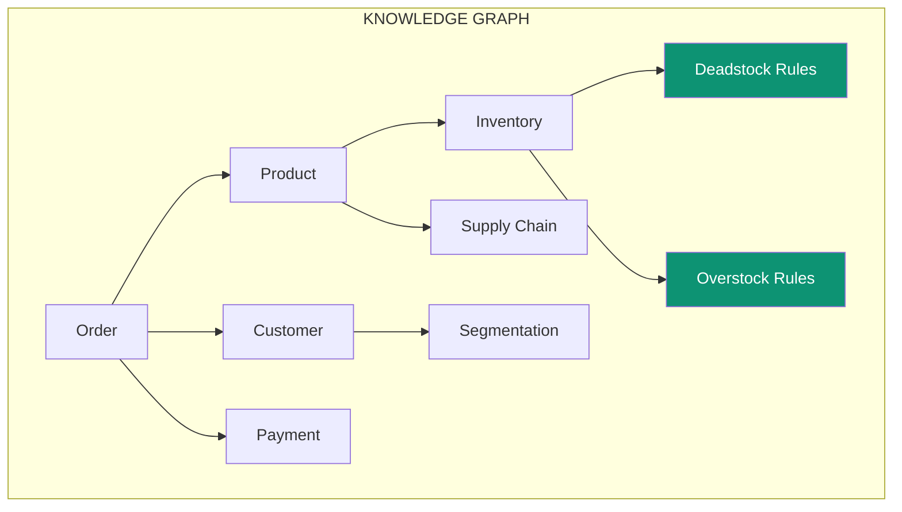
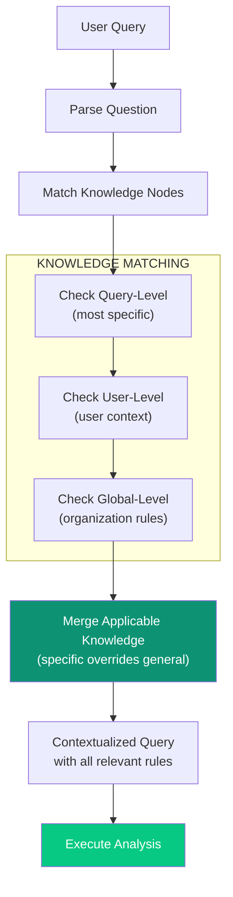

import { Card, CardGrid, LinkCard, Tabs, TabItem } from '@astrojs/starlight/components';

## The Hidden Knowledge Problem

Every organization has knowledge that exists only in people's heads:

<CardGrid>
  <Card title="Institutional Knowledge" icon="building">
		*"We never count demo units as inventory"*

    Unwritten rules specific to this organization
	</Card>
  <Card title="Experiential Knowledge" icon="graduation-cap">
		*"We tried that approach in 2019—it doesn't work with our suppliers"*

    Learned through doing, never documented
	</Card>
  <Card title="Operational Knowledge" icon="gears">
		*"Sales from the Miami branch always come in a day late"*

    How things actually work day-to-day
	</Card>
</CardGrid>

**This knowledge is critical for correct analysis.** Without it, AI will give technically correct but practically wrong answers.

---

## The Three-Level System

Superatom captures tribal knowledge at **three levels**, each with different scope and application:



---

## Level 1: Global Knowledge

**Scope:** Applies to every query for every user

**Purpose:** Organization-wide definitions, rules, and conventions

### Examples

| Knowledge Node | Effect |
|---------------|--------|
| *"Sales always exclude returns and refunds"* | All sales queries automatically filter out returns |
| *"Fiscal year starts April 1"* | Date calculations use Apr-Mar fiscal year |
| *"EMEA region includes UK despite Brexit"* | Geographic groupings remain consistent |
| *"Inactive products have status code 'D'"* | Product queries can correctly filter active items |

### How It Works



Without global knowledge, "Q3" might be interpreted as calendar Q3 (Jul-Sep) instead of fiscal Q3.

---

## Level 2: User Knowledge

**Scope:** Applies to queries from specific users

**Purpose:** Role-based views, personal preferences, access restrictions

### Examples

| User/Role | Knowledge Node | Effect |
|-----------|---------------|--------|
| West Coast Manager | *"Only show data for regions CA, OR, WA"* | All queries automatically filtered to West Coast |
| Finance Team | *"Include pending transactions"* | Queries show uncommitted data |
| Executive | *"Always compare to same period last year"* | Automatic YoY comparison |
| Warehouse Staff | *"Show quantities in cases, not units"* | Unit conversion applied |

### How It Works



The same question from a different user would show different data based on their knowledge nodes.

---

## Level 3: Query Knowledge

**Scope:** Applies to specific types of questions

**Purpose:** Define business terms, calculation methods, domain-specific logic

### Examples

| Term/Query | Knowledge Node | Effect |
|-----------|---------------|--------|
| "deadstock" | *"Items with no sales in 12 months where On-Hand Cash Value exceeds COGS"* | Specific calculation applied |
| "overstock" | *"Inventory exceeding 90 days of average sales"* | Days-of-supply calculation |
| "margin" | *"(Revenue - COGS - Shipping) / Revenue"* | Includes shipping in calculation |
| "active customer" | *"Placed order in last 180 days"* | Customer status definition |

### How It Works

  



---

## Knowledge Node Structure

Each knowledge node contains:

```yaml
knowledge_node:
  id: "kn_overstock_definition"
  type: "query"  # global | user | query
  trigger: "overstock"  # when to apply

  content:
    description: "Items with inventory exceeding 90 days of sales"
    calculation: |
      - Structural products: Rolling 90 days COGS > $0
      - Decking products (MajorMinorCode = '0103DEC'): Rolling 180 days COGS > $0
      - Specialty products: Rolling 120 days COGS > $0

    key_columns:
      - "FactInventoryDaily.OnHandInventory"
      - "FactSalesInvoice.AverageCostExtended"
      - "DimItem.ProductType"

    formula: "OnHandInventory - (RollingPeriod * COGS)"

  metadata:
    created_by: "admin@company.com"
    created_at: "2025-11-15"
    updated_at: "2026-01-21"
    applies_to: ["inventory queries", "deadstock analysis"]
```

---

## The Knowledge Graph

Knowledge nodes connect to form a graph that captures organizational understanding:

  



This graph enables:
- **Relationship traversal** — Understanding how concepts connect
- **Context inheritance** — Child nodes inherit parent knowledge
- **Conflict resolution** — More specific nodes override general ones

---

## Creating Knowledge Nodes

### From the UI

  

1. Navigate to **Knowledge Base → Knowledge Graphs**
2. Click **+ Create Node**
3. Select level (Global, User, Query)
4. Define trigger conditions
5. Add description and rules
6. Save and test

### From Conversations

When the AI gives an answer that needs organizational context:

1. User corrects: *"Actually, we don't count returns in sales"*
2. System prompts: *"Would you like to save this as a rule?"*
3. User confirms scope (global, user, query)
4. Knowledge node created automatically

---

## How Knowledge Flows



**Priority Order:**
1. Query-level knowledge (most specific) wins
2. User-level adds personal/role context
3. Global-level provides baseline rules

---

## Why This Matters

### The Problem with Generic AI

| Scenario | Generic AI Answer | With Tribal Knowledge |
|----------|------------------|----------------------|
| "Show sales" | All transactions | Excludes returns, demos, internal transfers |
| "Q4 revenue" | Oct-Dec | Jan-Mar (fiscal year) |
| "Top customers" | By raw revenue | By margin-adjusted lifetime value |
| "Overstock items" | Undefined error | Calculated per product category rules |

### Business Impact

<CardGrid>
  <Card title="Accuracy" icon="bullseye">
		Answers reflect how YOUR organization actually works
	</Card>
  <Card title="Consistency" icon="equals">
		Same terminology means the same thing for everyone
	</Card>
  <Card title="Onboarding" icon="user-plus">
		New employees get organization-aware AI from day one
	</Card>
  <Card title="Knowledge Preservation" icon="vault">
		Institutional knowledge survives employee turnover
	</Card>
</CardGrid>

---

## Curating for Any Domain

The Tribal Knowledge system allows Superatom to be **curated for any industry and any organization**:

<Tabs>
  <TabItem label="Supply Chain">
    - Lead time calculations
    - Safety stock formulas
    - Supplier rating methods
    - Logistics cost allocation
  </TabItem>
  <TabItem label="Retail">
    - Markdown definitions
    - Same-store sales rules
    - Promotional lift calculations
    - Customer segment criteria
  </TabItem>
  <TabItem label="Finance">
    - Revenue recognition rules
    - Cost allocation methods
    - Reporting period definitions
    - Currency conversion timing
  </TabItem>
  <TabItem label="Healthcare">
    - Patient outcome metrics
    - Compliance definitions
    - Care pathway criteria
    - Quality score calculations
  </TabItem>
</Tabs>

---

## Next Steps

<CardGrid>
  <LinkCard title="Knowledge Base Platform" href="/platform/knowledge-base" description="Managing knowledge in the platform" />
  <LinkCard title="Coding Agents" href="/ip/coding-agents" description="How agents use tribal knowledge" />
</CardGrid>
