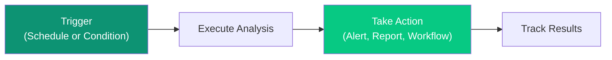

import { Card, CardGrid, LinkCard } from '@astrojs/starlight/components';

Automated Actions let you create workflows that respond to data conditions—from daily summaries to real-time alerts when critical thresholds are breached.

  

---

## How Actions Work



Actions have three components:

1. **Trigger** — When to run (schedule or data condition)
2. **Analysis** — What to check or calculate
3. **Action** — What to do with the results

---

## Action Types

### Scheduled Actions

Run on a regular schedule:

<CardGrid>
  <Card title="Daily KPI Summary" icon="calendar-day">
		Every morning at 7 AM, send executive summary of business health
	</Card>
  <Card title="Weekly Cash Flow Forecast" icon="calendar-week">
		Every Monday, generate cash flow projections for the week
	</Card>
</CardGrid>

### Triggered Actions

Run when conditions are met:

<CardGrid>
  <Card title="Revenue Anomaly Detection" icon="chart-line-down">
		Alert when revenue variance exceeds 15% from forecast
	</Card>
  <Card title="Margin Compression Alert" icon="compress">
		Notify when profit margins fall below acceptable thresholds
	</Card>
</CardGrid>

---

## Creating an Action

1. **Navigate to Actions**

   Click **Actions** in the sidebar under SYSTEM

  1. **Click Create Action**

   Start the action creation wizard

  1. **Choose Trigger Type**

   - **Schedule** — Run at specific times
    - **Condition** — Run when data meets criteria

  1. **Define the Analysis**

   Describe what to analyze: *"Check if daily revenue is more than 10% below forecast"*

  1. **Configure Actions**

   What happens when triggered:
    - Generate dashboard
    - Send email alert
    - Post to Slack
    - Create task
    - Trigger webhook

  1. **Set Recipients**

   Who receives the output

  1. **Activate**

   Turn on the action

---

## Example Actions

### Daily KPI Summary

```yaml
name: "Daily KPI Summary"
category: "Executive Dashboard"

trigger:
  type: schedule
  frequency: daily
  time: "07:00"
  timezone: "America/New_York"

analysis: |
  Generate executive summary of:
  - Revenue vs. target
  - Orders and average order value
  - Inventory health
  - Customer metrics

actions:
  - generate_dashboard
  - send_email

recipients:
  - role: "Executive Team"

status: active
last_run: "2026-01-25 07:00 AM"
success_rate: 100%
```

### Revenue Anomaly Detection

```yaml
name: "Revenue Anomaly Detection"
category: "Financial Intelligence"

trigger:
  type: condition
  metric: "daily_revenue"
  condition: "variance > 15% OR variance < -10%"
  check_frequency: "hourly"

analysis: |
  When revenue variance detected:
  - Identify contributing factors
  - Compare to historical patterns
  - Generate root cause analysis

actions:
  - critical_alert
  - generate_investigation_report

recipients:
  - user: "cfo@company.com"
  - role: "Finance Team"

status: active
executions: 12
success_rate: 100%
```

---

## Action Categories

| Category | Purpose | Examples |
|----------|---------|----------|
| **Executive Dashboard** | Leadership summaries | Daily KPI summary, weekly review |
| **Financial Intelligence** | Revenue and margin monitoring | Anomaly detection, forecast alerts |
| **Inventory Management** | Stock level monitoring | Low stock alerts, overstock warnings |
| **Customer Intelligence** | Customer behavior tracking | Churn risk alerts, segment changes |
| **Operational** | Process monitoring | SLA breaches, capacity alerts |

---

## Action Outputs

### Dashboards

Auto-generated visual summaries with:
- KPI cards for key metrics
- Trend charts
- Comparison tables
- AI-written analysis

### Alerts

Notifications sent via:
- Email
- Slack
- Microsoft Teams
- SMS (configurable)
- Push notification (mobile app)

### Reports

Full PDF or interactive reports with:
- Executive summary
- Detailed analysis
- Visualizations
- Recommendations

### Webhooks

Trigger external systems:
- Create tickets in Jira
- Update records in Salesforce
- Trigger workflows in Zapier
- Custom integrations

---

## Monitoring Actions

Track action performance:

| Metric | Description |
|--------|-------------|
| **Status** | Active, Paused, Error |
| **Last Run** | When it last executed |
| **Executions** | Total number of runs |
| **Success Rate** | Percentage of successful runs |
| **Average Duration** | How long it takes to run |

### Action History

View complete execution history:
- When it ran
- What triggered it
- What actions were taken
- Who received outputs
- Any errors encountered

---

## Best Practices

  <details>
<summary>Start with High-Value Alerts</summary>

Focus on metrics that directly impact business decisions.

</details>
  <details>
<summary>Set Reasonable Thresholds</summary>

Too sensitive = alert fatigue. Too loose = missed issues.

</details>
  <details>
<summary>Include Context</summary>

Alerts should explain WHY something happened, not just WHAT.

</details>
  <details>
<summary>Review and Refine</summary>

Regularly review action effectiveness and adjust thresholds.

</details>

---

## Next Steps

<CardGrid>
  <LinkCard title="Automated Analyst" href="/ip/automated-analyst" description="How continuous monitoring works" />
  <LinkCard title="Security" href="/security/overview" description="How actions respect access controls" />
</CardGrid>
