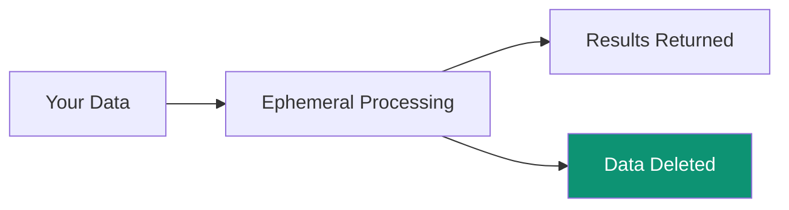

## Zero-Storage Principle

:::note
Superatom NEVER stores your business data. All processing is ephemeral.
:::

## What IS Stored

| Data Type | Storage Location | Purpose |
|-----------|-----------------|---------|
| User accounts | PostgreSQL | Authentication |
| Conversation history | PostgreSQL | Context, audit |
| Dashboard configs | PostgreSQL | User preferences |
| Knowledge nodes | PostgreSQL | Tribal knowledge |
| Embeddings | ChromaDB | Semantic search |

## What is NOT Stored

- Raw business data
- Query results
- Exported files
- Customer PII from sources

## Encryption

| State | Method |
|-------|--------|
| In transit | TLS 1.3 |
| At rest | AES-256 |
| API keys | Hashed (SHA-256) |
| Passwords | Hashed (bcrypt) |

## Data Lifecycle

1. **Query Received**

   User asks a question

  1. **Data Retrieved**

   Query executes against source

  1. **Processing**

   AI analyzes results in memory

  1. **Response Sent**

   Visualization streamed to user

  1. **Cleanup**

   All temporary data deleted

## Network Security

- VPC deployment
- No public database exposure
- TLS for all connections
- Connection severable instantly
