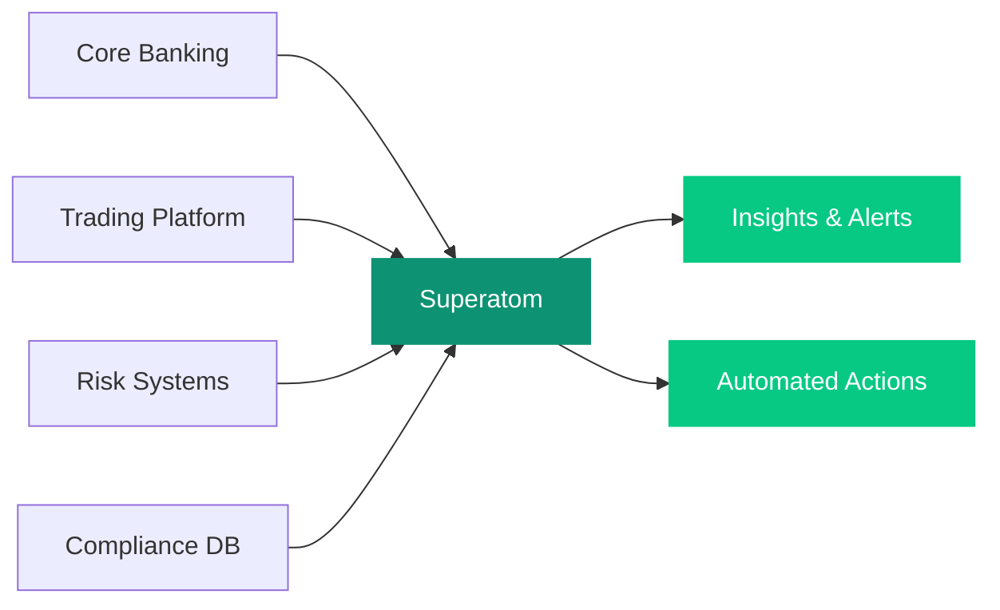

## Overview

Superatom connects to core banking, trading, risk management, and compliance systems to deliver instant analysis across your financial operations. From exposure monitoring to regulatory reporting, ask questions in plain language and receive accurate, auditable answers.

---

## Connected Data Sources

<CardGroup cols={3}>
  <Card title="Core Banking" icon="building-columns">
    Loan origination, deposits, and account systems
  </Card>
  <Card title="Trading Platforms" icon="chart-candlestick">
    Order management and execution systems
  </Card>
  <Card title="Risk Management" icon="shield-halved">
    Credit risk, market risk, and operational risk systems
  </Card>
  <Card title="CRM" icon="address-book">
    Salesforce and client relationship platforms
  </Card>
  <Card title="Compliance Databases" icon="gavel">
    Regulatory reporting and audit trail systems
  </Card>
  <Card title="Market Data" icon="chart-line">
    Real-time and historical market data feeds
  </Card>
</CardGroup>

---

## Example Queries

The following table shows real questions you can ask Superatom and how the platform handles each one.

| Question | What Superatom Does |
|---|---|
| "What's our current exposure to commercial real estate?" | Aggregates loan balances, collateral valuations, and risk ratings across the CRE portfolio. Segments by geography, property type, and maturity. Flags concentrations exceeding policy limits. |
| "Show me all accounts with unusual transaction patterns this week" | Applies anomaly detection to transaction volumes, amounts, and counterparty patterns. Flags deviations from established baselines. Groups by risk category. |
| "What would happen to our NIM if rates drop 50 basis points?" | Models the impact on net interest margin by repricing assets and liabilities based on rate sensitivity. Shows the timeline of impact as fixed-rate instruments mature. |
| "Which branch managers are exceeding their lending authority?" | Queries approval records against delegated authority limits. Identifies exceptions, patterns, and frequency. |

---

## Automated Workflows

Set up workflows that continuously monitor risk positions and compliance requirements.

<CardGroup cols={1}>
  <Card title="Daily Risk Position Summary" icon="gauge-high">
    Aggregates exposures by category, flags limit breaches, and calculates Value at Risk. Delivered to risk officers each morning before markets open.
  </Card>
  <Card title="Regulatory Reporting Data Preparation" icon="file-contract">
    Collects and validates data required for periodic regulatory submissions. Identifies data quality issues before filing deadlines.
  </Card>
  <Card title="Credit Quality Monitoring" icon="arrow-trend-down">
    Tracks migration between risk grades and flags deteriorating credits early. Alerts relationship managers to initiate proactive review.
  </Card>
</CardGroup>

---

## How It Works

<Warning>
All analysis is fully auditable. Superatom exposes the SQL behind every answer so compliance teams can verify the logic and methodology used for any regulatory-sensitive query.
</Warning>
