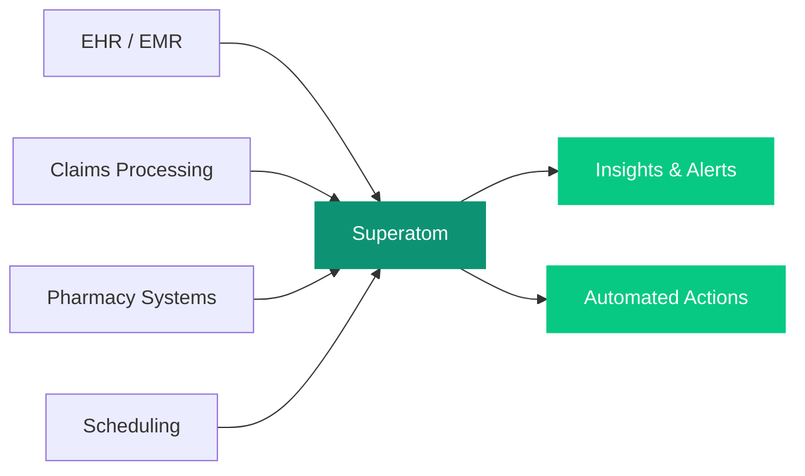

## Overview

Superatom connects to EHR/EMR, claims processing, pharmacy, and scheduling systems to deliver instant insights on clinical operations, financial performance, and quality metrics. Ask questions in plain language and get actionable answers -- without exposing protected health information.

<Note>
All PHI remains within the customer's network. Superatom's zero-storage architecture means patient data is processed ephemerally and never persisted in the platform. Data is queried in place, analyzed in memory, and results are delivered without any patient information being stored by Superatom.
</Note>

---

## Connected Data Sources

<CardGroup cols={3}>
  <Card title="EHR / EMR Systems" icon="laptop-medical">
    Electronic health and medical record platforms
  </Card>
  <Card title="Claims Processing" icon="file-invoice-dollar">
    Payer and claims management systems
  </Card>
  <Card title="Pharmacy Systems" icon="prescription-bottle-medical">
    Medication management and dispensing
  </Card>
  <Card title="Scheduling" icon="calendar-check">
    Appointment and resource scheduling platforms
  </Card>
  <Card title="Patient Engagement" icon="comments">
    Patient portals and communication tools
  </Card>
</CardGroup>

---

## Example Queries

The following table shows real questions you can ask Superatom and how the platform handles each one.

| Question | What Superatom Does |
|---|---|
| "What's our average length of stay by diagnosis group, and how does it compare to benchmarks?" | Calculates ALOS by DRG/diagnosis group. Compares against internal targets and external benchmarks. Identifies outlier cases and contributing factors (readmissions, complications, discharge delays). |
| "Which departments have the highest overtime hours relative to patient volume?" | Normalizes labor hours against patient encounters, admissions, or procedures. Identifies staffing imbalances by department, shift, and day of week. |
| "Show me the trend in denied claims over the past 6 months by payer" | Tracks denial rates by payer, denial reason, and department. Identifies increasing denial patterns and estimates revenue impact. |

---

## Automated Workflows

Set up workflows that continuously monitor clinical operations and financial performance.

<CardGroup cols={1}>
  <Card title="Bed Utilization Monitoring" icon="bed">
    Tracks occupancy by unit and forecasts capacity needs 24-48 hours ahead. Alerts administrators when units approach capacity so resources can be rebalanced.
  </Card>
  <Card title="Claims Denial Pattern Alerts" icon="triangle-exclamation">
    Flags emerging denial trends by payer or reason code. Identifies root causes and estimates the revenue impact so billing teams can address issues proactively.
  </Card>
  <Card title="Quality Metric Tracking" icon="clipboard-check">
    Monitors core quality measures with early warning on targets at risk. Provides trend analysis and contributing factor breakdowns for each metric.
  </Card>
</CardGroup>

---

## How It Works

<Warning>
Superatom is designed for operational and financial analytics. It does not make clinical decisions or provide medical advice. All clinical workflows should follow your organization's established protocols and regulatory requirements.
</Warning>
