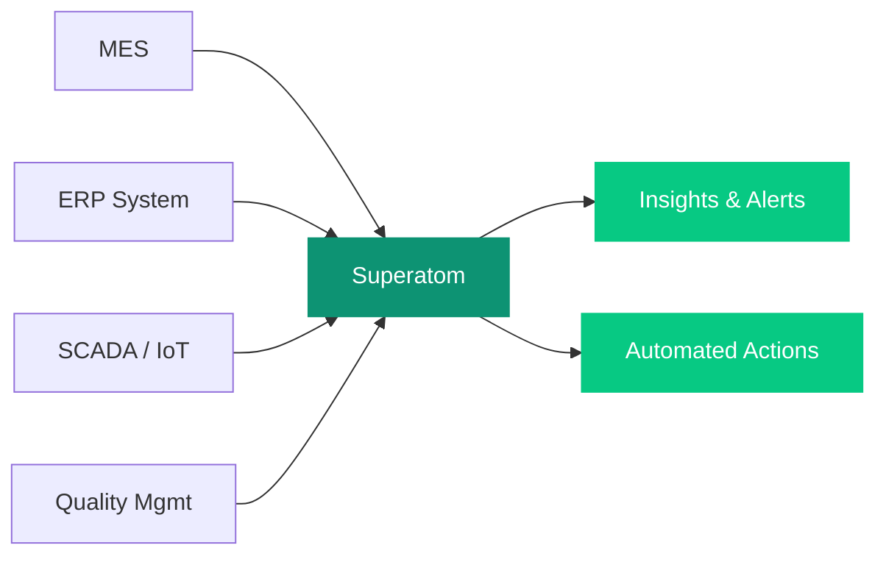

## Overview

Superatom connects to MES, ERP, SCADA/IoT, quality management, and maintenance systems to deliver instant insights on production performance, equipment health, and supplier quality. Ask questions in plain language and get root-cause analysis, trend detection, and actionable recommendations.

---

## Connected Data Sources

<CardGroup cols={3}>
  <Card title="MES" icon="gears">
    Manufacturing Execution Systems for production tracking
  </Card>
  <Card title="ERP Systems" icon="database">
    SAP, Oracle, and enterprise resource planning platforms
  </Card>
  <Card title="SCADA / IoT" icon="microchip">
    Sensor data, PLCs, and industrial control systems
  </Card>
  <Card title="Quality Management" icon="clipboard-check">
    Inspection, testing, and quality control systems
  </Card>
  <Card title="Maintenance Management" icon="wrench">
    CMMS and preventive maintenance platforms
  </Card>
</CardGroup>

---

## Example Queries

The following table shows real questions you can ask Superatom and how the platform handles each one.

| Question | What Superatom Does |
|---|---|
| "What's our OEE by production line this month?" | Calculates Overall Equipment Effectiveness by decomposing into availability, performance, and quality components per line. Identifies which factor is limiting each line. |
| "Which suppliers have the highest defect rates for incoming materials?" | Aggregates incoming inspection results by supplier, material type, and defect category. Trends over time. Compares against contractual quality requirements. |
| "Show me unplanned downtime events correlated with maintenance schedules" | Maps downtime events against preventive maintenance records. Identifies patterns (e.g., machines that fail within 2 weeks of scheduled maintenance suggest maintenance intervals are too long). |

---

## Automated Workflows

Set up workflows that continuously monitor production and equipment health.

<CardGroup cols={1}>
  <Card title="Production Yield Monitoring" icon="chart-simple">
    Alerts when yield drops below threshold by line, shift, or product. Includes automatic root-cause investigation that checks materials, equipment, and environmental factors.
  </Card>
  <Card title="Predictive Maintenance Signals" icon="sensor-triangle-exclamation">
    Flags equipment showing patterns that historically preceded failures. Prioritizes maintenance interventions by risk of unplanned downtime and production impact.
  </Card>
  <Card title="Supplier Quality Trending" icon="truck-ramp-box">
    Weekly summary of incoming quality metrics with trend warnings. Identifies suppliers whose quality is degrading before it impacts production.
  </Card>
</CardGroup>

---

## How It Works

<Note>
Superatom correlates data across production, quality, and maintenance systems automatically. When yield drops, the platform investigates material inputs, equipment status, and environmental factors to pinpoint the root cause.
</Note>
