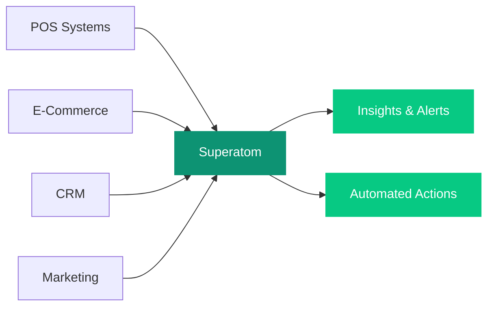

## Overview

Superatom unifies your retail data across POS, e-commerce, CRM, and marketing platforms to deliver instant insights on customer behavior, product performance, and omnichannel operations. Ask questions in plain language and get actionable answers with visualizations.

---

## Connected Data Sources

<CardGroup cols={3}>
  <Card title="POS Systems" icon="cash-register">
    In-store transaction and sales data
  </Card>
  <Card title="E-Commerce Platforms" icon="cart-shopping">
    Shopify, Magento, and online storefronts
  </Card>
  <Card title="CRM" icon="address-book">
    Salesforce, HubSpot, and customer databases
  </Card>
  <Card title="Inventory Management" icon="boxes-stacked">
    Stock levels across channels and locations
  </Card>
  <Card title="Marketing Platforms" icon="bullhorn">
    Advertising, email, and campaign analytics
  </Card>
</CardGroup>

---

## Example Queries

The following table shows real questions you can ask Superatom and how the platform handles each one.

| Question | What Superatom Does |
|---|---|
| "What's our customer acquisition cost by channel this quarter?" | Pulls marketing spend from advertising platforms and customer data from CRM. Calculates CAC per channel. Compares against customer lifetime value for ROI analysis. |
| "Which products should we markdown this week?" | Analyzes sell-through rates, days of inventory, seasonal patterns, and margin thresholds. Identifies slow-moving items approaching markdown triggers. Suggests discount levels based on price elasticity. |
| "Compare same-store sales growth across all locations" | Normalizes for store age, format, and geography. Calculates like-for-like growth. Identifies outperformers and underperformers with contributing factors. |
| "What's driving the increase in return rates?" | Breaks down returns by product, reason code, channel, and customer segment. Identifies patterns (e.g., specific product sizes, shipping damage from a specific carrier). |

---

## Automated Workflows

Set up workflows that continuously monitor retail operations and surface opportunities.

<CardGroup cols={1}>
  <Card title="Weekly Assortment Performance" icon="ranking-star">
    Ranks products by sell-through, margin contribution, and inventory weeks. Highlights items that need promotional support or markdown consideration.
  </Card>
  <Card title="Customer Churn Early Warning" icon="user-minus">
    Identifies customers showing declining purchase frequency or engagement. Flags at-risk segments before they lapse so retention campaigns can be targeted.
  </Card>
  <Card title="Price Optimization Alerts" icon="tags">
    Flags items where competitive pricing or demand signals suggest price adjustment opportunities. Estimates revenue and margin impact of proposed changes.
  </Card>
</CardGroup>

---

## How It Works

<Note>
Superatom joins customer, transaction, and marketing data across systems automatically using its semantic model. No manual data integration required.
</Note>
