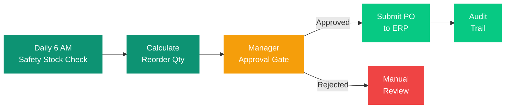

## Overview

These scenarios illustrate how Superatom handles real enterprise situations end-to-end. Each walkthrough shows the trigger, the automated analysis, and the outcome -- demonstrating the decision loop in practice.

---

## Cross-Source Analysis

**Situation:** A retail company uses SAP for ERP, Salesforce for CRM, and Google BigQuery as a data warehouse. A VP asks: *"How does customer satisfaction score correlate with order fulfillment timeliness?"*

<Steps>
  <Step title="Query Routing">
    Superatom routes the query to three agents simultaneously: SAP (fulfillment data), Salesforce (satisfaction scores), and BigQuery (historical aggregations).
  </Step>
  <Step title="Independent Data Collection">
    Each agent queries its data source independently, retrieving the relevant metrics without requiring any pre-built integration between systems.
  </Step>
  <Step title="Synthesis and Joining">
    The Main Agent synthesizes results, joining on customer ID and time period. The semantic model automatically resolves join paths across the three systems.
  </Step>
  <Step title="Visualization">
    A scatter plot shows the correlation with trend line, R-squared value, and outlier callouts. The VP can see the relationship at a glance.
  </Step>
  <Step title="Follow-Up Drill-Down">
    The VP asks a follow-up: *"Which fulfillment centers are driving the low-satisfaction outliers?"* Superatom drills down into the outliers, identifying specific fulfillment centers with delays.
  </Step>
</Steps>

<Note>
No data modeling was required. No ETL pipeline was built. The semantic model automatically resolved the join paths across SAP, Salesforce, and BigQuery.
</Note>

---

## Anomaly Detection and Response

**Situation:** A manufacturing company monitors daily production metrics across 12 plants.

<Steps>
  <Step title="Continuous Monitoring">
    The anomaly detection engine monitors configured metrics every hour: yield, scrap rate, downtime, and output volume across all 12 plants.
  </Step>
  <Step title="Anomaly Detected">
    At 10:15 AM, the engine detects a 23% yield drop at Plant 7, Line 3. This exceeds the configured threshold and triggers an automatic investigation.
  </Step>
  <Step title="Automated Root Cause Investigation">
    Superatom runs a multi-factor investigation automatically:

    | Factor Checked | Finding |
    |---|---|
    | Current shift vs. previous shifts | Yield was normal yesterday |
    | Material inputs | New batch from Supplier X started at 9:30 AM |
    | Equipment status | No maintenance events, no sensor alerts |
    | Environmental factors | Temperature and humidity within range |
  </Step>
  <Step title="Root Cause Assessment">
    Superatom concludes: *"Yield drop correlates with material batch #4721 from Supplier X, which started processing at 9:30 AM. No other variables changed."*
  </Step>
  <Step title="Alert Delivery">
    Alert delivered to the plant manager via Slack with full analysis, affected batch details, and recommended action: hold batch and notify supplier.
  </Step>
  <Step title="Action from Mobile">
    The plant manager reviews on mobile, approves the hold action, and the system creates a supplier notification automatically.
  </Step>
</Steps>

---

## New Employee Onboarding

**Situation:** A new financial analyst joins the organization and needs to understand company-specific terminology and data.

<Steps>
  <Step title="Automatic Role Assignment">
    The analyst is assigned the "Analyst" role via SSO. Row-level permissions automatically scope their data access to their business unit. No manual provisioning is needed.
  </Step>
  <Step title="First Question">
    The analyst asks their first question: *"What's our current revenue?"*
  </Step>
  <Step title="Knowledge Applied Transparently">
    Because a Global Knowledge Node defines "revenue = net revenue excluding returns and internal transfers," the system applies the correct definition automatically. The analyst does not need to know this rule -- it is embedded in the platform.
  </Step>
  <Step title="Learning Definitions">
    The analyst asks: *"What does 'overstock' mean here?"*
  </Step>
  <Step title="Contextual Knowledge Returned">
    The system returns the Query Knowledge Node: *"Overstock = on-hand inventory exceeds 90-day rolling COGS-based forecast. Key columns: on_hand_qty, cogs_90d_rolling, safety_stock_level."*
  </Step>
  <Step title="Immediate Productivity">
    The analyst immediately works with the same definitions as a 10-year veteran. Organizational knowledge is captured in the system rather than in people's heads.
  </Step>
</Steps>

<Note>
Tribal Knowledge nodes ensure every user -- new or experienced -- works with the same business definitions. This eliminates the months-long ramp-up period that typically accompanies onboarding into data-intensive roles.
</Note>

---

## Board Meeting Preparation

**Situation:** The CFO needs a quarterly business review report for the board of directors.

<Steps>
  <Step title="Request the Report">
    The CFO (or their team) asks: *"Generate a Q3 business review with revenue by segment, margin trends, cash flow, headcount, and key strategic metrics with year-over-year comparison."*
  </Step>
  <Step title="Comprehensive Report Generation">
    The AI Analyst generates a complete report including:

    - Executive summary with key highlights and concerns
    - Revenue by segment with YoY comparison and variance explanations
    - Margin trends with waterfall showing what drove changes
    - Cash flow statement with forecast
    - Operational metrics with trend indicators
    - Anomaly callouts (significant deviations explained)
  </Step>
  <Step title="Multi-Format Export">
    The report is exported as PDF for board distribution and as an interactive web link for drill-down during the meeting.
  </Step>
  <Step title="Template Saved">
    The template is saved. Next quarter, the same report runs automatically with updated data -- no manual effort required.
  </Step>
</Steps>

---

## Automated Inventory Management

**Situation:** A distributor wants to automate low-stock detection and purchase order initiation.

<Steps>
  <Step title="Trigger: Daily Safety Stock Check">
    Every day at 6:00 AM, a scheduled workflow checks all SKUs against safety stock levels automatically.
  </Step>
  <Step title="Analysis: Reorder Calculation">
    For items below safety stock, Superatom calculates the optimal reorder quantity based on demand forecast, lead time, and economic order quantity.
  </Step>
  <Step title="Action Gate: Manager Approval">
    Draft purchase orders are generated and grouped by supplier. The procurement manager receives an email with a link to review and approve each PO.
  </Step>
  <Step title="Execution: PO Submission">
    On approval, the PO is submitted to the ERP system via the Action Agent. The action is logged in the audit trail for full traceability.
  </Step>
</Steps>

<Warning>
The procurement manager reviews 3-5 POs each morning instead of manually checking hundreds of SKUs. It is recommended to use dry-run mode for the first two weeks to validate the system's recommendations before activating live PO generation.
</Warning>
