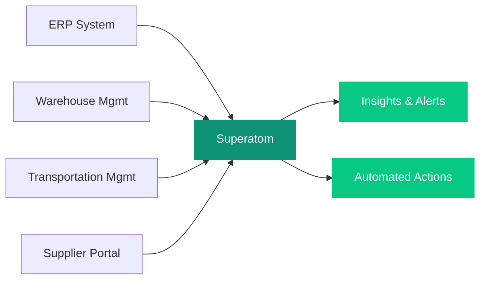

## Overview

Superatom connects to your existing supply chain systems and provides instant, AI-powered analysis across inventory, procurement, demand planning, and logistics operations. No data modeling required -- ask questions in plain language and get answers in seconds.

---

## Connected Data Sources

<CardGroup cols={3}>
  <Card title="ERP Systems" icon="database">
    SAP, Oracle, Dynamics 365
  </Card>
  <Card title="Warehouse Management" icon="warehouse">
    WMS platforms and inventory systems
  </Card>
  <Card title="Transportation" icon="truck-fast">
    TMS and carrier management tools
  </Card>
  <Card title="Supplier Portals" icon="handshake">
    Vendor management and procurement platforms
  </Card>
  <Card title="Demand Planning" icon="chart-line">
    Forecasting and planning tools
  </Card>
</CardGroup>

---

## Example Queries

The following table shows real questions you can ask Superatom and how the platform handles each one.

| Question | What Superatom Does |
|---|---|
| "Which items are at risk of stockout in the next 7 days?" | Queries current inventory levels, calculates burn rate from recent sales, compares against lead times and safety stock thresholds. Returns a prioritized list with recommended reorder quantities. |
| "Why did our fill rate drop last month?" | Decomposes fill rate into component metrics (order lines, shipped lines, backorders). Identifies which products, warehouses, and suppliers contributed to the decline. Traces root cause to specific supply disruptions or demand spikes. |
| "Show me deadstock across all warehouses" | Identifies items with zero sales movement for a configurable period (default: 12 months). Calculates carrying cost. Groups by warehouse, category, and supplier. Suggests transfer or liquidation actions. |
| "What's the optimal reorder point for our top 50 SKUs?" | Analyzes demand variability, lead time variability, and service level targets. Calculates safety stock and reorder points using statistical methods. Compares current settings against calculated optimal values. |

---

## Automated Workflows

Set up workflows that continuously monitor your supply chain and alert you when action is needed.

<CardGroup cols={1}>
  <Card title="Daily Inventory Health Check" icon="heart-pulse">
    Flags items below safety stock, above overstock thresholds, or trending toward stockout. Runs automatically each morning and delivers a prioritized action list.
  </Card>
  <Card title="Supplier Performance Monitoring" icon="chart-mixed">
    Tracks on-time delivery rates, quality metrics, and lead time trends. Alerts on degradation so you can intervene before disruptions cascade.
  </Card>
  <Card title="Demand-Supply Mismatch Detection" icon="scale-unbalanced">
    Identifies emerging gaps between forecast and actual demand. Highlights SKUs where the forecast needs recalibration or where supply adjustments are required.
  </Card>
</CardGroup>

---

## How It Works

<Note>
Superatom's semantic model automatically resolves join paths across your supply chain data sources. No ETL pipelines or data warehouses required.
</Note>
